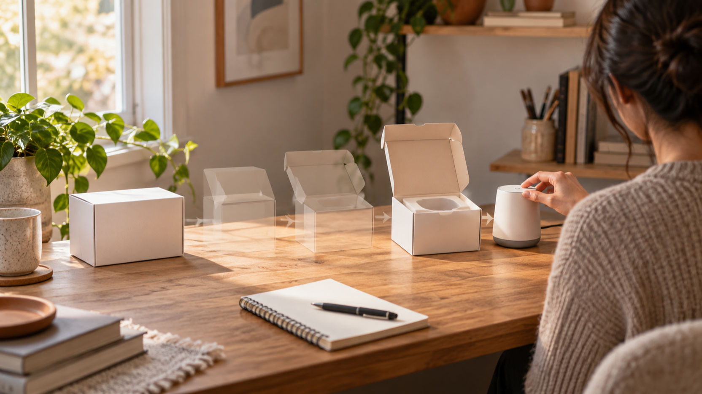
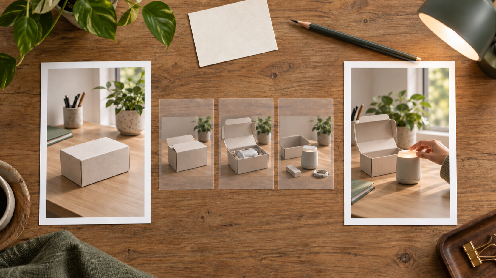
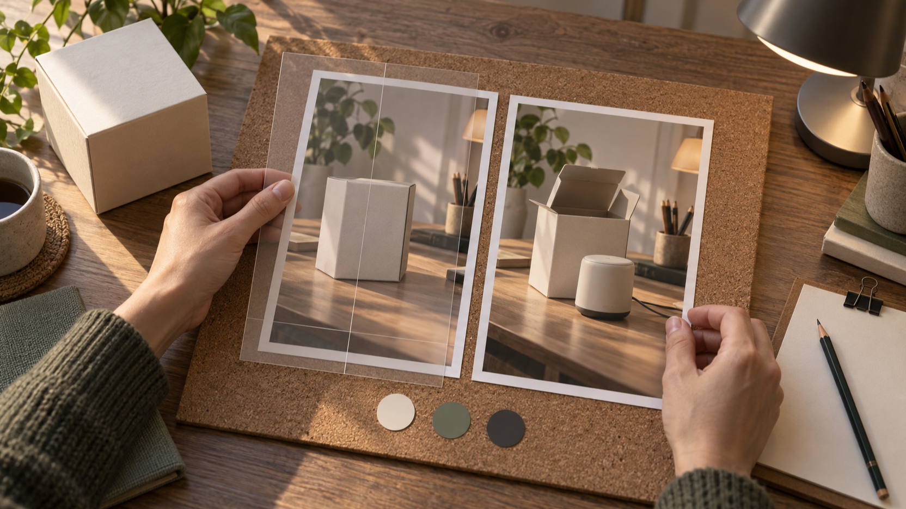

# Plan a MiniMax H3 Start-and-End-Frame Launch Clip From Box to Desk

Disclosure: I’m the founder of BestImage AI. This is a planning guide, not an independent test of a model or service.

A launch clip does not need a busy transformation to feel deliberate. For a vertical product story, a simple move from an unopened box to an in-use desk scene gives the viewer an easy visual question at the start and a clear answer at the end. The work is in the plan: decide what must stay fixed, choose one visible change, and make the bridge between the two frames feel physically plausible.

BestImage’s MiniMax H3 product page describes a written prompt used on its own or paired with one start frame and one end frame. It lists five-second, 480p clips in 16:9, 9:16, or 1:1, so a 9:16 brief is an appropriate planning constraint for this kind of compact launch story. Treat those page-described options as setup context, not as a promise of a particular result. For the current controls and access wording, [see the BestImage MiniMax H3 page](https://bestimage.ai/free-minimax-h3/).

<!-- IMAGE ANCHOR: LEAD — place directly after the opening setup paragraph -->

*Caption: A narrow box-to-desk transition gives the two frames one clear job.*

*Editorial illustration for this guide; it is not product output or an independently tested result.*

## Start With One Visible Change

The first frame should make the unopened state unmistakable. Use a plain, unbranded box on a tidy desk, with enough surrounding surface to establish where the action happens. Keep the lighting, desk material, camera height, and the box’s position stable. Those are the continuity anchors that make a very short sequence readable.

The final frame should answer only one question: what does the same scene look like when the item is in use? In this concept, the box is open and a generic, unbranded desktop device is being used at the same desk. Avoid adding a new room, a second person, a dramatic color change, or a different camera angle. Each extra change creates a second story that competes with the launch moment.

Before drafting any instructions, write two plain-language sentences:

- Start: An unopened, unbranded box rests on the left side of a warm home-studio desk.
- End: The same desk is shown from the same angle, with the box open and the generic device in use.

These sentences are deliberately modest. They describe a target sequence for an editorial plan, not a claim that a generated clip will reproduce it exactly.

## Build the MiniMax H3 Start-and-End-Frame Brief

For a 9:16 launch clip, describe the frames first and motion second. The provider’s page also describes controls for motion and camera direction, plus generated sound in its browser creator. Use that information only to organize the brief; do not treat it as evidence about a result you have not independently tested.

An effective brief separates fixed details from the single change:

    Format: vertical 9:16 launch clip
    Start frame: unopened, unbranded box on a warm desk
    End frame: the same desk and angle, box open, generic device in use
    Motion: the lid lifts and the scene resolves from packaging to use
    Camera: steady, close desk-level view with a restrained forward drift
    Sound direction: quiet room tone and a soft cardboard-open cue
    Keep fixed: desk surface, warm light, box position, framing, and device scale
    Avoid: extra products, a location change, text overlays, logos, or a sudden camera jump

The phrase “steady, close desk-level view” matters because vertical framing leaves little room to recover from a loose composition. Put the object change near the center of the frame. Leave modest negative space above it for the motion to read, rather than filling the scene with props.

<!-- IMAGE ANCHOR: MIDDLE — place immediately after the brief skeleton -->

*Caption: Pair the vertical start and end views before describing the bridge between them.*

*Editorial illustration for this guide; it is not product output or an independently tested result.*

## Write the Box-to-Desk Story in Three Small Beats

The bridge between the frames should be a sequence of cause and effect, not a collection of effects. A useful planning pattern has three beats:

1. Establish the unopened box and the calm desk environment.
2. Show the lid beginning to open while the framing and light remain consistent.
3. Resolve to the open box and the device already in use at the same desk.

This structure gives the viewer a direction of travel without inventing a complex product reveal. It also makes revision easier. If the middle feels crowded, remove a beat instead of adding another object. If the end frame feels disconnected, check the invariant details: box side, desk edge, lamp position, hand placement, and camera height.

Do not use the concept to imply a real unboxing, a measured generation time, a quality comparison, or a marketing outcome. It is simply a visual brief for a possible box-to-desk story. The distinction is useful for a founder-written guide: readers get a concrete planning method without being asked to accept unverified performance claims.

## Let the Provider Facts Set the Boundary, Not the Promise

The provider page labels this free MiniMax H3 route “No Signup Required” and uses free-access wording. Those are provider labels that can change, so keep them attributed to that page rather than presenting them as a permanent editorial guarantee. The same page says requests are handled one at a time and may wait in a queue; that is another reason to design the smallest viable sequence before asking for a clip.

The page’s stated format options are a reason to choose a composition, not a reason to overstate capability. Here, the 9:16 option supports a portrait launch narrative. A five-second format favors one clear transition. The described sound control suggests a separate sound direction, but it does not require an elaborate audio story. Small, specific choices keep the brief useful even when the eventual result needs adjustment.

## Use a Final Continuity Review Before You Generate

Review the start and end descriptions side by side before moving to any creator:

- Does the box stay in the same part of the desk?
- Is the room, lighting, and camera viewpoint stable?
- Is opening the box the only meaningful transition?
- Does the end frame show use without introducing a different product story?
- Are any text, brand marks, interface elements, or unneeded claims absent?
- Does the sound direction support the action instead of becoming a second plot?

If a point cannot be answered from the two frame descriptions, simplify the brief. In a compact vertical launch clip, continuity is more persuasive than spectacle. The goal is not to pack every possible feature into one sequence; it is to make one planned change legible from the first frame through the final desk scene.

<!-- IMAGE ANCHOR: CLOSING — place directly after the continuity checklist -->

*Caption: A side-by-side review catches broken continuity before the brief becomes more complex.*

*Editorial illustration for this guide; it is not product output or an independently tested result.*

## Keep the First Attempt Narrow

A MiniMax H3 start-and-end-frame launch clip plan works best when the frames do most of the storytelling. Begin with the unopened box, keep the desk recognizable, and let the final image show a single believable state of use. That leaves a reader with a repeatable briefing habit: define the opening, define the ending, name the invariants, and remove everything that does not serve the transition.

That approach is also kinder to the review process. A focused brief makes it easier to see whether a later output matches the intended narrative, while keeping this article honest about what has and has not been tested. It keeps the provider page’s free MiniMax H3 and no-signup-required labels separate from any untested output claim.

## Frequently Asked Questions

### Do I need both a start frame and an end frame?

The provider page describes both a prompt-only route and a route that pairs one start frame with one end frame. Use paired frames when the story depends on a defined opening and ending. This guide does not independently test how any route will perform.

### What does 9:16 change in this plan?

The provider page lists 9:16 among its format options. For planning, it means keeping the box, hands, and desk action close to the vertical centerline and avoiding a wide scene that depends on side detail.

### What should I remove if the brief feels too busy?

Remove changes that are not required for the box-to-desk transition: extra objects, a second setting, text overlays, abrupt camera moves, or a separate narrative beat. Keep the single visible change and the fixed scene details.
