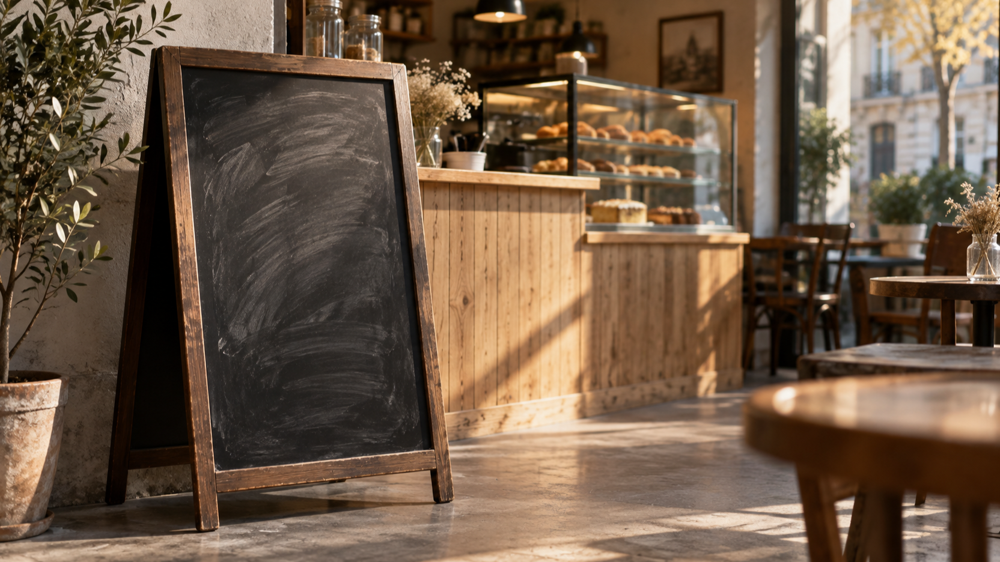
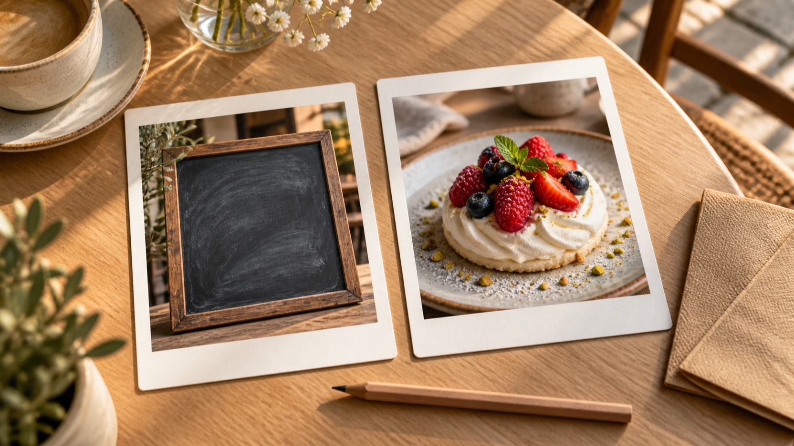
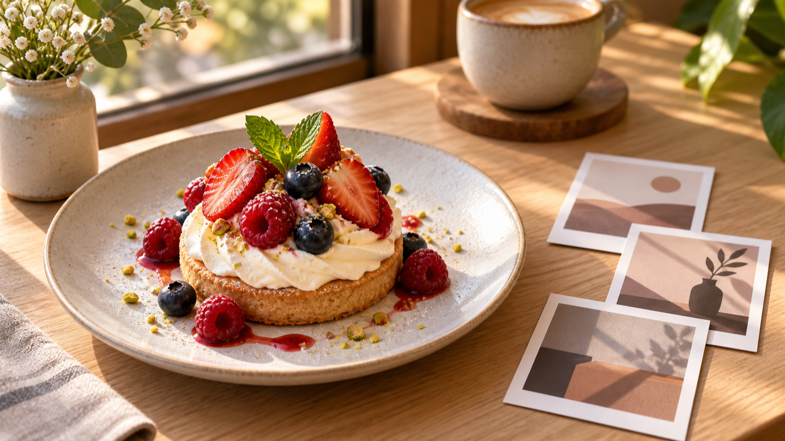

# MiniMax H3 : préparer un teaser de café, de l’ardoise au dessert

Un café de quartier n’a pas besoin d’un récit compliqué pour préparer une idée de teaser : une ardoise de menu peut donner le point de départ, puis un gros plan de dessert dressé peut en fixer l’arrivée. L’enjeu est de préciser ce qui change, ce qui reste stable et ce que le spectateur doit comprendre en quelques secondes.

Si vous cherchez un **générateur vidéo MiniMax H3 gratuit sans inscription**, au 14 septembre 2026, la page de BestImage présente cet accès comme une option sans inscription. Ce guide se limite à la préparation du brief : il ne présente ni test indépendant ni promesse de résultat pour un réseau social.

*Illustration éditoriale : l’ardoise sert de point de départ visuel au brief, sans représenter une sortie de produit.*

Je suis fondateur de BestImage.AI ; ce lien avec le service est indiqué pour que vous puissiez situer ce guide.

## Partir d’un contraste simple : le menu à la craie puis le dessert

Le premier plan peut montrer l’ardoise près du comptoir, avec la lumière du café et quelques lignes de craie non lisibles. Le dernier plan resserre le cadre sur l’assiette finie : un dessert dressé, la texture visible, une main hors champ ou immobile selon le ton souhaité. La transition n’a pas besoin de raconter toute la préparation ; elle doit seulement rendre lisible le passage d’une annonce de menu à un plat prêt à regarder.

Selon BestImage, sa page décrit des clips de cinq secondes en 480p, dont le format 16:9. Pour un brief aussi court, choisissez donc un seul événement visuel : l’ardoise quitte le champ, puis le dessert prend la place centrale. Cette indication de format ne préjuge ni du rendu ni de la réception du teaser.

### Définir ce qui doit rester cohérent

- Gardez le même univers : bois clair, comptoir de café et lumière chaude de fin de journée.
- Faites passer le regard de la surface mate de l’ardoise au détail brillant du dessert, sans ajouter de personnage, d’offre ou de texte inventé.
- Évitez de demander plusieurs plats, plusieurs lieux ou plusieurs changements de saison dans le même moment très court.

## Cadrer le brief du teaser : de l’ardoise au dessert

La page de BestImage indique qu’un brief peut partir d’une consigne écrite, ou d’une consigne associée à une image de début et à une image de fin. Pour ce teaser, la première image peut représenter l’ardoise et la seconde le dessert. Ces deux repères servent à exprimer l’idée de passage ; ils ne constituent pas une démonstration de résultat.

### Écrire une consigne utile au café

Décrivez d’abord le sujet et le changement : « ardoise de menu de café au premier plan, transition vers un dessert dressé en gros plan ». Ajoutez ensuite le décor, la lumière et le mouvement souhaité. Gardez les mots de marque, les prix et les slogans hors du brief si vous ne voulez pas les voir devenir un élément visuel à contrôler.

### Préparer les deux repères sans confondre plan et promesse

L’image de départ doit privilégier l’ardoise et le contexte du comptoir ; l’image de fin doit isoler le dessert avec un cadrage serré. Avant toute utilisation, vérifiez que les deux images racontent le même lieu et la même ambiance. Cette vérification améliore la clarté du brief ; elle ne permet pas d’annoncer une continuité ou une qualité de sortie.

*Illustration éditoriale : deux repères physiques aident à préparer le brief, sans montrer une interface ni un résultat généré.*

## Décrire mouvement, cadrage et son comme des intentions

BestImage décrit sur sa page des consignes de mouvement, de direction de caméra et de son généré dans son outil de création. Dans ce cas, formulez-les comme des intentions simples : un lent rapprochement vers l’ardoise, un passage sobre, puis un plan fixe ou légèrement rapproché sur le dessert. Si le son compte pour l’idée, indiquez seulement une ambiance de café discrète, sans promettre un résultat audio particulier.

### Distinguer le brief de la publication

Un brief utile indique ce que l’on veut regarder ; il ne remplace pas le contrôle d’un contenu avant diffusion. Pour un café, préparez une version courte qui identifie le décor, l’objet de départ, l’objet d’arrivée et le mouvement de caméra souhaité. Gardez une seconde version plus neutre si le dessert ou l’ardoise doivent changer avec le menu du jour. Cette méthode aide l’équipe à relire les éléments visibles sans prétendre que le clip obtenu suivra chaque détail.

Séparez aussi les éléments éditoriaux des éléments commerciaux. Le nom du café, son prix du jour ou une promotion peuvent être vérifiés par la personne qui publie, plutôt que laissés à une description visuelle. Cela réduit le risque de confondre une idée de plan avec un message destiné aux clients. Le guide ne conseille ni rythme de publication, ni ciblage, ni mesure de performance : il sert seulement à rendre la direction visuelle plus simple à discuter.

### Limiter le brief à ce qu’un spectateur doit remarquer

Avant de diffuser le teaser, relisez le brief avec trois questions : voit-on bien le menu au départ ? comprend-on que le dessert en est l’aboutissement visuel ? le cadrage reste-t-il adapté à une communication locale sobre ? Cette relecture aide à éviter un concept surchargé et ne mesure ni portée, ni engagement, ni ventes.

*Illustration éditoriale : le dessert devient le point d’arrivée d’un storyboard de teaser, et non la preuve d’une vidéo générée.*

## Conclusion : garder l’idée de teaser vérifiable et sobre

Le scénario fonctionne lorsqu’il reste précis : une ardoise, un dessert, un changement lisible et une atmosphère cohérente. Pour consulter les indications de préparation décrites par la marque, vous pouvez partir de [la page MiniMax H3 de BestImage.AI](https://bestimage.ai/free-minimax-h3/). Gardez le brief court, relisez les éléments visuels avant usage et évitez d’en déduire une promesse de performance sociale.
