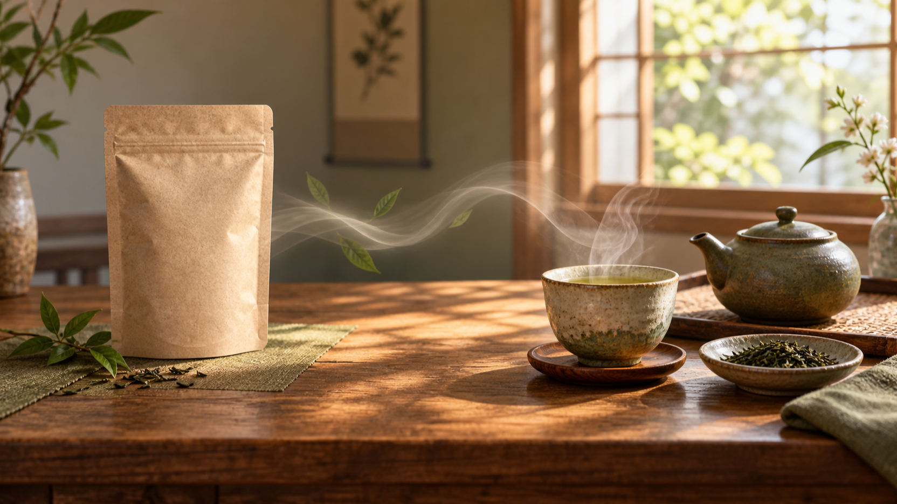
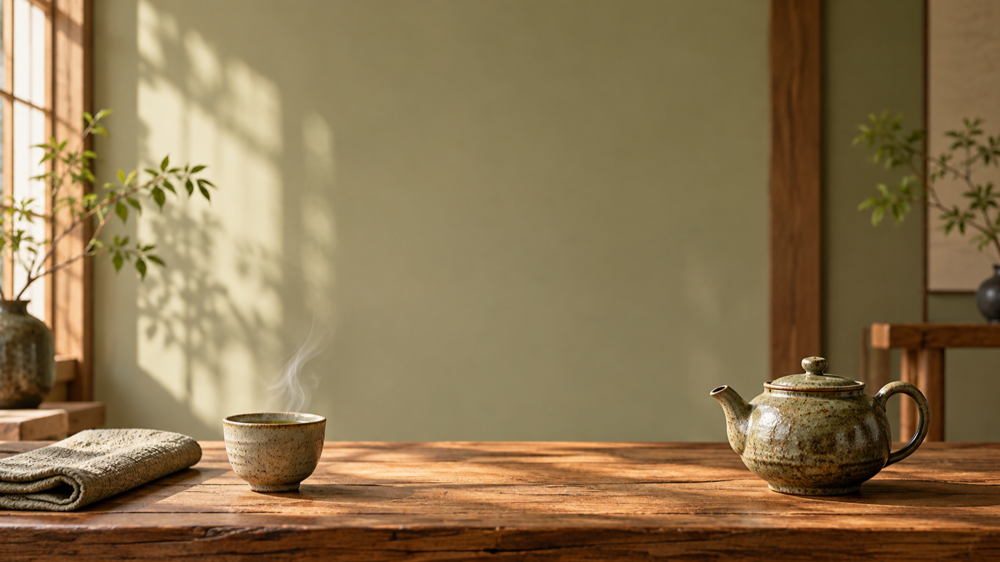
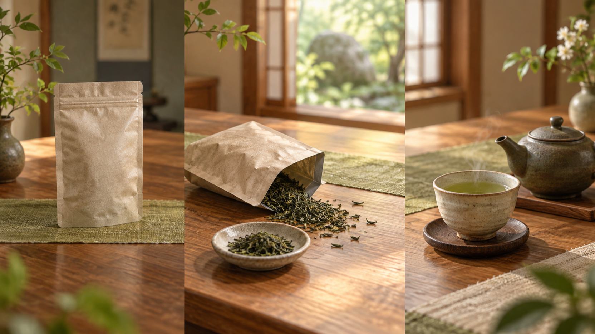

# 季節の茶葉パウチから静かな茶卓へ：MiniMax H3で設計する縦型動画

季節感のある茶葉パウチを、落ち着いた茶卓へ変化させる短い縦型動画は、装飾を増やすよりも「どこから始まり、どこで静止するか」を決めると組み立てやすくなります。ここでは9:16の投稿を想定し、茶葉パウチ・茶葉・湯のみだけで小さな物語を設計する手順を整理します。

> 開示：本記事はBestImageの創業者チームが、自社の製品ページを紹介する目的で作成しています。以下は実出力を検証した記録ではなく、同ページの記載をもとにした構成メモです。

## 季節の茶葉パウチから静かな茶卓へ：MiniMax H3で始点と終点を設計する

紹介ページの[BestImage Free MiniMax H3](https://bestimage.ai/free-minimax-h3/)では、文章による指示に加え、文章と開始・終了フレームを組み合わせる進め方が示されています。まずは「無地の茶葉パウチが低いテーブルにある」から、「湯気のある湯のみと急須が整う」までを、同じ光・同じ素材・同じ温度感でつなげます。

始点と終点を対にすると、途中の変化を足しすぎずに済みます。茶葉パウチの位置、茶葉が現れる量、湯気の向きを、あらかじめ一文ずつ決めておくと、あとから動きの言葉を選びやすくなります。

<!-- IMAGE-ANCHOR:A08-IMG-01 | 手動アップロード時は下の画像を差し替え、操作用の注記を残さない -->

*編集用イラスト：茶葉パウチを始点、整えた茶卓を終点として置く。*

## 茶葉パウチから茶卓へ：始点と終点を先に決める

書き出しは、物を増やす順番ではなく、画面の役割で分けます。始点では無地の茶葉パウチを静かに見せる。中間では少量の茶葉とやわらかな湯気で「準備が進んだ」ことだけを伝える。終点では湯のみと小さな急須を整え、視線を止める場所をつくる。この三段階なら、場面ごとに何を残し、何を省くかを判断しやすくなります。

文章には、素材と光の言葉を繰り返し入れます。たとえば、木の低いテーブル、亜麻色の布、朝の拡散光、淡い緑と琥珀色です。変化の前後でこの基調を保てば、茶葉パウチと茶卓が別々の写真のように離れて見えるのを防げます。

## 9:16で落ち着きを残すための、余白と動きの書き分け

縦長の投稿では、主役を中央に詰め込むより、湯のみと急須を低めに置き、上側に呼吸できる余白を残すほうが静けさを保ちやすくなります。茶葉パウチ、茶葉、器をすべて同じ強さで見せず、最初の視線の行き先を一つに絞ります。

紹介ページには、動き、カメラの方向、生成される音を文章で考える文脈が案内されています。ここでは、動きは「茶葉がそっと現れる」、カメラは「低い茶卓へゆっくり寄る」、音は「湯気のある朝の静けさ」のように、各要素を場面の理由に結びつけて短く書くのがよいでしょう。実際の出力は検証していないため、表現が意図どおりかは利用時に確認してください。

<!-- IMAGE-ANCHOR:A08-IMG-02 | 手動アップロード時は下の画像を差し替え、操作用の注記を残さない -->

*編集用イラスト：縦長の見え方を想定し、主役を低く、余白を広く取る。*

## 5秒に収めるための、三つの区切り

紹介ページの仕様説明では、クリップは5秒・480pで、16:9、9:16、1:1が挙げられています。5秒を長い説明にせず、次の三つの役割に分けて考えると、場面が散らかりにくくなります。

1. 最初の瞬間は、静かな茶葉パウチと朝の光を見せる。
2. 中ほどでは、茶葉と湯気で準備の気配をつくる。
3. 最後は、整った湯のみと急須に視線を落ち着かせる。

この順序では、切り替えのための過剰な演出は不要です。茶葉が現れる量、湯気の立ち方、カメラが寄る距離を少なく書き、終点の茶卓を一番長く印象に残る場所にします。

<!-- IMAGE-ANCHOR:A08-IMG-03 | 手動アップロード時は下の画像を差し替え、操作用の注記を残さない -->

*編集用イラスト：五秒を、始点・移り変わり・終点の三つの役割に分けて考える。*

## まとめ：静かな茶卓は、始点と終点の関係から整える

短い縦型動画では、茶葉パウチから茶卓への変化を一度に説明しようとせず、始点・中間・終点の役割を分けるのが基本です。2026年9月14日時点で、BestImageの紹介ページは「100% Free」「No Signup Required」と表示していますが、同じページはリクエストを一度に一件ずつ処理し、キューで待つことがあるとも説明しています。利用時は表示されている条件を確認し、実行の可否や結果は自身で確かめてください。

茶葉パウチ、茶葉、湯のみという少ない要素でも、光、余白、動きの言葉を揃えれば、9:16の画面に静かな余韻をつくれます。

**タグ：** #AI動画 #縦型動画 #動画構成 #茶のある暮らし #プロンプト設計
