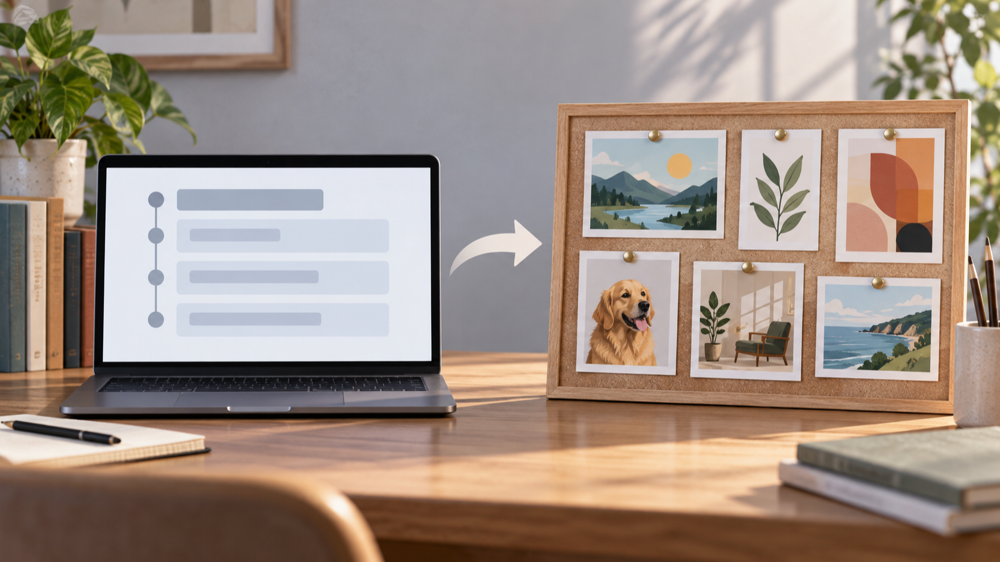

# MiniMax H3で講座アウトラインを学習者の完成プロジェクトボードへつなぐ、5秒チュートリアル予告の設計

## MiniMax H3で予告を組み立てる前に、変化を一つに決める

開示：本記事は BestImage の創業者チームが、同社の Free MiniMax H3 ページを紹介するために作成したものです。ここで整理する機能は同ページの記載に限られ、独自の動作テストや成果の保証は行っていません。

講座の説明を短い予告にするなら、情報を増やすよりも「何が変わるのか」を一つ決めるほうが伝わります。ここでは、画面上の講座アウトラインが、学習者の完成プロジェクトボードへつながる流れを例にします。[BestImage Free MiniMax H3](https://bestimage.ai/free-minimax-h3/) の案内ページには、文章だけで進める方法と、文章に開始フレーム1枚・終了フレーム1枚を組み合わせる方法が記載されています。

<!-- IMAGE-ANCHOR: A10-01 / 導入直後 / course-outline-transition-16x9.png -->

*編集用イラスト：講座の構成カードから完成プロジェクトボードへ、焦点が移る流れ。*

この予告で見せる変化は、「学ぶ内容の一覧」から「自分で完成させたものの一覧」へ進むことです。開始側には章立てを連想させる控えめなカード、終点側には色分けした作品カードを置きます。どちらの画面にも説明を詰め込みすぎず、見る人が一目で前後関係を読めるようにします。

ページ上では、動きやカメラの方向、生成音声を文章の指示に含める考え方も案内されています。この題材では、カードが派手に飛び交う演出より、左から右へ視線が流れ、最後に作品ボードへ落ち着く設計のほうが目的に合います。ここで述べるのは構成の考え方であり、生成結果を評価したものではありません。

## 講座アウトラインから完成プロジェクトボードまでの二枚を設計する

開始フレームは、余白のある講座アウトラインにします。読み取れる文字や実在サービスの画面を入れず、章の順番を表す中立的なブロックだけを置くと、説明用の映像として扱いやすくなります。終了フレームは、同じ配色を一部残しながら、学習者が完成させた小さな作品カードを並べたボードにします。

この二枚の間に必要なのは、講座が急に別物になることではなく、学ぶ順番が制作物の集合へ変わる手がかりです。カードの位置、机の光、落ち着いた色数を引き継ぐと、短い切り替えでも意図を保ちやすくなります。

<!-- IMAGE-ANCHOR: A10-02 / 二枚の設計を説明した段落の直後 / learner-project-board-16x9.png -->

*編集用イラスト：学習者がアウトラインを、完成した作品の配置へ置き換えていく作業机。*

### 開始側で残すもの

- 章立てを示す数個のブロックと、静かな机上の空気。
- 作品ボードにも引き継ぐ一つか二つの色。
- 視線を左から右へ動かす、単純な配置。

### 終点側で増やすもの

- 完成した作品を示す、重なりすぎないカードのまとまり。
- 学習者の手元や道具ではなく、仕上がったプロジェクトに焦点を移す構図。
- 予告の最後に残る、次の説明を見たくなる余白。

## 5秒・9:16の予告なら、画面に入れる情報を減らす

BestImage の案内ページには、5秒・480pのクリップと、16:9、9:16、1:1の比率が記載されています。この題材を縦長のチュートリアル予告として考えるなら、講座アウトラインと完成ボードを一画面に同量で置くのではなく、最初にアウトライン、終わりにボードという順番をはっきり分けます。編集用イラストも、縦長で見せる主役が中央に残るように考えると、後の切り出しを検討しやすくなります。

<!-- IMAGE-ANCHOR: A10-03 / 縦長構図の説明直後 / vertical-tutorial-teaser-16x9.png -->

*編集用イラスト：縦長のチュートリアル予告を考えるための、開始と終点のストーリーボード。*

短尺では、カードの文字を読ませる必要はありません。開始と終点の役割が違うこと、そして終点に制作の手触りがあることが伝われば、本文や次の教材で詳しい内容を補えます。

## ページ上の手順を、テストの結論に置き換えない

この構成は、案内ページに記載された開始フレーム・終了フレームの考え方を、講座紹介の題材に当てはめた編集案です。ページにはブラウザ内の履歴、プレビュー、ダウンロードに関する案内もありますが、保存の持続性や別の端末での利用までをここから推測することはできません。実際に扱う際は、その時点のページ表示と利用条件を確認してください。

## まとめ：MiniMax H3の予告は、学びの進行を一つの変化に絞る

講座アウトラインから完成プロジェクトボードへ移る5秒の予告では、開始側と終点側に共通する色や視線の流れを残すと、説明が短くても目的が伝わります。MiniMax H3については、ページに記載された入力の考え方と比率を確認しながら、まずは一つの変化だけを丁寧に設計するのがよい出発点です。

---

**SEOタイトル**：MiniMax H3で講座アウトラインを作品ボードへ変える5秒予告の設計  
**SEO説明**：講座アウトラインから学習者の完成プロジェクトボードへ切り替える、5秒チュートリアル予告の設計メモ。BestImage の案内ページにある開始・終了フレームの考え方を、ページ記載の仕様に限定して整理します。  
**タグ**：MiniMax H3、動画生成、チュートリアル予告、講座設計、作品ボード
