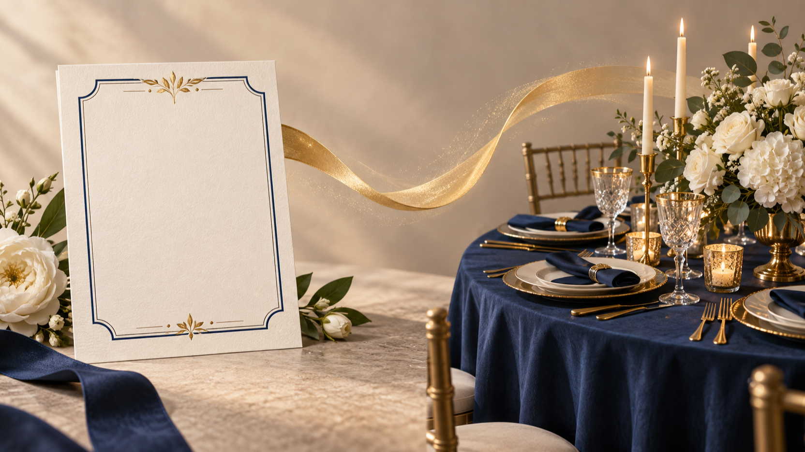
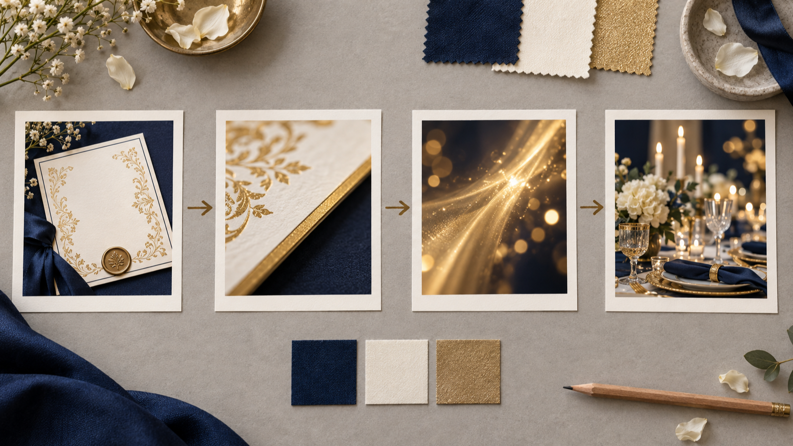
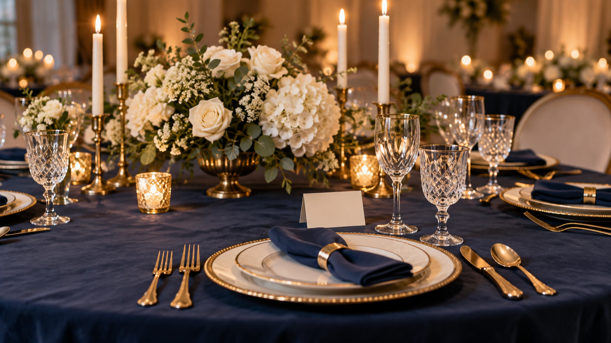

# Vídeo de convite de casamento com IA: do convite impresso à recepção azul e dourada

Um **vídeo de convite de casamento com IA** começa por decidir qual detalhe do convite impresso abre a história. A mesma lógica ajuda a estruturar um **convite digital animado**: aqui, o ponto de partida é um cartão marfim com azul-marinho e dourado; o destino é uma mesa de recepção na mesma paleta. A proposta é organizar uma sequência curta para um reel vertical, não fazer uma demonstração técnica.

Divulgação: faço parte da equipe fundadora da BestImage. Este artigo não se baseia em um teste independente.

*Ilustração editorial 1 — os dois pontos de partida para planejar a transição; não é captura de produto nem resultado de teste independente.*

> Nota editorial: esta ilustração serve ao planejamento visual e não é captura de produto nem resultado de teste independente.

## Comece pelos dois extremos da cena

Antes do movimento, descreva duas imagens que existam sozinhas. A primeira enquadra o convite, sua textura, a margem azul e um detalhe dourado. A última mostra a mesa preparada: toalha azul-marinho, louça marfim, velas, flores brancas e pontos dourados. Materiais e cores compartilhados dão à passagem um vocabulário visual definido.

Anote o que não muda: marfim, azul-marinho, dourado discreto, flores claras e luz quente. Isso evita que o convite pareça pertencer a uma festa e a mesa a outra. Escolha também uma direção de leitura, do detalhe do papel para a abertura da mesa.

### Escolha um detalhe que carregue a passagem

O dourado pode ligar as cenas sem virar texto na tela. Um filete do convite, o reflexo de uma vela ou uma borda da louça sugerem continuidade. Descreva-o como matéria e luz: “um brilho dourado suave atravessa a borda do cartão e acompanha a abertura da mesa”.

## Planeje o vídeo de convite de casamento com IA em três batidas

Organize a narrativa em três batidas. Primeiro, mantenha o convite quase imóvel para apresentar textura, recorte e paleta. Depois, aproxime-se do detalhe dourado e use-o como ponte. Por fim, abra para a mesa de recepção, com flores, velas, porcelana e tecido.

Quatro quadros bastam: convite inteiro, corte no dourado, passagem abstrata de luz e mesa pronta. Ao lado, use amostras de azul, marfim e dourado. Se um quadro pedir outra paleta, simplifique-o antes de criar qualquer clipe.

*Ilustração editorial 2 — um plano visual para ordenar a transição e a paleta; não é captura de produto nem resultado de teste independente.*

> Nota editorial: esta ilustração serve ao planejamento visual e não é captura de produto nem resultado de teste independente.

## Escreva uma instrução que descreva continuidade

Em vez de pedir uma mudança genérica, especifique a progressão: cartão marfim, filete azul-marinho, reflexo dourado e, por fim, mesa com tecido azul, flores claras e velas. Acrescente a direção de câmera só depois de definir os elementos: aproximação lenta no cartão, seguida de abertura para a mesa.

Para quem usa uma ferramenta de imagem para vídeo, a página da BestImage descreve planejamento com prompt escrito ou com um prompt acompanhado de imagem inicial e imagem final. A mesma página descreve movimento, direção de câmera e som gerado em um criador no navegador. Essas são descrições da página, não observações deste artigo; elas ajudam apenas a transformar o storyboard em uma lista objetiva de decisões.

### Revise o texto com a paleta na mão

Procure trocas involuntárias: azul-marinho não deve virar turquesa, dourado não precisa ser intenso e flores brancas não precisam competir com o convite. Remova tipografia e dados do evento deste planejamento visual. Para som, registre apenas um clima, como “cerimonial e calmo”, sem supor resultado.

## Mantenha o reel vertical legível

O quadro vertical pede hierarquia. No começo, deixe o convite no centro ou na parte inferior. Na passagem, use o brilho dourado para subir pelo quadro. No final, permita que a mesa ocupe a metade inferior e que velas e flores criem altura.

A página da BestImage informa clipes de cinco segundos em 480p e proporções 16:9, 9:16 e 1:1. Para este reel, a proporção 9:16 é a referência de composição; a informação vem da página da BestImage e não afirma como um clipe específico vai se comportar. Planeje cada batida para caber em um intervalo curto, mas mantenha o roteiro separado de qualquer promessa de acabamento.

*Ilustração editorial 3 — a cena de chegada da recepção azul e dourada; não é captura de produto nem resultado de teste independente.*

> Nota editorial: esta ilustração serve ao planejamento visual e não é captura de produto nem resultado de teste independente.

## Consulte a descrição do produto com o escopo certo

A página da BestImage descreve acesso sem cadastro para o criador e também menciona áudio de IA integrado, prévia, download e histórico local do navegador. Essas informações permanecem atribuídas à página da BestImage; não são confirmação independente de disponibilidade, armazenamento ou resultado. Para consultar a descrição atual do criador, use [Explore BestImage MiniMax H3](https://bestimage.ai/free-minimax-h3/).

Mantenha uma lista ao lado do roteiro: imagem inicial, imagem final, detalhe de ligação, direção de câmera, duração prevista e composição vertical. Ela separa o conceito do convite da ferramenta.

## Conclusão

Um **vídeo de convite de casamento com IA** ganha unidade quando o convite impresso e a mesa de recepção são tratados como capítulos da mesma paleta, e não como cenas isoladas. Parta de dois extremos, use o dourado como elo, reduza o storyboard a batidas legíveis e preserve espaço no quadro vertical. O resultado deste planejamento é uma direção editorial: do papel marfim à recepção azul e dourada, sem transformar ilustrações ou descrições de produto em prova de teste.

## Perguntas frequentes

### Preciso de uma imagem inicial e uma imagem final para planejar a sequência?

Não necessariamente. Para o planejamento editorial, você pode começar com uma descrição escrita dos dois extremos. A página da BestImage descreve tanto um prompt escrito quanto um prompt com imagem inicial e imagem final; essa é uma informação atribuída à página, não uma recomendação de teste.

### O que deve permanecer igual entre o convite e a mesa?

Escolha poucos elementos: a combinação marfim, azul-marinho e dourado, a luz quente e um detalhe de flores claras. Repetir esses sinais é mais útil do que repetir todos os objetos do convite na decoração.

### As ilustrações deste guia mostram resultados gerados?

Não. São ilustrações editoriais originais para explicar o planejamento da sequência. Elas não são capturas de produto, não documentam um teste independente e não devem ser lidas como exemplo de saída.
