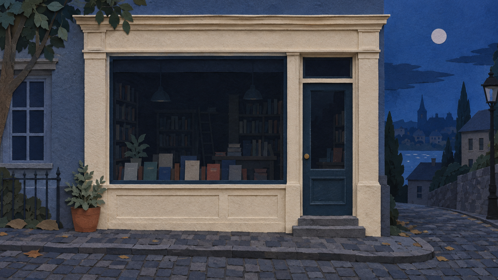
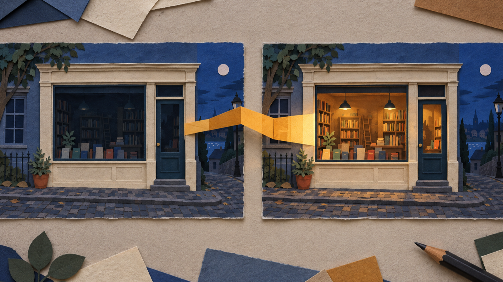
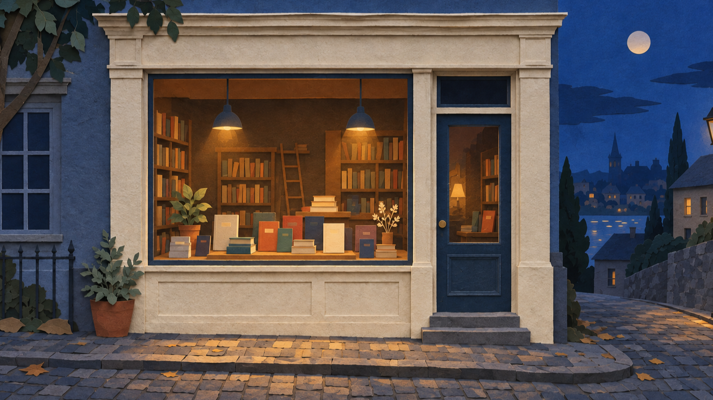

# Ein Schaufenster-Reel mit Papiermotiven planen: vom Ladenschluss zur warmen Buchneuheiten-Auslage

Ein kurzes Schaufenster-Reel wirkt überzeugender, wenn es nicht gleich eine ganze Werbewelt erzählen soll. Für eine kleine Buchhandlung reicht eine klare Veränderung: Zu Beginn ist das Fenster am Ladenschluss still und zurückhaltend. Am Ende leuchtet darin eine Auswahl neuer Bücher warm auf. Dazwischen liegt kein großer Effekt, sondern ein gut vorbereiteter Übergang aus Papierformen, Licht und einer ruhigen Kamerabewegung.

Dieser Beitrag ist eine Planungsanleitung für genau diese Szene. Die Buchhandlung, die Bücher und der Ablauf sind ein redaktionelles Beispiel; sie belegen weder eine erzeugte Ausgabe noch einen Test. **Transparenzhinweis:** Der Autor ist Gründer von BestImage. Aussagen zur Produktseite werden deshalb ausdrücklich BestImage zugeschrieben.

Hinweis zu den Abbildungen: Die drei Bilder sind redaktionelle Papierillustrationen zur Ideenfindung. Sie zeigen weder eine BestImage-Oberfläche noch ein getestetes oder erzeugtes Ergebnis.

*Abbildung 1 – Redaktionelle Papierillustration: Das ruhige Startbild definiert Ort, Material und Abendstimmung; kein Produktresultat.*

## Die Geschichte zuerst auf eine sichtbare Veränderung reduzieren

Die beste Grundlage ist ein Satz, den man ohne Fachbegriffe versteht: „Das geschlossene Papierfenster einer kleinen Buchhandlung wird zu einer warm beleuchteten Neuheiten-Auslage.“ Dieser Satz ist keine Werbebotschaft. Er hält nur fest, was sich im Bild verändern soll.

Für das Startbild helfen drei feste Entscheidungen. Die Fassade bleibt aus cremefarbenem Karton, die Straße dunkelblau wie kurz nach Sonnenuntergang, und das Schaufenster wirkt noch geschlossen. Im Endbild bleiben Fassade und Perspektive gleich. Neu kommen warmes Licht, gestapelte Papierbücher und kleine farbige Buchrücken hinzu. So ist klar, was sich bewegt und was unverändert bleiben soll.

Lassen Sie Dinge weg, die die Miniaturgeschichte verwässern: keine Kundschaft, keine Schrift im Fenster, keine Logos und keine zweite Handlung im Hintergrund. Ein kompaktes Reel braucht einen Hauptmoment. Hier ist es das Aufleuchten der Auslage, nicht die gesamte Geschichte des Geschäfts.

## Startbild und Endbild als Planungsgrenzen festlegen

Bevor Sie einen ausführlichen Prompt formulieren, beschreiben Sie die beiden Bildränder getrennt. Das verhindert, dass der Übergang mitten in der Szene seine Richtung verliert.

**Startbild:** Eine kleine Papierbuchhandlung bei Dämmerung. Das Fenster ist gedämpft, die Regale sind nur als flache Formen zu erkennen, und vor dem Laden liegt eine ruhige, leere Straße.

**Endbild:** Dieselbe Fassade und derselbe Blickwinkel. Hinter dem Fenster liegen Neuerscheinungen als Papierstapel, die Auslage ist bernsteinfarben beleuchtet, und ein schmaler Lichtschein fällt auf den Gehweg.

Nach der Beschreibung von BestImage kann ein schriftlicher Prompt allein stehen oder mit einem Startbild und einem Endbild kombiniert werden. In diesem Beitrag dienen die beiden Bilder ausschließlich als Planungsgrenzen für das Beispiel. Sie sind kein Beleg dafür, wie ein späterer Clip aussehen wird.

*Abbildung 2 – Redaktionelle Papierillustration: Zwei festgelegte Szenen machen die geplante Veränderung prüfbar; kein Produktresultat.*

Prüfen Sie die Paare mit einer einfachen Frage: Würde jemand schon am ersten und letzten Bild erkennen, dass es derselbe Laden ist? Wenn nicht, vereinfachen Sie die Unterschiede. Ein anderes Gebäude, eine neue Tageszeit und neue Gegenstände zugleich machen die kurze Verwandlung schwer lesbar.

## Was BestImage beim MiniMax H3-Videogenerator ohne Registrierung beschreibt

BestImage beschreibt auf seiner Produktseite einen browserbasierten Ablauf mit einem schriftlichen Prompt oder mit einem Prompt zusammen mit je einem Startbild und Endbild. Die Seite nennt außerdem Bewegung, Kamerarichtung und erzeugten Ton als Bestandteile des beschriebenen Ablaufs. Das sind Angaben von BestImage, keine unabhängigen Qualitäts-, Geschwindigkeits- oder Ergebnisversprechen dieses Beitrags.

Für die Buchladen-Szene ist daraus nur eine praktische Konsequenz ableitbar: Schreiben Sie die Bewegung nicht als Stimmung, sondern als kleine Abfolge. Das Licht geht an, die flachen Formen hinter dem Fenster werden zu Buchstapeln, und die Kamera bleibt ruhig. Wer die aktuelle Produktbeschreibung selbst nachlesen möchte, findet sie auf der [BestImage MiniMax-H3-Seite](https://bestimage.ai/free-minimax-h3/).

## Aus dem Buchladen ein bewegbares Mini-Storyboard machen

### 1. Den festen Bildkern benennen

Notieren Sie zuerst die Elemente, die sich nicht ändern dürfen: die schmale Fassade, das einzelne große Fenster, die Papierkante des Vordachs und die leicht erhöhte Straßenperspektive. Dieser Kern sorgt dafür, dass Anfang und Ende wie zwei Zustände desselben Ortes wirken. Er braucht keine komplizierte Beschreibung; vier oder fünf eindeutige Merkmale reichen.

### 2. Die Veränderung in drei kleine Beats teilen

Der erste Beat ist Stille: Das Fenster bleibt dunkel, höchstens ein kühler Restlichtstreifen liegt auf dem Papier. Im zweiten Beat wandert ein warmer Schein langsam von innen nach außen. Im dritten Beat werden die Buchformen sichtbar und geben der Auslage Tiefe. Die Beats müssen nicht als einzelne Einstellungen gedacht werden. Sie sind eine Reihenfolge, mit der Sie den Übergang kontrollierbar beschreiben.

### 3. Bewegung, Blick und Ton getrennt planen

Eine gute Notiz trennt diese Entscheidungen. Für die Bewegung reicht etwa „warme Papierfalten öffnen sich im Fenster“. Für den Blick genügt „langsamer, gerader Kameravorschub ohne Schwenk“. Für den Ton können Sie eine leise Ladenatmosphäre oder das Rascheln von Papier als Idee festhalten. Diese Notizen sind kreative Vorgaben, keine Aussage darüber, was ein Werkzeug zuverlässig liefert.

Wenn die Szene zu hektisch wirkt, streichen Sie zuerst eine Bewegung, nicht die ganze Idee. Ein Lichtwechsel und sichtbar werdende Bücher erzählen bereits genug. Gerade bei einem kompakten Reel macht Reduktion den Übergang verständlicher.

## Einen Prompt-Brief statt eines langen Wunschzettels schreiben

Ein Prompt-Brief ist eine kurze Arbeitsnotiz, die Material, Ausgangspunkt, Ziel und Bewegung voneinander trennt. Er darf konkret sein, ohne jede Papierfaser zu erklären. Für dieses Beispiel könnte die Notiz so gegliedert sein:

- **Material:** handgeschnittene Papiercollage, sichtbare Kartonkanten, matte Oberflächen.
- **Ausgangslage:** kleiner Buchladen bei Dämmerung, gedämpftes Schaufenster, leere Straße.
- **Zielbild:** warme Neuheiten-Auslage, gestapelte Papierbücher, sanfter Lichtschein auf dem Gehweg.
- **Übergang:** das Innenlicht öffnet sich langsam; die Bücher werden nacheinander erkennbar.
- **Blick und Klang:** ruhiger Vorschub, kein schneller Schnitt; dezentes Papiergeräusch als Stimmungsidee.

Die Liste ist absichtlich keine getestete Eingabe. Sie hilft nur dabei, die gewünschte Veränderung vorab zu prüfen. Wenn ein Punkt nicht im Start- oder Endbild sichtbar wird, gehört er wahrscheinlich nicht in die erste Fassung. Dadurch bleibt der Brief kurz und die Szene behält ihren Schwerpunkt.

## Vor dem Abschluss die Szene auf falsche Signale prüfen

Die letzte Kontrolle betrifft nicht Technik, sondern Lesbarkeit. Fragen Sie sich, ob das Bild wie eine Papieridee wirkt oder versehentlich wie ein Screenshot, ein Produktlogo oder ein bewiesenes Resultat. Für diesen Beitrag sind Menschen, Schriftzüge, Markenkennzeichen, Bedienoberflächen und messbar wirkende Anzeigen ausgeschlossen.

Vergleichen Sie danach Start und Ende noch einmal nebeneinander. Die Fassade muss wiedererkennbar bleiben, das Licht darf nur dort stärker werden, wo die Auslage entsteht, und die Bücher dürfen nicht zu einem zweiten Schauplatz werden. Wenn diese drei Prüfungen bestehen, ist der Storyboard-Brief bereit für eine ruhige, verständliche Umsetzung.

*Abbildung 3 – Redaktionelle Papierillustration: Die fertige Zielstimmung zeigt nur das geplante Endbild, kein Produktresultat.*

## Fazit: Eine kleine Verwandlung trägt das ganze Reel

Das Buchladen-Beispiel funktioniert, weil der Übergang begrenzt bleibt. Ein festes Startbild, ein klares Endbild und wenige sichtbare Beats geben der Papiercollage Richtung. So wird aus einer allgemeinen Idee eine Szene, die sich vor der eigentlichen Umsetzung besprechen, kürzen und verbessern lässt.

## Häufige Fragen

### Muss das Startbild schon alle Bücher zeigen?

Nein. Im Beispiel ist gerade der Kontrast wichtig: Die Bücher werden erst im Endbild deutlich. Entscheidend ist nur, dass Fassade, Fenster und Blickwinkel als derselbe Ort erkennbar bleiben.

### Wie viele Bewegungen braucht eine kurze Szene?

Beginnen Sie mit einer Hauptbewegung, etwa dem Aufleuchten des Fensters. Ergänzen Sie nur dann eine zweite, wenn sie den Wandel verständlicher macht. Zusätzliche Effekte sind kein Ersatz für ein klares Zielbild.

### Warum wird die Papieroptik so genau beschrieben?

Sie hält die Gestaltung zusammen. Kartonkanten, matte Flächen und handgeschnittene Formen unterscheiden die redaktionelle Szene von einer fotorealistischen Ladenaufnahme und verhindern, dass einzelne Elemente beliebig wirken.
