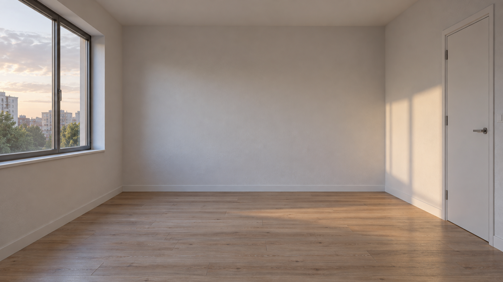
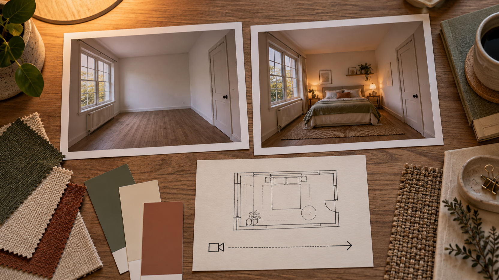
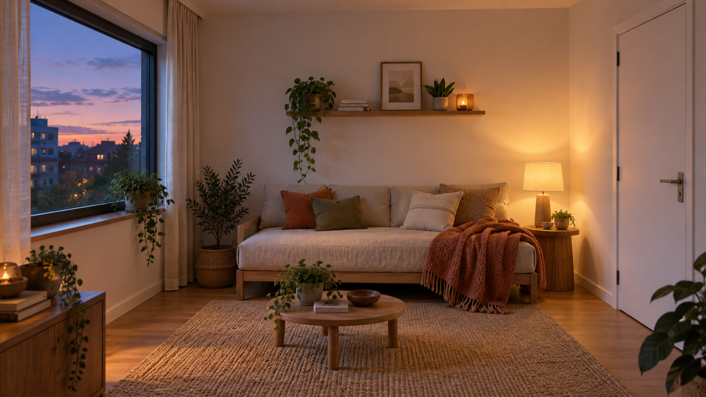

# De una habitación vacía a un rincón cálido: planifica una transición breve con MiniMax H3

Una habitación de alquiler vacía ayuda a contar una reforma breve con claridad. No hace falta imaginar una transformación enorme: basta con que el plano inicial sea reconocible, que algunos elementos se mantengan estables y que el plano final tenga una intención precisa. En esta guía, el objetivo es organizar una transición visual corta, no prometer que cualquier generación vaya a reproducirla exactamente.

Divulgación: la persona autora es fundadora de BestImage.AI. El texto parte de las funciones que describe la página del producto y no presenta una prueba independiente.

Las tres imágenes que acompañan el artículo son ilustraciones editoriales generadas para explicar el guion visual. No son capturas de la herramienta ni resultados atribuidos a MiniMax H3.

<!-- IMAGE: A-02-01 · estado inicial · insertar assets/01-vacant-rental-room-16x9.png -->

*Ilustración editorial: una habitación de alquiler vacía establece el punto de partida de la transición.*

## Define la historia de la habitación antes de escribir el prompt

El error más común en una transición de reforma no es la falta de objetos, sino la falta de una relación clara entre el principio y el final. Si el cuarto empieza vacío, el público debe poder reconocer qué ha cambiado y qué sigue en su sitio. La ventana, la puerta, la perspectiva y la luz del atardecer pueden funcionar como anclas visuales.

Antes de redactar un prompt de vídeo, conviene decidir cuatro cosas:

- El estado de partida: paredes claras, suelo de madera, habitación sin muebles y luz natural suave.
- El estado de llegada: una estancia cálida con una lámpara, una alfombra, textiles y pocas piezas funcionales.
- Lo que no cambia: la posición de la ventana y la puerta, la proporción del espacio y el punto de vista de la cámara.
- El movimiento: un avance leve o un giro suave que revele el cambio sin convertirlo en una sucesión de objetos que aparecen al azar.

Esta preparación reduce la ambigüedad del relato. También deja claro qué debe describir el texto y qué debe estar en las referencias visuales si se decide utilizarlas.

## MiniMax H3 y los fotogramas de inicio y final para ordenar la transición

La página de BestImage describe un flujo que puede empezar con un prompt escrito o combinar un prompt con un fotograma inicial y otro final. Para una habitación de alquiler, esa segunda opción puede servir como un modo de ordenar la idea: el cuarto vacío marca el inicio y una escena nocturna acogedora marca el destino. No convierte la planificación en una garantía de continuidad; simplemente hace más concreta la dirección creativa.

<!-- IMAGE: A-02-02 · planificación de referencias · insertar assets/02-reference-frame-plan-16x9.png -->

*Ilustración editorial: referencias de composición y materiales para decidir el inicio, el final y el recorrido de cámara.*

Un par de referencias puede llevar mejor la carga espacial que una lista larga de adjetivos. En este caso, cada una debería responder a una pregunta sencilla: ¿desde dónde entra la luz?, ¿qué pared recibe la lámpara?, ¿qué zona queda libre para que la cámara avance? Si el plano final cambia de mobiliario respecto a una referencia de trabajo, trátalo como una decisión de composición, no como una promesa de resultado.

La página también asocia el creador con movimiento, dirección de cámara y sonido generado. En un guion corto, es útil separar esas capas: primero la geometría del cuarto, después la transformación visual y, por último, el ambiente. Así se evita pedir a una sola frase que resuelva iluminación, decoración, movimiento y ritmo al mismo tiempo.

## Escribe un guion de cinco segundos que conserve la lógica del espacio

Según la página de BestImage, el flujo describe clips de cinco segundos a 480p y admite relaciones 16:9, 9:16 y 1:1. Para esta escena se ha elegido 16:9 porque el encuadre horizontal permite mostrar la ventana, la puerta y el cambio de atmósfera en un mismo plano. Es una elección de narración para el ejemplo, no una recomendación de rendimiento.

Un borrador de prompt puede ser directo:

> Habitación de alquiler vacía con ventana grande a la izquierda y puerta blanca a la derecha al final de la tarde. La cámara avanza lentamente hacia el centro mientras la luz se vuelve cálida. Aparecen una alfombra sencilla, una lámpara encendida, una planta y textiles discretos; la geometría de la habitación permanece estable. Ambiente de tarde que pasa a noche, sin personas ni texto.

Después conviene revisar el borrador con tres preguntas. Primero, ¿el inicio contiene detalles suficientes para reconocer el espacio? Segundo, ¿el final tiene pocos cambios importantes y no una acumulación de decoración? Tercero, ¿el movimiento de cámara revela el cambio o compite con él? Esta revisión ayuda a que el vídeo de reforma tenga una secuencia comprensible incluso antes de intentar ninguna generación.

Si se usa un fotograma inicial y otro final, el texto puede concentrarse en la transición: avance suave, encendido gradual de la lámpara, aparición contenida de los elementos y conservación de la ventana y la puerta. Si se usa solo texto, esos mismos elementos pasan al prompt con más detalle. La página de BestImage presenta ambas formas de plantear el inicio; este artículo no evalúa cuál produce un resultado superior.

## Mantén explícitos el acceso y los límites del ejemplo

La página de BestImage presenta el acceso como “100% Free” y “No Signup Required”. Son descripciones atribuidas a esa página, no una promesa permanente de disponibilidad. La misma fuente indica que las solicitudes se procesan una a una y que puede haber espera en cola, por lo que conviene planificar el guion antes de enviar una solicitud y no basar una entrega urgente en una expectativa de inmediatez.

La página también indica que los clips pueden previsualizarse y descargarse, y que el historial terminado permanece en el navegador local. Esas indicaciones sirven para pensar el flujo de revisión, pero no permiten inferir almacenamiento en la nube, acceso desde otros dispositivos ni condiciones de privacidad.

Para consultar la descripción actual del flujo, revisa [BestImage Free MiniMax H3](https://bestimage.ai/free-minimax-h3/).

## Cierra en una estancia cálida, no en una promesa de resultados

El último plano debe confirmar la idea con pocos elementos: luz de lámpara, una superficie textil, una planta y un punto de descanso. El ambiente puede sentirse terminado sin convertir la habitación en una sala de exposición. Esa contención es especialmente útil en una escena de alquiler, donde el contraste con el cuarto vacío es parte de la historia.

<!-- IMAGE: A-02-03 · estado final · insertar assets/03-warm-evening-room-16x9.png -->

*Ilustración editorial: un rincón cálido al anochecer resuelve el destino visual de la transición.*

La última revisión no debería preguntar si la escena parece más lujosa, sino si conserva la lógica del espacio. Cuando la ventana y la puerta siguen siendo reconocibles, el espectador puede leer el trayecto completo: cuarto vacío, intención visual y estancia habitable.

## Preguntas frecuentes sobre una transición de reforma con MiniMax H3

### ¿Hace falta aportar imágenes para empezar?

No necesariamente. La página de BestImage describe tanto un prompt escrito como un prompt acompañado por un fotograma inicial y uno final. Las referencias pueden ayudar a expresar una composición concreta, pero este artículo no compara resultados entre ambos enfoques.

### ¿Qué duración y formato describe la página?

La página atribuye al flujo clips de cinco segundos a 480p y relaciones 16:9, 9:16 y 1:1. El ejemplo de la habitación utiliza una composición horizontal 16:9 para dejar visibles los elementos espaciales clave.

### ¿Las imágenes de este artículo son resultados de MiniMax H3?

No. Son ilustraciones editoriales generadas para explicar la planificación de la escena. No documentan una prueba del producto ni demuestran un resultado que deba esperarse al usarlo.

## Conclusión: una transición de reforma con MiniMax H3 empieza por dos estados claros

Una transición de reforma con MiniMax H3 resulta más fácil de plantear cuando el cuarto vacío y la estancia final se definen antes del movimiento. Conserva las anclas del espacio, limita los cambios a unos pocos elementos visibles y usa el prompt para describir el recorrido entre ambos estados. El valor del guion está en hacer la intención revisable, no en prometer una transformación idéntica cada vez.

---
SEO Title: De habitación vacía a rincón cálido: transición con MiniMax H3
SEO Description: Planifica una transición visual breve para una habitación de alquiler usando un prompt y dos estados de referencia con MiniMax H3.
TAGS: MiniMax H3, vídeo con IA, reforma visual, diseño de interiores, habitación de alquiler
