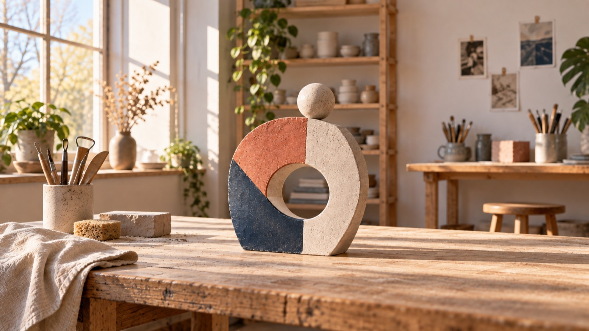
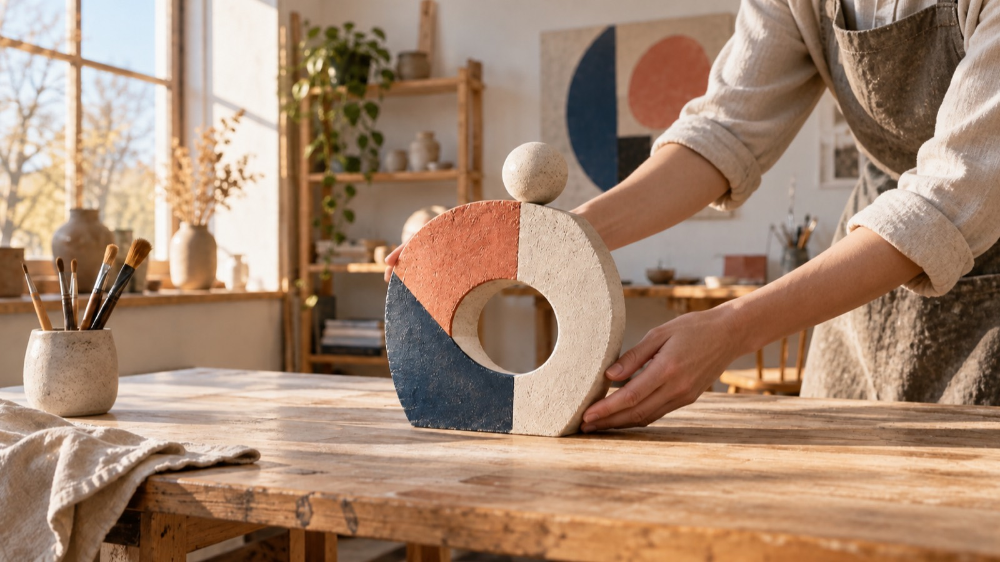
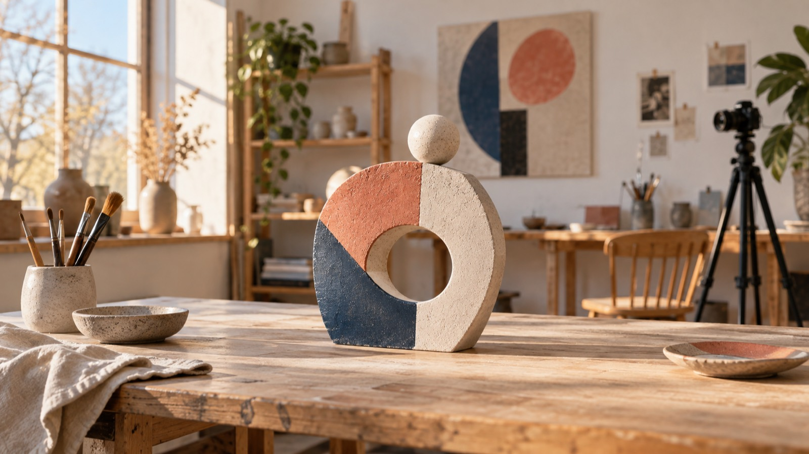

# Утренний кадр и короткий процесс-ролик: как собрать спокойную историю в MiniMax H3

Тихая студия утром уже содержит историю: свет ложится на стол, а керамическая кольцевая скульптура ручной работы с круглым проёмом и геометрическими секциями ржаво-рыжего, тёмно-синего и тёплого белого цветов ждёт своего места. Для короткого процесс-ролика не нужно превращать этот момент в шумную рекламу. Достаточно выбрать одно ясное действие — например, бережно выровнять законченную скульптуру перед съёмкой — и дать ему начало, развитие и точку покоя.

*Кольцевая скульптура на утреннем рабочем столе задаёт исходное настроение для ролика о завершённой работе.*

## Начните не с эффекта, а с жеста

В этом сюжете важен не «вау»-переход, а рука автора и её намерение. Представьте стартовый кадр: на светлом столе стоит готовая кольцевая скульптура с круглым проёмом и геометрическими цветными секциями. Затем автор мягко выравнивает её положение и убирает руки из кадра. Финальный кадр фиксирует ту же аккуратно собранную композицию.

Такой жест помогает не расплыться в перечислении деталей. Зритель быстро понимает, что перед ним: не инструкция по изготовлению с нуля, а последние спокойные минуты перед тем, как готовую вещь покажут миру. Для пяти секунд лучше выбрать одно действие, чем пытаться вместить в них всю историю работы.

## Заранее назначьте начальный и конечный кадры

Страница BestImage.AI описывает работу как текстовый запрос либо как запрос с одним начальным и одним конечным кадром. Для этого сценария удобно подготовить именно пару кадров: первый сохраняет неподвижность утра, второй показывает уже выстроенную работу. Это план кадра, а не обещание конкретного результата.

### Начальный кадр: пространство ещё не собрано

Опишите мягкий боковой свет, чистую поверхность стола и керамическую кольцевую скульптуру чуть не по центру; её круглый проём и секции ржаво-рыжего, тёмно-синего и тёплого белого цветов должны быть видны ещё до появления рук. Вместо общих слов вроде «красиво» назовите форму, фактуру и направление света. Камера может оставаться близко к уровню стола: тогда движение рук будет главным событием, а не случайной декорацией.

### Конечный кадр: автор оставляет вещь в покое

Во втором кадре та же скульптура уже выровнена, а руки выходят из кадра. Сохраняйте тот же свет, палитру ржаво-рыжего, тёмно-синего и тёплого белого и тот же угол обзора. Иначе финал станет другим сюжетом, а не естественным завершением одного действия.

*Руки автора выравнивают ту же кольцевую скульптуру: один точный жест становится серединой короткого процесса.*

## Сформулируйте запрос как режиссёрскую заметку

Хорошая заметка для такого ролика отвечает на четыре вопроса: где происходит действие, что находится в кадре, что меняется и как должна двигаться камера. Например, в рабочем черновике можно задать: «тихая мастерская ранним утром; автор спокойно выравнивает керамическую кольцевую скульптуру с круглым проёмом на столе; камера медленно приближается на уровне поверхности; мягкий дневной свет; естественная пауза после движения». Если для задумки нужен звук, страница BestImage.AI также описывает в браузерном инструменте работу с направлением камеры, движением и генерируемым звуком; это следует воспринимать как заявленную возможность сервиса, а не как оценку качества.

Не перегружайте запрос длинным списком эффектов. В этой истории пауза после жеста важнее быстрых смен планов. Она даёт зрителю время увидеть, что проект уже завершён, а автор лишь организует его для показа.

## Что разумно ожидать от формата MiniMax H3

На странице BestImage.AI указаны клипы длительностью пять секунд в 480p и соотношениях сторон 16:9, 9:16 или 1:1. Для спокойного студийного эпизода 16:9 помогает показать стол, свет и небольшое движение руки в одном горизонтальном пространстве. Это не означает, что такой ролик автоматически подходит для любой площадки или решает задачу монтажа: сначала проверьте, нужен ли именно горизонтальный фрагмент в вашем будущем процессе.

Там же BestImage.AI заявляет бесплатный доступ к MiniMax H3 без регистрации. Запросы, согласно странице, обрабатываются по одному и могут ожидать в очереди, поэтому не стоит строить расписание съёмки вокруг мгновенной выдачи. Я не провожу независимое тестирование этого инструмента и не обещаю визуальный или маркетинговый результат; здесь речь только о том, как заранее сделать короткую идею яснее.

*В финальном кадре та же скульптура остаётся в центре внимания, а штатив без маркировки на заднем плане напоминает о замысле процесс-ролика.*

## Проверьте историю до генерации

Перед запуском прочитайте идею вслух одной фразой: «Автор аккуратно выравнивает готовую кольцевую скульптуру для короткого показа». Если эта фраза звучит точнее, чем список эффектов, у ролика есть понятный центр. Если нет — сократите действие, вернитесь к двум кадрам и уберите деталь, которая не помогает увидеть финальный предмет.

Раскрытие: я — основатель BestImage.AI, поэтому открыто обозначаю связь с продуктом. Если вы хотите сверить заявленные параметры и спланировать свой короткий эпизод, откройте [MiniMax H3 без регистрации на BestImage.AI](https://bestimage.ai/free-minimax-h3/).
