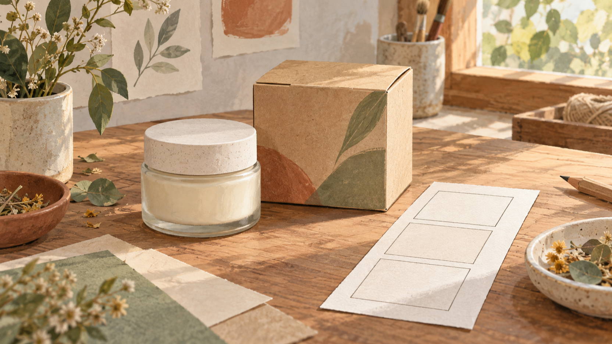
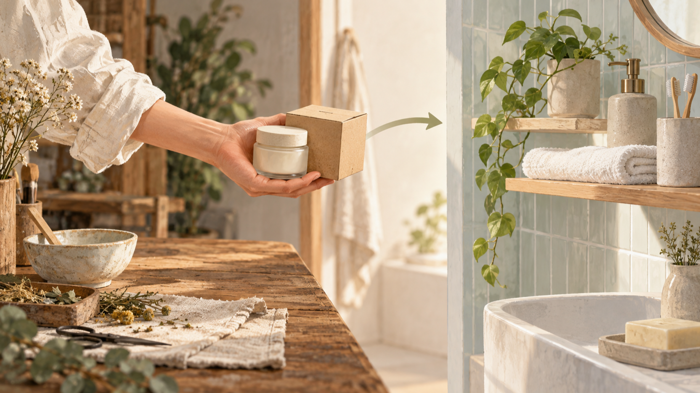
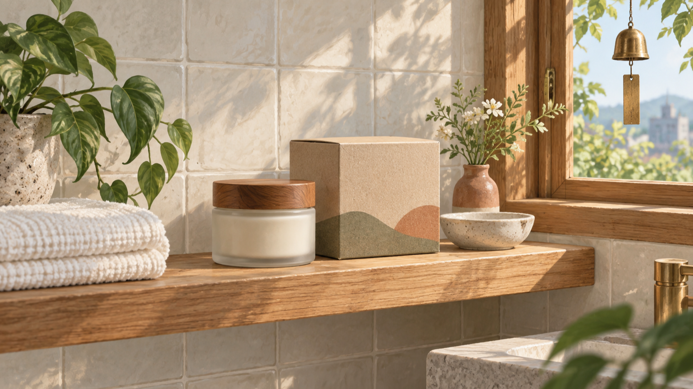

# 把手工保養品包裝放上浴室層架：9:16 短片的分鏡規劃

手工保養品的包裝，往往先在工作桌上完成：瓶罐、折盒、紙材與植物元素各自安靜地等著。若要把它們整理成一段精簡的 9:16 產品故事，與其先想像一支很長的影片，不如先選定一個上架瞬間：手把包裝帶離工作桌，放到浴室層架，讓畫面在那一刻收束。

作者為 BestImage 的創辦人；本文分享一個依照 BestImage 產品頁所述工作流程發想的創作規劃。以下三幅圖皆為本文的編輯插畫，用來說明分鏡思路；它們不是產品截圖，也不是任何工具的輸出畫面。

<!-- IMAGE-ANCHOR: A06-IMG-01 | images/a06-01-handmade-package-storyboard-16x9.png -->

*圖 1．先定義包裝的起點，才能讓直式故事有清楚的第一個畫面。*

## 先把 9:16 故事壓縮成一個上架瞬間

先把畫面拆成三個能看懂的節點即可。起點是工作桌上的包裝與手作痕跡；中段是一個明確的移動方向；結尾則是包裝在浴室層架上的安放位置。這樣安排不是為了預告任何成效，而是讓每一個畫面都回答同一件事：這個包裝從哪裡來，又準備落在哪裡。

直式構圖裡，移動不必複雜。可以把前景留給瓶罐與紙盒，把手的動作放在畫面中段，再讓層架保留在最後的視線高度。先寫下「工作桌、拿起、放上層架」三個畫面目的，後續的提示與分鏡就有了可對照的順序。

## 以文字提示或首尾畫面規劃轉換

依 BestImage 產品頁所述，這個以瀏覽器使用的創作工具可接受文字提示，也可使用文字提示搭配一張起始畫面與一張結尾畫面；頁面同時提到可描述動作、鏡頭方向與生成的聲音。對這個包裝情境而言，文字提示可以先交代材質、工作桌與浴室層架的關係；若要把開頭與收束畫面分得更清楚，則可把工作桌作為起始畫面，把層架作為結尾畫面來規劃。

這裡的重點是先把鏡頭意圖說完整，而不是替結果下結論。例如，移動可以只是一個把紙盒與瓶罐帶向右側層架的動作；鏡頭方向也只需服務於這個過程。本文不含操作測試，亦不以任何畫面品質、完成速度或行銷效果作出判斷。

<!-- IMAGE-ANCHOR: A06-IMG-02 | images/a06-02-package-to-shelf-transition-16x9.png -->

*圖 2．中段只保留一個移動方向，讓包裝走向層架的轉換更容易規劃。*

## 用五秒節奏安排浴室層架的產品故事

BestImage 的產品頁描述五秒、480p 的短片，並列出 16:9、9:16 與 1:1 比例。若選擇 9:16，這個故事可把開頭留給工作桌的材質，中間留給手帶著包裝的移動，最後把視線停在層架上的瓶罐與紙盒。這是一份節奏規劃，不是對成片外觀或使用情境的保證。

在收束前，可再問三個小問題：層架上要留下哪一個主角？毛巾、植物或陶器要如何陪襯而不搶走包裝？若需要聲音提示，它是否只是在提醒觀眾「已放妥」？把答案縮小到一個主體、一個方向與一個結尾位置，會比堆疊太多物件更容易維持故事的焦點。

<!-- IMAGE-ANCHOR: A06-IMG-03 | images/a06-03-bathroom-shelf-closing-16x9.png -->

*圖 3．結尾以層架上的安放瞬間收束，讓畫面與聲音提示都服務同一個產品故事。*

## 免費 MiniMax H3 影片生成器，無需註冊：先理解頁面說明

BestImage 將這條路徑標示為免費、無需註冊；其 FAQ 也對生成次數作出說明。同時，BestImage 說明請求會一次處理一個，可能需要在佇列中等候，因此這不是即時輸出的承諾。若要先對照目前的頁面說明，可查看[BestImage 免費 MiniMax H3 影片生成器的產品頁](https://bestimage.ai/free-minimax-h3/)。

這個說明最適合放在分鏡已經清楚之後：先知道自己要呈現工作桌、移動與層架三個節點，再判斷文字提示或首尾畫面是否足以表達它。本文不延伸到付款方式、浮水印、保存、隱私、權利或其他未在指定產品頁事實範圍內的條件。

## 把分鏡交回自己的創作判斷

當 BestImage 所標示的「免費 MiniMax H3 影片生成器，無需註冊」成為你理解頁面入口的方式時，仍可把創作判斷留在畫面本身：從手工保養品包裝的工作桌起步，以單一移動帶到浴室層架，最後讓產品在一個安靜的位置落下。這份規劃只提供可討論的故事骨架；下一個畫面要保留什麼，仍由你的產品與敘事目的決定。
