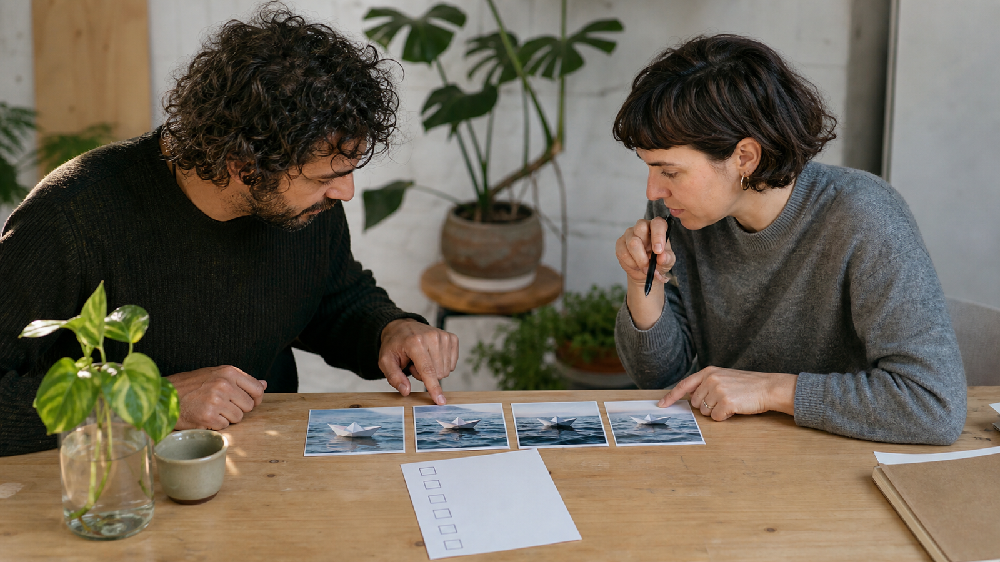

# مطالبات MiniMax H3 لتحويل الصور إلى فيديو: من الخطة الإبداعية إلى واجهة FLAQ

عندما تبدأ بصورة ثابتة، لا تكون المشكلة في كتابة كلمات أكثر، بل في تحديد ما الذي يجب أن يبقى ثابتاً وما الذي ينبغي أن يتحرك. هذا الدليل يشرح طريقة عملية لتنظيم **مطالبات MiniMax H3 لتحويل الصور إلى فيديو** مع الفصل بين خطة إبداعية قابلة للمراجعة وبين ما تصفه صفحة الخدمة فعلاً.

*صورة افتتاحية: اختيار صورة البداية قرار تحضيري قبل كتابة الحركة.*

## ما الذي تصفه واجهة FLAQ، وما الذي لا تصفه؟

تذكر [صفحة FLAQ العربية لتحويل الصور إلى فيديو](https://flaq.ai/ar/models/minimax/minimax-h3-image-to-video/) أن خدمة MiniMax H3 تحتاج إلى **إطار البدء**، وتعرض تحكماً اختيارياً في **الإطار النهائي** وحقل **الموجه**، مع تسميات لمدة من 5 إلى 15 ثانية ودقة 768p أو 2K. هذه أوصاف من صفحة FLAQ الحالية للواجهة؛ وليست نتيجة اختبار مخرجات، ولا حكماً على جودة الفيديو أو نجاحه.

لا تعني هذه الحقول أن كل تفصيل في خطة العمل يتحول إلى إعداد منفصل. من المفيد أن تكتب خطتك أولاً بلغة بشرية واضحة، ثم تنقل فقط ما يلائم حقل الموجه والصور المرجعية المتاحة في الخدمة.

## ابدأ بإطار البدء قبل وصف الحركة

اختر صورة بداية تؤدي وظيفة واحدة مفهومة. إن كان موضوعك قارباً ورقياً، فقرّر قبل كتابة الموجه: هل ترى القارب من مستوى الماء؟ ما موضعه داخل الكادر؟ وما تفاصيل الورق أو الضوء التي لا تريد تبديلها؟ هذا لا يضمن نتيجة بعينها؛ إنه يجعل المراجعة اللاحقة أكثر تحديداً لأنك تعرف ما كنت تحاول الحفاظ عليه.

بعد ذلك، اكتب التغيير المرغوب بوصف قابل للملاحظة: حركة القارب، اتجاه الموج، سرعة الكاميرا، ثم الحالة التي تريد الوصول إليها. وإذا اخترت إطاراً أخيراً، فاعتبره مرجعاً اختيارياً لنقطة الوصول وفق وصف الصفحة، لا دليلاً على أن أي انتقال بين الصورتين سيتحقق كما تتخيله.

## استخدم مطالبات MiniMax H3 لتحويل الصور إلى فيديو كمادة تخطيط، لا كقائمة قدرات للواجهة

يوفر [مستودع مطالبات MiniMax H3 على GitHub](https://github.com/flaqai/awesome-minimax-h3-video-prompts) مورداً مرخّصاً بترخيص MIT ومصاناً من FLAQ. في المرجع المثبت `f639f9d6d0a3273ca85be4461e0a1265cb481387`، جرى التحقق من 84 وصفة موزعة على 24 فئة مرقمة.

اقرأ الوصفة المناسبة كطريقة لترتيب التفكير: الهدف، عناصر المشهد، الحركة، الكاميرا، وما ينبغي مراجعته. لا تحوّل ذكر الوصفة للصوت أو التحرير أو المراجع المتعددة أو النشر المحلي إلى ادعاء بأن واجهة FLAQ لتحويل الصور إلى فيديو تقبل تلك المدخلات أو تنفذ تلك المهام. هذه مسائل مختلفة عن حقول الواجهة الموصوفة أعلاه.

*صورة وسطية: تحويل فكرة الحركة إلى مسار مراجعة قبل إدخالها في أي واجهة.*

## قالب تحضيري أصلي للموجه

يمكنك استعمال هذا القالب القصير لتجهيز الفكرة. إنه مثال تحضيري أصلي، وليس نصاً من المستودع ولا مجموعة حقول مؤكدة للواجهة:

> **صورة البداية:** قارب ورقي صغير على ماء هادئ، منظور منخفض.\
> **المشهد والحركة:** يتقدم القارب ببطء إلى الأمام وتظهر تموجات خفيفة خلفه.\
> **الكاميرا:** متابعة جانبية هادئة من دون قطع.\
> **الاستمرارية:** حافظ على شكل القارب وملمس الورق واتجاه الضوء.\
> **نقطة الوصول:** يقترب القارب من منتصف الكادر؛ إن استُخدم إطار نهائي فليكن مرجعاً لهذه الحالة.

قبل وضع النص في **الموجه**، احذف التفاصيل التي لا تستطيع التحقق منها من الصورة. ثم اسأل: ما الحركة الوحيدة الأساسية؟ ما الذي يجب أن يبقى ثابتاً؟ وهل توضح صورة البداية ذلك بالفعل؟ بهذه الأسئلة تصبح المطالبة وصفاً للمشهد بدلاً من قائمة وعود.

## راجع الفيديو كقرار بشري منفصل

عند مراجعة أي فيديو، قارن النتيجة بالخطة التي كتبتها: هل بقي موضوع الصورة قابلاً للتعرّف؟ هل حدثت الحركة التي طلبتها؟ وهل أضافت الكاميرا أو الإضاءة ما لم تكن تقصده؟ إذا لم يناسبك شيء، غيّر عنصراً واحداً في الخطة في كل مرة، مثل اتجاه الحركة أو وصف الكاميرا، وسجل سبب التغيير.

هذه المراجعة لا تُعد اختباراً مستقلاً للخدمة ولا تثبت أفضلية نموذج أو ترتيباً بين أدوات. هي ببساطة طريقة لتبقي قرارك الإبداعي مرئياً وقابلاً للنقاش.

*صورة ختامية: مراجعة بشرية للتسلسل وحدود الاستخدام قبل اعتماد قرار إبداعي.*

## خلاصة عملية

ابدأ بإطار بدء واضح، صف حركة واحدة يمكن ملاحظتها، واستعمل الإطار النهائي فقط عندما يلزم كمرجع اختياري. خذ من مورد المطالبات طريقة تنظيم الفكرة، لا دليلاً على قدرات الواجهة. ثم راجع ما وصل إليك مقابل خطتك وغيّر سبباً واحداً في كل مرة.

المؤلف مؤسس FLAQ؛ يقدّم المقال خدمة FLAQ لتحويل الصور إلى فيديو باستخدام MiniMax H3 ومورد المطالبات؛ ولا يورد اختباراً مستقلاً للمخرجات.
