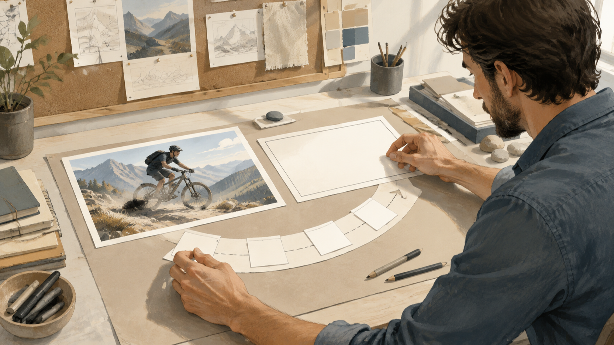
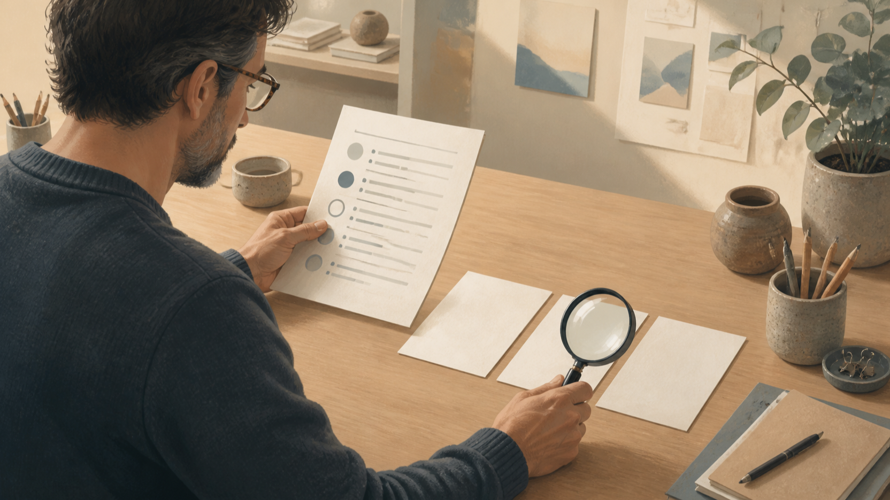

# MiniMax H3 Bild-zu-Video-Prompts: Referenzbilder in einen prüfbaren Workflow übersetzen

Ein gutes Referenzbild beantwortet noch nicht die wichtigste Arbeitsfrage: Was soll sich im Bild bewegen, was soll gleich bleiben und woran lässt sich später prüfen, ob die Vorgabe verständlich war? Für MiniMax H3 Bild-zu-Video-Prompts ist deshalb ein kurzer, prüfbarer Ablauf hilfreicher als ein besonders ausgeschmückter Einzeiler. Er überführt eine Bildreferenz in klare Entscheidungen zu Ausgangszustand, Bewegung, Kameraführung und gewünschtem Zielzustand.

**Offenlegung:** Der Autor ist Gründer von FLAQ. Der Beitrag stellt die FLAQ-Bild-zu-Video-Route und zugehörige Prompt-Ressourcen vor; er berichtet keinen unabhängigen Test erzeugter Ergebnisse.

*Redaktionelle Illustration: Ein Referenzbild in einen überprüfbaren Bewegungsplan übersetzen.*

## Vom Referenzbild zur prüfbaren Aufgabe

Bevor ein Prompt entsteht, lohnt sich ein Blick auf die Referenz wie auf ein Briefing. Notieren Sie nicht alles Sichtbare, sondern nur die Entscheidungen, die später überprüfbar sein sollen. Bei einer Person im Bild können das etwa Blickrichtung, Kleidung, Position im Raum und die beabsichtigte Bewegung sein. Bei einer Landschaft können Horizont, Hauptmotiv, Lichtstimmung und die Bewegungsrichtung im Vordergrund wichtiger sein.

Eine nützliche Arbeitsnotiz trennt dabei vier Ebenen:

1. **Ausgangszustand:** Was zeigt das Referenzbild unverzichtbar?
2. **Kernbewegung:** Welche einzelne Veränderung soll im Zeitverlauf stattfinden?
3. **Kamera:** Bleibt die Perspektive ruhig, folgt sie einem Motiv oder verändert sie bewusst die Distanz?
4. **Kontinuität:** Welche Merkmale dürfen nicht unbeabsichtigt wechseln?

Das Ergebnis ist keine Zusage über ein späteres Video. Es ist ein kontrollierbares Briefing: Ein Team kann erkennen, welche Vorgabe fehlt, bevor es eine Variante beurteilt oder weiterverwendet.

## Welche Eingaben aktuell zur FLAQ-Bild-zu-Video-Route gehören

Die [deutsche FLAQ-Seite für MiniMax H3 Bild-zu-Video](https://flaq.ai/de/models/minimax/minimax-h3-image-to-video/) beschreibt ein erforderliches Startbild, einen Prompt und eine optionale Steuerung über ein Endbild. Außerdem ist dort eine Dauersteuerung im Bereich von 5 bis 15 Sekunden sowie ein Auflösungsselektor sichtbar. Diese Angaben helfen beim Planen der Eingaben; sie sind kein Ersatz für eine Prüfung der aktuell sichtbaren Auswahl im jeweiligen Arbeitskontext.

Für den Workflow folgt daraus eine klare Reihenfolge. Das Startbild ist die belastbare Referenz für den Ausgangszustand. Das Endbild ist nur dann sinnvoll, wenn ein bestimmter Zielzustand wichtig ist und bewusst als optionale Richtung vorgegeben werden soll. Der Prompt verbindet beide Punkte mit einer nachvollziehbaren Bewegungs- und Kamerabeschreibung. Die Dauer sollte anschließend zum Umfang dieser einen Bewegung passen, statt mehrere unabhängige Ereignisse in einen kurzen Ablauf zu pressen.

## Den Prompt in Schichten bauen

Ein prüfbarer Prompt muss nicht kompliziert klingen. Er sollte jedoch so gegliedert sein, dass eine Änderung an einer Ebene nicht unbemerkt eine andere ersetzt. Eine Arbeitsformel kann so aussehen:

> sichtbarer Ausgangszustand → eine Kernbewegung → Kamerabewegung → unveränderte Merkmale → beobachtbarer Zielzustand

Beginnen Sie mit dem, was bereits im Startbild erkennbar ist. Formulieren Sie dann eine Bewegung als Abfolge, nicht als Sammlung von Stimmungswörtern. „Die Person dreht den Kopf zur Fensterscheibe“ lässt sich leichter besprechen als eine allgemeine Aufforderung zu einer „dynamischen, filmischen Szene“. Ergänzen Sie die Kamera separat: statisch, langsam folgend oder mit einer klaren Richtungsänderung. Schließlich halten Sie fest, welche Eigenschaften kontinuierlich bleiben sollen, etwa Motiv, räumliche Relation oder dominierende Bildkomposition.

*Redaktionelle Illustration: Den Prompt in sichtbare Schichten und Kontinuitätsregeln gliedern.*

Diese Trennung verhindert keine Abweichungen. Sie macht sie aber benennbar: War die Bewegung unklar, kollidierte die Kamerabeschreibung mit dem Zielzustand oder fehlte eine Kontinuitätsregel? So bleibt der Prompt ein überprüfbares Arbeitsdokument statt einer nachträglichen Deutung.

### Das Endbild als optionale Richtung einsetzen

Ein Endbild ist keine Pflichtvorgabe. Verwenden Sie es, wenn der Schlusszustand für die Aufgabe entscheidend ist: etwa wenn ein Objekt an einer anderen, klar definierten Stelle enden soll oder wenn ein Übergang auf eine bestimmte Komposition zulaufen muss. Fehlt ein solcher Bedarf, genügt das Startbild zusammen mit einer präzisen Bewegungsbeschreibung.

Wenn ein Endbild eingesetzt wird, sollte es mit dem Prompt dieselbe Geschichte erzählen. Vergleichen Sie daher vorab Motiv, Blickrichtung, räumliche Logik und die gewünschte Kameraführung. Ein Endbild, das eine andere Szene verlangt als der Text beschreibt, erzeugt keine prüfbare Richtung.

## Das Prompt-Repository richtig einordnen

Das [FLAQ-Repository mit MiniMax-H3-Prompts](https://github.com/flaqai/awesome-minimax-h3-video-prompts) ist als Ideenindex nützlich: Sein aktueller Index nennt 84 Prompt-Rezepte in 24 Kategorien. Diese Zahl beschreibt den dokumentierten Umfang des Repository-Index, nicht die Leistungsfähigkeit eines Modells, eine Erfolgsaussicht oder eine Qualitätswertung.

Lesen Sie die Beispiele deshalb als Strukturhilfe. Sie können eine Kategorie auswählen, die ähnliche Bild-, Bewegungs- oder Kamerafragen behandelt, und daraus eine eigene, überprüfbare Arbeitsnotiz ableiten. Das Repository enthält auch Beispiele zu mehreren Modalitäten, Audio und lokaler Bereitstellung. Solche Abschnitte sind von der hier beschriebenen Bild-zu-Video-Route zu trennen: Sie belegen weder zusätzliche Eingaben noch einen Audio-Endpunkt für diese Route.

Eine gute Anpassung übernimmt nicht blind eine Formulierung. Sie ersetzt jedes allgemeine Motiv durch die sichtbaren Fakten des eigenen Startbilds, begrenzt die Kernbewegung und streicht alles, was sich nicht am Briefing prüfen lässt.

## Vor der Nutzung prüfen: Bewegung, Kontinuität und Grenzen

Die letzte Schleife ist kein unabhängiger Output-Test. Sie ist eine Prüfung, ob die vorab notierten Anforderungen noch zueinander passen. Arbeiten Sie dafür mit einer kurzen Liste:

- Entspricht der beschriebene Ausgangszustand wirklich dem gewählten Startbild?
- Lässt sich die Kernbewegung in einer Reihenfolge erzählen?
- Ist die Kameraführung mit dieser Bewegung und einem möglichen Endbild vereinbar?
- Sind die Merkmale benannt, die in der Szene kontinuierlich bleiben sollen?
- Ist klar, welche Beobachtung bei einer Abweichung erneut präzisiert werden müsste?

*Redaktionelle Illustration: Vor der Nutzung sichtbare Abweichungen und Grenzen prüfen.*

Notieren Sie bei einer Abweichung nicht nur „nicht passend“, sondern den betroffenen Teil der Arbeitsformel. So kann das Team den Ausgangszustand, die Bewegung, die Kamera oder die Kontinuität gezielt überarbeiten. Der Artikel bleibt bei der Prüfung des Briefings.

## Fazit: MiniMax H3 Bild-zu-Video-Prompts als überprüfbares Briefing

Der robuste Teil eines MiniMax-H3-Bild-zu-Video-Workflows liegt vor der Ausgabe: ein eindeutiges Startbild, ein optionales Endbild nur bei echtem Bedarf und ein Prompt mit getrennten Schichten für Bewegung, Kamera und Kontinuität. Die sichtbare Dauersteuerung von 5 bis 15 Sekunden und der Auflösungsselektor sind dabei Planungsparameter, keine Ergebnisgarantie. Wer die Referenz in eine solche Prüfliste übersetzt, kann Anforderungen sauberer besprechen, Änderungen dokumentieren und die Grenzen des eigenen Briefings transparent halten.

### Häufige Fragen

### Ist ein Endbild für MiniMax H3 Bild-zu-Video erforderlich?

Nein. Die deutsche FLAQ-Seite beschreibt das Startbild als erforderlich und die Steuerung über ein Endbild als optional. Entscheidend ist, ob der Zielzustand für Ihr Briefing tatsächlich festgelegt werden muss.

### Beweist ein Prompt aus dem Repository eine bestimmte Endpunkt-Funktion?

Nein. Das Repository ist ein Ideenindex. Mehrmodale, Audio- oder lokale Bereitstellungsbeispiele sind nicht mit den verifizierten Eingaben der beschriebenen Bild-zu-Video-Route gleichzusetzen.

### Welche Auflösung sollte ich wählen?

Die deutsche FLAQ-Seite zeigt einen Auflösungsselektor. Dieser Beitrag sagt keine bestimmten Auswahlwerte zu; prüfen Sie die aktuell sichtbaren Optionen in Ihrem vorgesehenen Arbeitskontext und dokumentieren Sie die Wahl im Briefing.
