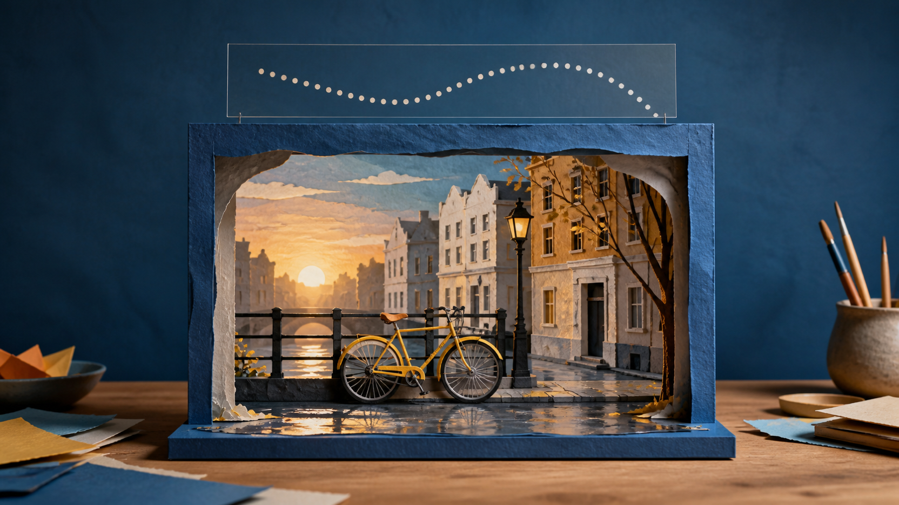
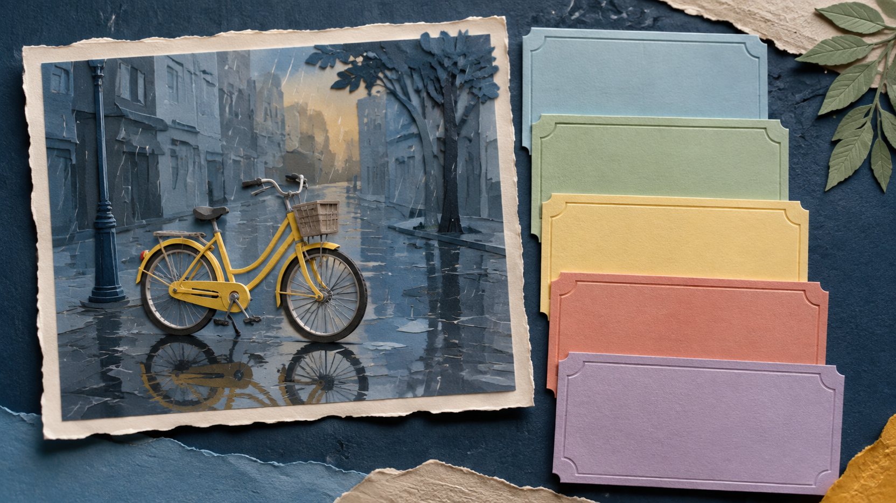

# From One Reference Image to a MiniMax H3 Prompt: A Calm Anatomy for Motion

A reference image can make a MiniMax H3 image-to-video prompt feel deceptively easy. You can point at a rain-dark street, a yellow bicycle, and a warm window in the distance, then ask for “cinematic motion.” But a reference image is a dense bundle of decisions. It holds place, light, materials, scale, framing, and atmosphere at once. If the prompt merely repeats adjectives, it has not decided what should move or what should remain the point of the scene.

This guide offers a restrained way to read one image before writing. It is a planning habit, not a promise about a generated result. The useful question is not “How do I describe everything?” It is: “What is the smallest set of observations that gives this image a direction?”

*A reference can supply a place and a mood; the writer still has to choose one visible direction.*

## Start by separating what is already there from what could change

Imagine a reference photo of a yellow bicycle beside a wet canal street at dusk. Before adding a verb, take an inventory. The bicycle is the focal subject. The pavement carries reflections. The buildings make a narrow corridor. The light is low and warm at the horizon. The camera is near street level and slightly to the side.

Those observations are not yet a prompt. They are the starting state. Keeping them separate from the desired change prevents a common muddle: treating a still image as if it already contains a sequence.

Write two short lists:

- **What the reference establishes:** subject, setting, composition, light, material, and mood.
- **What the next moment could introduce:** one action, one camera relationship, and one sense of time.

The first list keeps the reference legible. The second list gives it a direction. Neither needs to be exhaustive. In fact, the smaller list is usually easier to reason about because it reveals the tradeoff: if the bicycle rolls forward, what becomes less important? If the camera moves closer, what part of the street no longer needs to carry the scene?

## Read the image in five layers

The following layers are a writing anatomy, not a menu of product controls. They help turn a visual observation into a clear creative brief.

### 1. The anchor

Name the one thing a viewer should notice first. In the bicycle image, the anchor is not “a European city,” “rain,” and “a bicycle” equally. It is the yellow bicycle in a narrow wet street. A good anchor is concrete enough to point to in the reference and modest enough that it can stay central.

### 2. The visible change

Choose one change that can be seen rather than a mood word that has to be guessed. “The bicycle begins to roll away from the curb” is a visible change. “Make it emotional” is an editorial aspiration. The second may matter to a director, but it does not tell a reader what to observe in the imagined sequence.

The change does not need to be dramatic. A wheel beginning to turn, a reflection stretching after a tire passes, or a rider entering the frame are all smaller than a full plot. That restraint is a feature: it lets the reference remain recognisable while the motion has a purpose.

### 3. The camera relationship

Describe how the viewer relates to the change. Does the view stay at street level? Does it hold its distance while the bicycle moves through the frame? Does it drift backward just enough to reveal more pavement? Use one relationship, not a catalogue of moves.

The FLAQ [MiniMax H3 Image to Video page](https://flaq.ai/models/minimax/minimax-h3-image-to-video/) uses the terms “movement,” “camera behavior,” “timing,” and “scene evolution” in its English description. Those are useful names for a planning conversation. They are not evidence that a particular sentence is a guaranteed instruction.

### 4. The time shape

Give the change a simple rhythm. “The scene holds for a beat; the bicycle moves; the view settles on the wet street” is enough to establish an opening, a change, and a pause. A time shape keeps a prompt from reading like a static caption with a motion word attached.

Avoid adding a second event just because the image feels rich. If the bicycle is moving, the street does not also need to transform, the weather does not also need to change, and a crowd does not also need to arrive. A single beat is often more faithful to the reference than a chain of spectacle.

### 5. The boundary

Finally, state what the brief is trying to preserve. For the bicycle, that may be its yellow color, the rain-washed pavement, the narrow street geometry, and the dusk palette. A boundary is not a guarantee; it is a way to tell yourself which observations matter enough to keep in the written direction.

*Five blank cards stand in for the observations that become a compact creative brief, not for software settings.*

## Use prompt anatomy from a reference image to shape a MiniMax H3 image-to-video prompt

Once the five layers are clear, write them in plain language before turning them into a single paragraph. Here is a deliberately modest planning note for the imaginary bicycle reference:

> A yellow bicycle remains the focal subject on a narrow rain-washed street at dusk. After a brief still moment, it begins to roll away from the curb while the street-level view holds beside it. The movement is unhurried; reflections stretch across the pavement as the bicycle passes. Keep the quiet dusk light, wet road texture, and yellow bicycle central.

This is not a magic formula, and it is not a demonstration of a model result. It is simply a readable set of choices: anchor, action, viewpoint, rhythm, and boundary. If the note feels crowded, remove a choice rather than decorate it. If it feels vague, replace one adjective with something visible.

The supplied [MiniMax H3 prompt repository](https://github.com/flaqai/awesome-minimax-h3-video-prompts) is useful here as a separate prompt-resource reference: its recipes distinguish reference roles, timelines, continuity notes, and avoidances. That repository also discusses broader materials that do not describe the FLAQ image-to-video page. Keep the sources separate: a creative prompt structure is not proof of an endpoint feature.

## Use the reference as evidence, not as a shopping list

The strongest part of a single reference image is often its internal logic. The wet pavement explains the reflection. The tight street explains why a modest camera relationship feels intimate. The yellow bicycle gives the eye a fixed point. When the brief respects that logic, the writing becomes more specific without becoming longer.

This is also why copying every visible detail is rarely helpful. A reference might contain window frames, a lamp, rain streaks, paving stones, shopfronts, and distant figures. Most are supporting evidence for the scene, not separate story requirements. Treating each one as equally important makes the direction hard to read.

## A final editing pass: ask five questions

Before you keep a reference-image-led prompt, read it once as if you had never seen the picture. Can you answer these questions from the words alone?

1. What is the focal subject?
2. What single visible change begins the sequence?
3. Where is the viewer in relation to that change?
4. What is the simple time shape?
5. Which few visual facts are worth preserving in the brief?

If one answer is missing, add an observation. If two answers compete, choose the one that serves the anchor. The aim is not to squeeze an entire film into one paragraph. It is to give one still image a clear next moment.

*A finished brief can be small: one image, one change, one viewpoint, one rhythm, and a few boundaries.*

That is what prompt anatomy from a reference image can offer a MiniMax H3 image-to-video prompt: a calmer kind of prompt writing. You are not claiming that a reference controls every detail, and you are not treating a planning note as a promise. You are making the image easier to read: first as a place, then as a moment, then as a direction.

Disclosure: I am the founder of FLAQ. This article introduces our MiniMax H3 image-to-video service and prompt resources. It does not report independent output testing.
