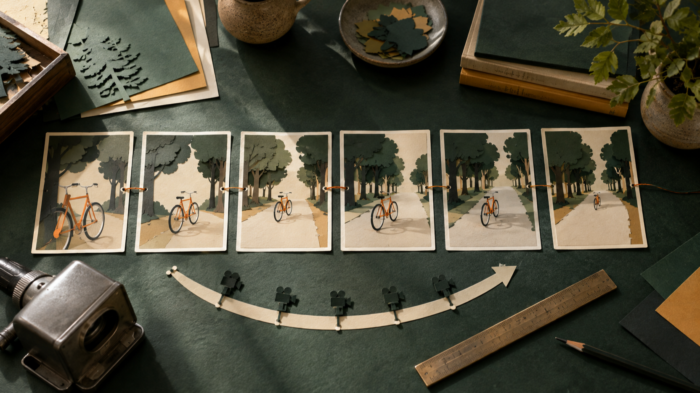

# Prompt per MiniMax H3 immagine-video: progettare riferimenti, azione e controlli

Un prompt immagine-video utile non comincia da una lista di aggettivi: comincia da una decisione su che cosa deve restare riconoscibile e che cosa deve cambiare. Questa guida propone una routine di progettazione per chi parte da una fotografia o da un’illustrazione di riferimento e vuole descrivere un’azione breve, una scelta di camera e criteri di controllo prima dell’invio.

**Trasparenza:** sono il fondatore di FLAQ e ho quindi un rapporto commerciale con FLAQ. Questo articolo presenta la relativa risorsa MiniMax H3 immagine-video e le risorse di prompt; non riporta test indipendenti dell’output.

*Una metafora editoriale della preparazione: definire il riferimento e il movimento prima di formulare il prompt.*

## Partire dal riferimento, non dall’effetto

Tratta l’immagine iniziale come una breve specifica visiva. Prima di chiedere movimento, annota ciò che non deve cambiare: soggetto principale, ambiente, direzione della luce, rapporto fra gli oggetti e punto da cui la camera osserva la scena. Non è necessario trasformare l’immagine in una descrizione enciclopedica; è più utile scegliere pochi elementi verificabili.

Per esempio, invece di chiedere semplicemente “una bici che si muove”, si può fissare: bici arancione, strada alberata, luce laterale del tardo pomeriggio, inquadratura all’altezza del manubrio. Questi vincoli rendono leggibile la richiesta e rendono più semplice il controllo successivo. La pagina [MiniMax H3 image-to-video di FLAQ](https://flaq.ai/models/minimax/minimax-h3-image-to-video/) documenta un flusso immagine-video con primo fotogramma richiesto e fotogramma finale opzionale: il riferimento iniziale merita quindi di essere scelto con cura.

## Costruire il prompt in cinque blocchi

### 1. Riferimento e invarianti

Apri con il soggetto e gli aspetti da conservare. Nomina un solo soggetto dominante e indica quali tratti devono rimanere stabili. Evita di introdurre nel testo dettagli che l’immagine non contiene, se non sono davvero necessari alla scena.

### 2. Un’azione osservabile

Scegli un’azione con inizio, sviluppo e arresto: avanzare di pochi metri, voltarsi verso una finestra, sollevare un oggetto, passare dietro un elemento in primo piano. Un verbo concreto è più utile di “rendere dinamico”. Per una durata breve, una sola azione principale è spesso più controllabile di una catena di eventi.

### 3. Camera e inquadratura

Specifica il punto di vista prima del movimento di camera: campo medio laterale, primo piano fermo, vista dall’alto, macchina che accompagna lentamente il soggetto. Poi descrivi una sola traiettoria, come una panoramica lenta o un lieve avvicinamento. Non serve promettere un risultato: questa parte è un’intenzione di regia da confrontare dopo la generazione.

*Una metafora editoriale della sequenza: una singola azione e una sola scelta di camera rendono il controllo più leggibile.*

### 4. Continuità e limiti

Indica cosa non deve mutare tra un momento e l’altro: colore e forma del soggetto, direzione della luce, numero di persone, geometria del luogo, posizione di un oggetto chiave. Includi anche gli elementi da evitare, per esempio nuovi cartelli, duplicazioni o cambi di abbigliamento. Sono criteri di pianificazione, non garanzie sul comportamento dell’output.

### 5. Controllo prima dell’uso

Concludi il prompt con una piccola lista di verifica. Chiediti se l’azione è unica, se il punto di vista è chiaro e se gli invarianti sono osservabili. Dopo la generazione, confronta il risultato con quella lista: soggetto, azione, camera, luce e continuità. Il controllo non sostituisce una prova indipendente del modello; è un modo pratico per decidere se rivedere il testo del prompt o il riferimento scelto.

## Un modello di prompt da adattare

Puoi usare questa struttura come promemoria, sostituendo le parti tra parentesi con dati presenti nel tuo riferimento:

> Mantieni [soggetto e tratti visivi] nell’ambiente [luogo e luce]. Mostra [un’azione principale] dall’inquadratura [punto di vista], con [un solo movimento di camera]. Conserva [invarianti di identità, scena e luce]. Evita [cambiamenti indesiderati]. Per il controllo, verifica [tre elementi osservabili].

Una possibile lettura operativa è: prima il riferimento, poi l’azione, quindi la camera, infine i limiti e la lista di controllo. Se un prompt diventa troppo fitto, togli i dettagli che non servono a distinguere la scena invece di aggiungere nuovi effetti.

## Separare le fonti dai limiti dell’endpoint

La documentazione pubblica della pagina FLAQ indica per questo endpoint immagine-video un primo fotogramma obbligatorio, un fotogramma finale opzionale, durate da 5 a 15 secondi e le risoluzioni elencate 768p e 2K. Questi dati aiutano a decidere quanto sia compatta la scena da pianificare. Non uso qui il prezzo, le diciture di gratuità o 480p: la disponibilità di 480p non è confermata dalla lista di parametri della pagina.

La raccolta [awesome-minimax-h3-video-prompts](https://github.com/flaqai/awesome-minimax-h3-video-prompts) è una risorsa distinta per idee di prompt. Al commit `f639f9d6d0a3273ca85be4461e0a1265cb481387`, i file numerati contengono 84 prompt in 24 categorie. Questa delimitazione è importante: esempi del repository che parlano di audio, più riferimenti, editing, localizzazione o deployment locale non dimostrano che tali funzioni siano disponibili in questo endpoint FLAQ.

## Una routine di controllo in quattro passaggi

1. **Rileggi il riferimento.** Elenca tre elementi che devono restare uguali.
2. **Riduci l’azione.** Conserva un solo evento centrale e un solo gesto di camera.
3. **Rendi visibili i vincoli.** Scrivi gli elementi da mantenere e quelli da evitare in frasi separate.
4. **Confronta senza attribuire meriti.** Verifica la lista dopo la generazione e annota cosa cambieresti nel prompt; non trasformare questa verifica interna in un giudizio di qualità indipendente.

*Una metafora editoriale della chiusura: confrontare gli invarianti scelti prima di riutilizzare o rivedere un prompt.*

## Conclusione

Un prompt immagine-video più leggibile non richiede di predire il risultato. Richiede di decidere che cosa osservare: riferimento, azione, camera, continuità e controllo. Quando ogni blocco ha un compito preciso, è più facile accorciare la richiesta, cambiare una variabile per volta e documentare i limiti senza attribuire all’endpoint capacità che non sono state verificate.
