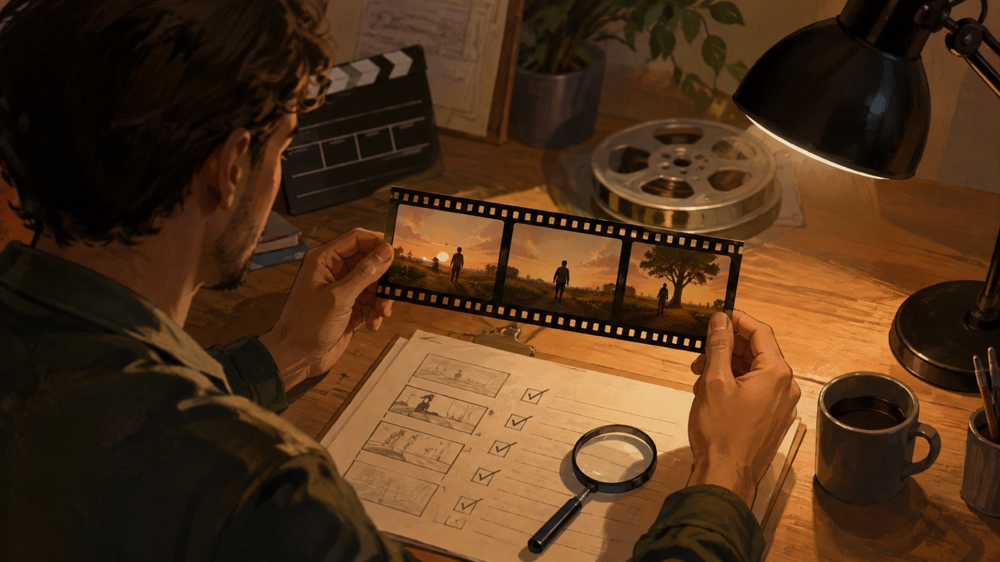

# Prompts MiniMax H3 para imagem em vídeo: um briefing claro antes de gerar

Neste guia de prompts MiniMax H3 para imagem em vídeo, o ponto de partida é a imagem de referência e o resultado que a equipe precisa revisar, não uma promessa de qualidade. Na página portuguesa da FLAQ, o endpoint MiniMax H3 Image-to-Video descreve primeiro quadro obrigatório, controle opcional do quadro final, vídeos de 5 a 15 segundos e saída em 768p ou 2K. Use esses limites como um briefing de produção antes de gerar.

## Comece pela imagem em vídeo e pelo primeiro quadro

Para cada tomada, descreva o que a imagem inicial precisa fixar: sujeito, enquadramento, proporção, luz e elementos que não podem mudar. Depois, escreva o movimento de forma observável: aproximação, deslocamento de câmera, ação do sujeito e estado final desejado. Se a tomada depender de uma composição final específica, registre também esse quadro final; no endpoint, esse controle é opcional, não uma garantia de resultado.

*Ilustração editorial gerada por IA; não é resultado, interface ou teste do MiniMax H3.*

## Prompts MiniMax H3: use uma ficha de cinco campos

Uma ficha curta evita que “mais detalhes” virem instruções contraditórias:

1. **Referência:** o que a imagem inicial define.
2. **Ação:** o que se move e em que ordem.
3. **Câmera:** ponto de vista, distância e deslocamento.
4. **Continuidade:** o que deve permanecer reconhecível.
5. **Encerramento:** quadro final desejado ou razão para deixá-lo aberto.

O prompt pode incluir uma duração-alvo compatível com o intervalo disponível, mas confirme a configuração atual antes de planejar uma entrega. A página não sustenta uma comparação de desempenho, taxa de sucesso ou preço garantido.

## Use receitas do repositório como referência, não como capacidade do endpoint

No snapshot de 1 de setembro de 2026 do commit `f639f9d6d0a3273ca85be4461e0a1265cb481387`, o repositório [Awesome MiniMax H3 Video Prompts](https://github.com/flaqai/awesome-minimax-h3-video-prompts) tem 84 receitas em 24 categorias. É uma contagem daquele commit, não uma promessa permanente e não “1000+ prompts”. Escolha uma receita pelo risco de produção — por exemplo, continuidade de produto ou clareza de movimento — e adapte a referência, a ação e o encerramento ao seu material com direitos de uso.

*Ilustração editorial gerada por IA; representa planejamento, não uma saída de modelo.*

O repositório também discute áudio, multimodalidade, edição, continuidade, múltiplas referências e deployment local. Esses exemplos não demonstram que o endpoint FLAQ Image-to-Video aceite tais entradas ou controles. Para este fluxo, mantenha a alegação limitada à imagem inicial, ao quadro final opcional, ao prompt e às opções descritas pela página da FLAQ.

## Revise o resultado sem transformar uma tentativa em prova

Antes de usar o vídeo, confira se a ação cabe na duração escolhida, se o sujeito e os elementos importantes permanecem coerentes e se o corte final serve ao próximo plano. Registre a imagem enviada, o texto do prompt, a duração e a resolução escolhida. Isso ajuda a revisar uma nova tentativa sem afirmar que um exemplo prova a superioridade de um modelo.

*Ilustração editorial gerada por IA; não é uma demonstração de desempenho ou teste independente.*

## Conclusão

Para prompts MiniMax H3 de imagem em vídeo, comece pelo primeiro quadro, descreva a ação e a câmera, preserve as restrições de continuidade e decida se o quadro final é necessário. Consulte a página oficial [MiniMax H3 Image-to-Video da FLAQ](https://flaq.ai/models/minimax/minimax-h3-image-to-video/) para a configuração vigente.

Divulgação: sou fundador da FLAQ. Este artigo apresenta o nosso serviço MiniMax H3 de imagem em vídeo e recursos de prompts; não relata testes independentes de resultados.
