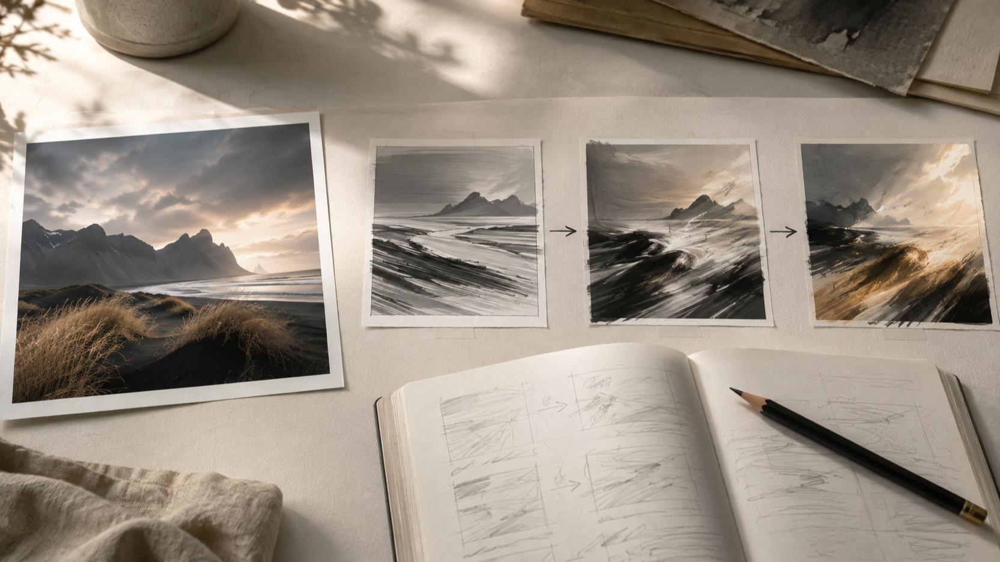
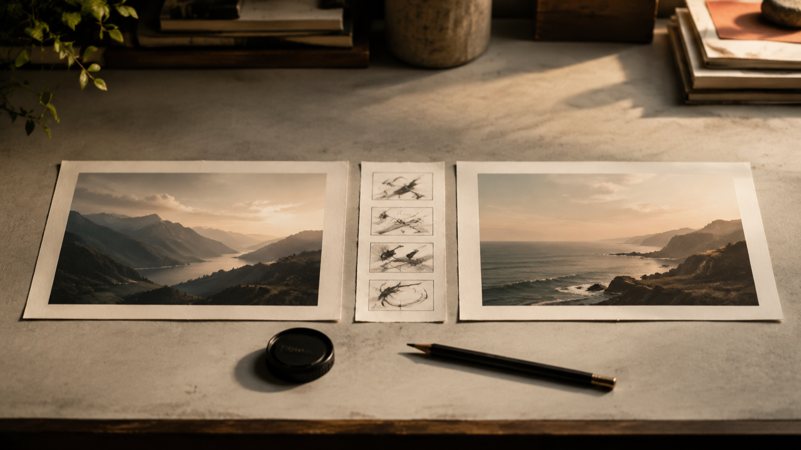

# Промпты MiniMax H3 для изображения в видео: как спланировать один управляемый кадр

**Раскрытие:** я — основатель FLAQ. В этой статье рассказывается о сервисе FLAQ MiniMax H3 для преобразования изображения в видео и о ресурсах с промптами; независимое тестирование результатов здесь не приводится.

Промпты MiniMax H3 полезнее воспринимать не как набор прилагательных, а как короткий бриф для одной сцены. Если исходный визуал уже выбран, задача — ясно описать, что в кадре начинает двигаться, куда ведёт камера и какое состояние должно завершить действие. Так идея остаётся проверяемой ещё до работы с материалом.

На текущей [странице FLAQ MiniMax H3 Image-to-Video](https://flaq.ai/models/minimax/minimax-h3-image-to-video/) этот сценарий описан как преобразование изображения в видео: нужен начальный кадр, а конечный кадр можно добавить для более направленного перехода. Там же показано текстовое поле промпта и диапазон длительности 5–15 секунд. Это описание интерфейса FLAQ, а не отчёт о независимой проверке.

*План перехода: исходный визуал, последовательность движения и заметки для брифа.*

## Что здесь означает «промпты MiniMax H3»

Для практической задачи промпт отвечает на один вопрос: какую наблюдаемую перемену должен описывать кадр. Вместо «сделай кинематографично» полезнее назвать исходное состояние, одно действие, движение камеры и ограничение непрерывности. Например, для пейзажа это может быть не «драматичный ролик», а «камера медленно отъезжает от берега; трава колышется ветром; линия горизонта и силуэт гор остаются теми же».

Такое описание не обещает конкретный результат. Оно лишь делает намерение яснее: что должно оставаться опорой, что меняется и по каким признакам можно заметить, что бриф слишком расплывчат.

## Как спланировать промпты MiniMax H3 для преобразования изображения в видео

Начните с начального кадра. Отметьте в нём один или два элемента, которые нельзя потерять: силуэт предмета, расположение человека, направление света, геометрию комнаты или линию горизонта. Не пытайтесь одновременно закрепить всё изображение и придумать десяток событий: это превращает бриф в перечень несвязанных требований.

Затем задайте одну главную перемену. Она может относиться к объекту, окружению или камере, но должна читаться во времени. Полезная формула выглядит так:

1. **Опора:** что уже видно в начальном кадре.
2. **Действие:** что именно начинает происходить.
3. **Камера:** статична ли она, приближается, отъезжает или следует за объектом.
4. **Непрерывность:** какие детали нельзя менять по ходу сцены.
5. **Завершение:** какое состояние нужно увидеть в конце; если оно существенно, продумайте конечный кадр как отдельную визуальную опору.

*Бриф кадра: визуальная опора, путь движения и вариант конечного состояния.*

Конечный кадр не стоит добавлять автоматически. Он нужен, когда важен конкретный переход между двумя визуальными состояниями. Если же задача — развить один уже утверждённый визуал, достаточно сначала сформулировать движение и ограничения вокруг начального кадра. В обоих случаях лучше оставить в брифе только те детали, которые можно увидеть и проверить глазами.

## Какие элементы держать в одном брифе

Хороший бриф можно прочитать как последовательность, а не как россыпь тегов. Попробуйте разделить его на четыре короткие строки:

- **Сцена:** место, время суток и исходная композиция.
- **Главное действие:** один объект или персонаж и одно заметное изменение.
- **Камера и ритм:** направление движения камеры и темп без противоречивых команд.
- **Ограничения:** предметы, форма, расположение или настроение, которые должны сохраняться.

Например, для предметной сцены сначала укажите сам предмет и его положение в референсе. Затем назовите действие — поворот, открывание, появление света, движение ткани. После этого добавьте камеру. В конце перечислите только самые важные запреты: не менять форму предмета, не добавлять текст, не переносить сцену в другое место. Это не универсальная формула качества, а способ убрать противоречия из собственного задания.

## Что отделить от возможностей эндпойнта

В [репозитории FLAQ с промптами MiniMax H3](https://github.com/flaqai/awesome-minimax-h3-video-prompts) на зафиксированном коммите README заявлены 84 рецепта в 24 практических категориях; структура 24 файлов категорий даёт тот же счёт. Это полезный набор концептуальных брифов, а не перечень возможностей конкретного Image-to-Video эндпойнта.

В рецептах встречаются мультимодальные референсы, аудио, монтажные задачи, продолжение сцены и локальное развёртывание. Их присутствие в репозитории не означает, что именно этот FLAQ Image-to-Video эндпойнт принимает такие входные данные или предоставляет такие элементы управления. Для текущего эндпойнта держитесь того, что прямо показано на его странице: начальный кадр, необязательный конечный кадр и текстовый промпт.

Это разделение особенно важно, когда вы адаптируете идею из библиотеки. Берите из рецепта драматургию кадра — действие, темп, ограничения непрерывности, — но не переносите технические предположения без отдельной проверки актуальной страницы сервиса.

## Проверка брифа перед работой с материалом

Перед тем как использовать промпт, прочитайте его вслух и ответьте на пять вопросов:

1. Понятно ли, какой начальный кадр является опорой?
2. Названо ли одно главное действие, а не несколько конкурирующих событий?
3. Можно ли представить движение камеры без противоречия с действием?
4. Указаны ли две-три действительно важные детали непрерывности?
5. Нужен ли конечный кадр для замысла, или он лишь дублирует уже понятную траекторию?

*Финальная проверка брифа перед работой с материалом.*

Если на вопрос нельзя ответить по тексту, не добавляйте новые эффекты — уточните существующую строку. Самые полезные правки обычно касаются последовательности: сначала опора, затем действие, затем камера и ограничения. Такой порядок помогает обсуждать бриф с командой без догадок о скрытых настройках.

## Частые вопросы

### Нужно ли писать длинный промпт?

Не обязательно. Длина сама по себе ничего не объясняет. Лучше коротко и последовательно описать визуальную опору, действие, камеру и ограничения, чем собирать несвязанные эпитеты.

### Когда нужен конечный кадр?

Когда замыслу действительно важно прийти к определённому визуальному состоянию. Если важнее оживить один референс и сохранить его логику, сначала достаточно хорошо описать движение вокруг начального кадра.

### Можно ли считать примеры из репозитория инструкцией к конкретному эндпойнту?

Нет. Репозиторий — источник идей и рецептов; технические входы и элементы управления нужно сверять с текущей страницей конкретного сервиса.

## Итог

Промпты MiniMax H3 становятся практичнее, когда вы планируете один наблюдаемый переход: начальный кадр, действие, камера, непрерывность и при необходимости конечное состояние. Сначала отделите идею кадра от технических предположений, затем проверьте, что в тексте нет лишних и противоречивых требований. Для старта используйте актуальную страницу FLAQ для преобразования изображения в видео, а библиотеку рецептов рассматривайте как источник структуры брифа, а не как доказательство возможностей эндпойнта.
