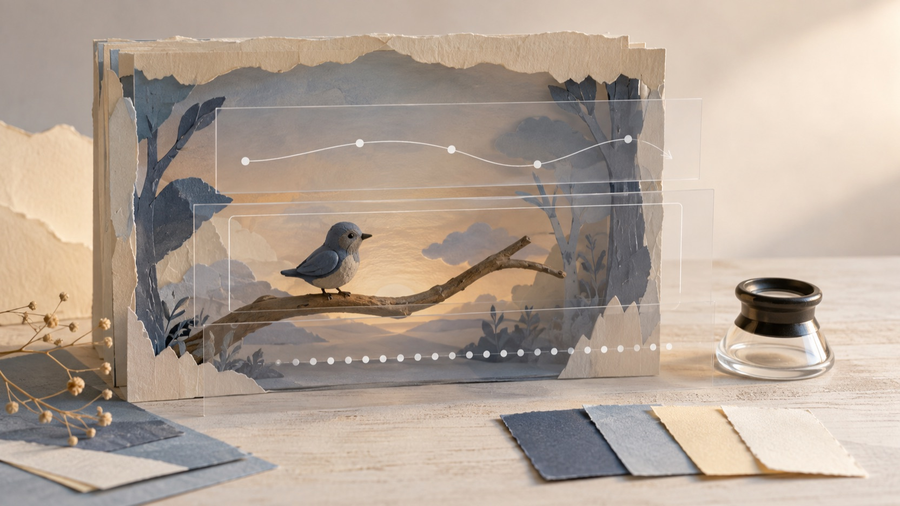

# พรอมต์ MiniMax H3 สำหรับการแปลงภาพเป็นวิดีโอ: เขียนบรีฟจากภาพเริ่มต้นถึงเฟรมสิ้นสุด

การเขียนพรอมต์ MiniMax H3 สำหรับการแปลงภาพเป็นวิดีโอจะชัดขึ้นเมื่อเริ่มจากสิ่งที่เห็นจริงในภาพ ไม่ใช่เริ่มด้วยรายการคำสั่งยาว ๆ เป้าหมายของบทความนี้คือช่วยจัดบรีฟให้มีภาพเริ่มต้น การเคลื่อนไหว พฤติกรรมกล้อง จังหวะเวลา และ—เมื่อจำเป็น—ภาพสิ้นสุดที่สอดคล้องกัน โดยแยกสิ่งที่หน้า endpoint ของ FLAQ ระบุออกจากแนวคิดในคลังพรอมต์อย่างระมัดระวัง

**การเปิดเผยข้อมูล:** ฉันเป็นผู้ก่อตั้ง FLAQ บทความนี้แนะนำบริการแปลงภาพเป็นวิดีโอและแหล่งข้อมูลพรอมต์ของ FLAQ เอง และไม่ได้รายงานการทดสอบเอาต์พุตของ MiniMax H3 อย่างอิสระ

*ภาพประกอบบรรณาธิการสร้างขึ้นสำหรับบทความนี้เพื่ออธิบายการวางบรีฟ ไม่ใช่ภาพหน้าจอหรือผลลัพธ์จาก MiniMax H3*

## เริ่มพรอมต์ MiniMax H3 ด้วยขอบเขตของการแปลงภาพเป็นวิดีโอ

สำหรับ endpoint `minimax-h3-image-to-video` ที่ FLAQ แสดงอยู่ในปัจจุบัน จุดตั้งต้นที่มีหลักฐานคือ **ภาพเริ่มต้น** และ **พรอมต์** โดยภาพสิ้นสุดหรือเฟรมสิ้นสุดเป็นตัวเลือก ไม่ใช่ข้อบังคับ หน้าเดียวกันยังอธิบายการส่งงานเป็น task และการตรวจสถานะของงานภายหลัง จึงควรคิดบรีฟเป็นลำดับที่เริ่มจากภาพหนึ่งภาพแล้วค่อยบอกการเปลี่ยนแปลงที่ต้องการ

หากต้องเลือกช่วงเวลาและความละเอียด ให้ใช้เฉพาะค่าที่หน้า endpoint เปิดให้เลือกในวันใช้งาน หน้าที่อ้างอิงได้อาจเปลี่ยนแปลงได้ และเอกสารที่ตรวจสอบครั้งนี้ไม่ได้ยืนยันรายการค่าที่ครบถ้วนสำหรับทุกสถานการณ์

ดูขอบเขตของหน้ารุ่นได้ที่ [Explore MiniMax H3 on FLAQ](https://flaq.ai/models/minimax/minimax-h3-image-to-video/) ก่อนใส่รายละเอียดเชิงเทคนิคลงในบรีฟของคุณ

### เขียนจากสิ่งที่ภาพมีอยู่แล้ว

แทนที่จะสั่งว่า “ทำให้ดูน่าสนใจ” ให้ตั้งต้นจากสิ่งที่ตรวจได้ในภาพเริ่มต้น: ตัวแบบอยู่ที่ใด แสงเป็นแบบใด วัตถุใดควรคงอยู่ และจุดใดควรเปลี่ยน จากนั้นระบุการเคลื่อนไหวเพียงหนึ่งแนวทางที่อ่านได้ เช่น วัตถุขยับ กล้องเลื่อน หรือฉากเปลี่ยนตามเวลา

บรีฟที่แคบลงช่วยให้ตรวจความต่อเนื่องได้ง่ายขึ้นด้วย เพราะผู้อ่านสามารถเทียบสิ่งที่ขอกับภาพเริ่มต้นได้โดยตรง แทนที่จะต้องตีความคำคุณศัพท์หลายชั้น

## โครงสร้างพรอมต์ MiniMax H3 ที่ใช้คุยกับภาพได้

ใช้โครงสร้างนี้เป็นแบบร่างสำหรับการแปลงภาพเป็นวิดีโอ ไม่ใช่รายการพารามิเตอร์ที่อ้างว่า endpoint รองรับทั้งหมด

1. **ภาพเริ่มต้น:** ระบุตัวแบบ ฉาก แสง และรายละเอียดที่ต้องคงไว้จากภาพต้นทาง
2. **การเคลื่อนไหวหลัก:** เลือกการกระทำที่มองเห็นได้หนึ่งอย่าง แล้วบอกทิศทางหรือการเปลี่ยนทีละน้อย
3. **พฤติกรรมกล้อง:** บอกการเคลื่อนกล้องเพียงแบบเดียว เช่น ค่อย ๆ เลื่อนด้านข้าง หรือคงมุมเดิมไว้
4. **จังหวะเวลาและบรรยากาศ:** อธิบายความเปลี่ยนแปลงตามลำดับ ไม่ใช่เติมคำกว้าง ๆ ที่ตรวจไม่ได้
5. **เฟรมสิ้นสุด (ถ้ามี):** ใช้ภาพสิ้นสุดเมื่อคุณต้องการจำกัดสภาพปลายทางของฉาก และบอกสิ่งที่ต้องต่อเนื่องกับภาพเริ่มต้น

ตัวอย่างโครงสร้างเชิงบรรณาธิการ: “ใช้ภาพเริ่มต้นของเรือกระดาษบนคลองยามค่ำ ให้เรือลอยไปข้างหน้าอย่างช้า ๆ กล้องเลื่อนตามระดับผิวน้ำ แสงจากสะพานค่อย ๆ สะท้อนยาวขึ้น และคงรูปทรงเรือกับแนวตลิ่งไว้” นี่เป็นเพียงวิธีแจกแจงสิ่งที่ควรอธิบาย ไม่ใช่รายงานว่ามีการส่งงานหรือทดสอบผลลัพธ์แล้ว

## คลังพรอมต์ 84 สูตรช่วยคิด แต่ไม่ใช่สเปก endpoint

คลังที่ให้มามี **84 สูตรใน 24 หมวดหมู่** จากการตรวจนับไฟล์และหัวข้อใน commit ที่ตรวจสอบได้ จำนวนนี้ต่างจากคำอธิบาย “1000+” ของหน้าคลัง จึงไม่ควรใช้ตัวเลขหลังเป็นข้อเท็จจริงสำหรับผู้อ่าน

[Browse the MiniMax H3 Prompt Repository](https://github.com/flaqai/awesome-minimax-h3-video-prompts) เพื่อดูแนวคิดการจัดบรีฟ เช่น บทบาทของข้อมูลอ้างอิง การกำหนดภาพที่ต้องการ การบอกไทม์ไลน์ที่มองเห็นได้ การเคลื่อนกล้อง ความต่อเนื่อง และจุดเสี่ยงที่ควรทบทวน

*ภาพประกอบบรรณาธิการนี้แยกคู่ภาพสำหรับบรีฟออกจากวัสดุแนวคิดอื่น ไม่ใช่แผงควบคุมผลิตภัณฑ์หรือผลลัพธ์การทดสอบ*

### อย่าเปลี่ยนแนวคิดในคลังให้เป็นความสามารถของ endpoint

บางส่วนของคลังพูดถึงข้อความ รูปภาพ วิดีโอ เสียง งานหลายรูปแบบ การติดตั้งในเครื่อง หรือองค์ประกอบที่โฮสต์ไว้ สิ่งเหล่านี้มีประโยชน์ในฐานะแนวคิดสำหรับเขียนหรือจัดระบบพรอมต์เท่านั้น จากเอกสาร endpoint ที่ตรวจสอบได้ในบทความนี้ ยังไม่มีหลักฐานให้เรียกสิ่งเหล่านั้นว่าเป็นอินพุตหรือความสามารถของ `minimax-h3-image-to-video`

ขอบเขตนี้สำคัญกว่าการทำให้บรีฟยาวขึ้น หากแนวคิดหนึ่งไม่อยู่ในภาพเริ่มต้น พรอมต์ ภาพสิ้นสุดที่เป็นตัวเลือก หรือการควบคุมช่วงเวลาและความละเอียดที่หน้า endpoint แสดงไว้ ให้ถือว่าเป็นแนวคิดนอกขอบเขตจนกว่าจะตรวจเอกสารปัจจุบันได้

## เช็กลิสต์ก่อนส่ง task

ก่อนสร้าง task ให้หยุดดูบรีฟด้วยคำถามสั้น ๆ เหล่านี้

- ภาพเริ่มต้นมีตัวแบบและฉากที่ต้องการจริงหรือไม่
- การเคลื่อนไหวหลักมีเพียงหนึ่งเส้นทางที่มองเห็นได้หรือไม่
- คำอธิบายพฤติกรรมกล้องไม่ขัดกับการเคลื่อนไหวของตัวแบบหรือไม่
- ถ้าใช้เฟรมสิ้นสุด ภาพนั้นยังรักษาตัวแบบ แสง หรือสถานที่ที่ควรต่อเนื่องหรือไม่
- มีคำกล่าวถึงเสียง วิดีโอ อินพุตหลายชิ้น หรือการติดตั้งในเครื่องที่มาจากคลัง แต่ไม่ได้รับการยืนยันสำหรับ endpoint หรือไม่

เช็กลิสต์นี้ไม่ได้บอกว่าผลลัพธ์จะเป็นอย่างไร แต่ทำให้บรีฟสามารถตรวจสอบความตั้งใจของตัวเองได้ก่อนเริ่มกระบวนการ task

*ภาพประกอบบรรณาธิการสำหรับการทบทวนความต่อเนื่องของบรีฟ ไม่ใช่ผลลัพธ์จากโมเดลหรือการวัดประสิทธิภาพ*

## สรุป: ให้พรอมต์ MiniMax H3 บอกลำดับที่ตรวจได้

พรอมต์ MiniMax H3 ที่มีประโยชน์สำหรับการแปลงภาพเป็นวิดีโอไม่จำเป็นต้องอ้างความสามารถที่ยังไม่ยืนยัน เริ่มด้วยภาพเริ่มต้น อธิบายการเคลื่อนไหวและพฤติกรรมกล้องตามที่มองเห็นได้ ใส่เฟรมสิ้นสุดเมื่อจำเป็น และใช้แนวคิดจากคลัง 84 สูตร 24 หมวดหมู่เป็นเครื่องช่วยวางบรีฟ ไม่ใช่ข้ออ้างเกี่ยวกับอินพุตของ endpoint เมื่อหน้ารุ่นเปลี่ยน ให้ตรวจค่าที่แสดงอยู่ในวันนั้นอีกครั้งก่อนปรับบรีฟ

## คำถามที่พบบ่อย

### ต้องมีเฟรมสิ้นสุดทุกครั้งหรือไม่

ไม่จำเป็น เอกสาร FLAQ ที่ตรวจสอบได้ระบุภาพสิ้นสุดหรือเฟรมสิ้นสุดเป็นตัวเลือก ใช้เมื่อคุณต้องการกำหนดสภาพปลายทางของฉากให้ชัดขึ้น

### คลังพรอมต์ยืนยันว่า endpoint รับเสียงหรือวิดีโอได้หรือไม่

ไม่ยืนยัน คลังมีแนวคิดที่กล่าวถึงสื่อหลายรูปแบบ แต่บทความนี้ไม่ใช้แนวคิดเหล่านั้นเป็นหลักฐานว่า endpoint รับอินพุตเสียงหรือวิดีโอ

### คำไทยในบทความนี้หมายถึงมีความต้องการค้นหาในไทยหรือไม่

ไม่ใช่ คำว่า “พรอมต์ MiniMax H3” และ “การแปลงภาพเป็นวิดีโอ” ถูกเลือกจากหน้าภาษาไทยปัจจุบันของ FLAQ และการตรวจคำค้นภาษาไทยเพื่อความเป็นธรรมชาติของภาษา ไม่ได้ใช้เป็นข้ออ้างเรื่องปริมาณการค้นหาหรือความต้องการในประเทศไทย
