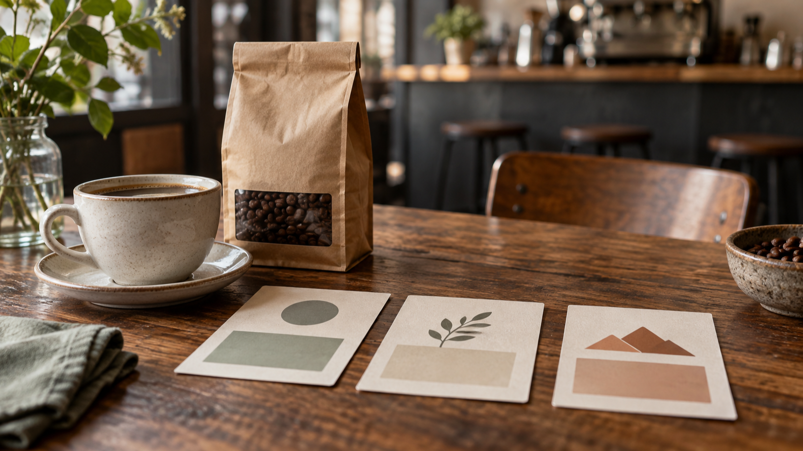

# A Coffee Shop AI Video Prompt: A One-Variable Diagnostic Plan

A coffee shop AI video prompt can sound like a request for a polished promotional clip. This article takes a narrower route: it is a planning method for describing one intended coffee product and one café setting, then changing only one named instruction. It is an editorial hypothesis for the phrase “coffee shop AI video prompt,” not evidence of search demand, volume, rank, trend, or popularity.

I am a founder of VideoWeb AI.

*Editorial planning still life: name the intended coffee product and café setting before any generation.*

The method does not predict what a system will do with a prompt. It does not promise that a bag, cup, scene, camera instruction, or mood will be retained, nor that a generated clip will serve as an effective advertisement. Its purpose is much smaller: make the planned input legible enough that a person can see which instruction they meant to alter before a generation is attempted.

## What this plan is—and is not

Think of the plan as a short creative brief with a diagnostic constraint. The brief names the product and café scene you *intend* to describe. The constraint says that a second version may alter one field only. This is useful when a coffee promotion has several visual ingredients that are easy to blur together: a product package, a served drink, a counter, an action, a camera direction, and an overall look.

It is not a claim about prompt obedience. A fixed brief does not establish that an input will be followed, that an object or setting will remain unchanged, or that two versions are comparable as outputs. It also is not a post-result workflow, a change log, a team handoff, a JSON schema, a quality scorecard, a travel-image preservation method, or a campaign-metric experiment. Keep it at the pre-generation planning stage.

## Start with one intended café brief

Choose details that a reader could identify without adding sales language. The example below is deliberately ordinary and unbranded.

### Name the product and setting

Write one product description and one setting description in plain language. For example:

- **Product:** one unbranded kraft coffee-bean bag beside one cream takeaway cup.
- **Setting:** an independent café counter in early-morning window light.
- **Action:** a barista places the cup beside the bag.
- **Frame:** a medium, counter-level view in a horizontal composition.
- **Look:** warm natural light, restrained café colors, no text overlay.

These are intended brief details, not invariants that any tool will necessarily preserve. Their value is administrative: a later reader can distinguish “the bag and cup I meant to describe” from “the camera direction I decided to rewrite.” Do not add price, discount, conversion, customer response, or a claim that the clip will market the shop successfully. Those questions are outside a prompt-planning note.

## Keep the brief readable before changing anything

The first version should use a small set of fields in a fixed order. A compact version could read:

> An unbranded kraft coffee-bean bag and a cream takeaway cup on an independent café counter in early-morning window light. A barista places the cup beside the bag. Medium counter-level horizontal view; warm natural light; no text overlay.

This is not offered as a tested prompt or a reusable performance recipe. It is simply a readable record of the intended scene. If a detail is not needed for the creative idea, leave it out rather than filling the line with adjectives. More words can conceal more simultaneous decisions.

## Change one declared variable

*Editorial planning still life: three abstract cards stand for a single declared planning variable, not generated results.*

Now choose one field whose wording you want to revise. Camera movement is a practical example because it can be written separately from the product and setting. The second planning version may change only that field:

> An unbranded kraft coffee-bean bag and a cream takeaway cup on an independent café counter in early-morning window light. A barista places the cup beside the bag. **Slow left-to-right camera movement at counter level**; warm natural light; no text overlay.

The bold sentence is the declared change. In a release package, keep the bolding only as an editorial aid; do not treat it as proof that a camera move will occur. The product, setting, action, composition, light, and exclusion of text are repeated because they remain part of the intended brief. Repeating them is not a guarantee that they will survive a generation.

### Avoid bundled rewrites

The diagnostic rule stops helping when the second version changes the product, time of day, action, lens language, color treatment, and camera movement at the same time. A reader then has no clean record of the decision they meant to isolate. Before generating anything, compare the two written versions line by line and ask one narrow question: “Which field did I deliberately rewrite?” If the honest answer is more than one, return to the brief and make the planned variation smaller.

This is a writing discipline, not a test result. It does not create a winner, rank a model, measure quality or speed, or say which outcome a café should prefer.

## Use a simple pre-generation check

Before moving from brief to any tool, inspect the words on the page:

1. Is the coffee product described once and without a brand claim?
2. Is the café setting described once and without a customer or conversion promise?
3. Does the first version have a named action and frame?
4. Does the second version identify exactly one changed field?
5. Have you avoided silently changing the action, product, scene, light, or composition alongside that field?
6. Is the plan free of claims about what a model will execute or what a video will achieve?

The check belongs before generation, not after reviewing an output. It is not a scorecard, and it asks for no results, metric, history note, or next-change handoff. Its only job is to make a proposed prompt rewrite understandable on its own terms.

## Where the two VideoWeb pages fit

VideoWeb describes [Seedance 2.5’s text-and-image generation workflow](https://videoweb.ai/model/seedance-2-5/) on its model page; that provider description is not an official model-maker document, a test, or evidence that this café brief will be followed.

VideoWeb describes [MiniMax H3’s text-or-source-image workflow](https://videoweb.ai/model/minimax-h3/) on a separate page; that provider description likewise does not establish availability, pricing, a free entitlement, output quality, speed, or an outcome for a coffee promotion.

For this article, the pages are optional places to orient a reader who wants to see how VideoWeb presents the two named workflows. They do not supply a benchmark or a comparison winner. The one-variable method comes first because it governs the clarity of the brief, not a claim about either model.

## Finish with a bounded record

*Editorial planning still life: keep the intended brief and one declared change as notes before generation.*

Keep two written versions together: the intended café brief and the same brief with one declared field rewritten. Label the change in your working notes, then remove the label if a destination requires clean reader copy. The useful artifact is the pre-generation distinction itself: one intended product-and-setting description, one stated variation, and no invented promise about what happens next.

That restraint matters. A coffee shop AI video prompt can be a clear creative-planning exercise without becoming a performance claim, a product comparison, or a forecast of marketing results.
