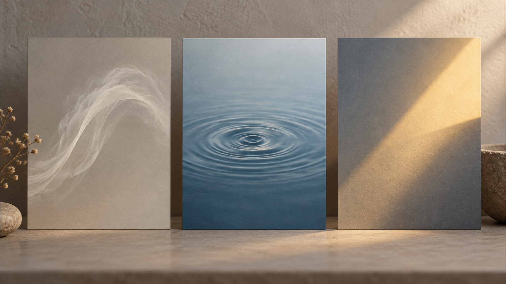

# A Travel Photo to Video Prompt: Plan Three Motion Directions Before You Generate

A travel photograph can hold a precise memory: the weather, the framing you chose, and its documentary limits. A travel photo to video prompt is most useful here as a planning note, not as a promise that a later clip will reproduce that memory faithfully. Before using one, decide what kind of movement you intend, what must remain an interpretation, and what you will refuse to represent as fact.

I am a founder of VideoWeb AI.

This is a creator-planning guide, not a test of any model or a claim about a generated result. The three directions below are deliberately small: they help you describe an intended motion and give you a review standard before you use a clip. They do not establish that a system will keep a location, landmark, building, person, scene, geography, composition, or any other real-world detail unchanged.

*A still photograph and a motion idea are different things; keep that boundary visible in the plan.*

## Start with the photograph, not the imagined outcome

Begin by naming the source honestly. Is it your own photograph? Does it include people, private property, a protected place, or visual details that could invite viewers to infer a real event? Those questions belong in the brief before any style language. A static image can document one moment; a moving version may add events, camera behavior, atmosphere, or timing that were never recorded.

Write a one-sentence intention that describes the viewer's experience rather than a claim about the world. For example: “I want a quiet sense of air moving through this remembered evening.” That is different from saying that the wind, water, crowd, or light actually behaved that way. If your project needs to retain the real place, treat that as your intended planning and ethical-review requirement. It is not a guarantee about what any system will preserve.

Keep a second sentence for the non-negotiables. You might note that you will not imply a different destination, a changed building, a fabricated encounter, or a journey you did not take. This does not make a later render accurate; it gives you a standard for deciding whether it is appropriate to use.

VideoWeb describes its [Seedance 2.5 page](https://videoweb.ai/model/seedance-2-5/) as supporting text-to-video, image-to-video, and optional reference media. On its current [MiniMax H3 page](https://videoweb.ai/model/minimax-h3/), VideoWeb says that a text prompt or a source image can start the workflow. Those are provider descriptions of advertised workflows, not evidence about a particular travel image or an endorsement of either page for this use.

## Travel photo to video prompt: define one motion

The practical restraint is simple: choose one primary motion direction. When every part of a travel scene is asked to move at once, the description becomes vague and the ethical review becomes harder. A modest direction gives you something concrete to inspect later without treating a plan as proof.

Before drafting your travel photo to video prompt, write four fields in plain language:

- **Source boundary:** what the photograph records, and what it does not establish.
- **Primary motion:** one element or one camera feeling you intend to explore.
- **Mood:** the emotional register you want viewers to feel, without claiming it was the original weather or event.
- **Use boundary:** what the finished piece must not imply about place, time, people, or your experience.

These fields prevent a common mistake: using decorative language to smuggle in an unreviewed story. “Late-afternoon calm” can be a mood choice. It should not quietly turn into a claim that the scene was filmed in the late afternoon, that the location looked exactly that way, or that the camera was there.

## Three controlled motion directions for a travel image

The following directions are options for an intention, not recipes for a verified output. Pick one that fits the memory you want to interpret, then state its limits next to it.

### 1. Atmospheric drift: let the mood move, not the location

Atmospheric drift uses a restrained feeling of air, haze, or soft shifting light. In a planning note, say where the movement belongs: perhaps the open sky, a foreground veil, or the edge of a shadow. Keep the named place out of the motion claim. The point is to explore a mood around the image, not to certify what happened at that destination.

**Review question:** would a viewer mistake the added atmosphere for evidence of the original conditions? If the answer might be yes, label the piece as an interpretation or choose a different direction.

### 2. Surface pulse: focus attention on one abstract rhythm

Surface pulse is useful when you want a measured feeling of time passing. The prompt can identify an intended ripple, reflection, or gradual shift in texture, but the plan should avoid claiming that a real river, sea, street, or object behaved this way. Describe the visual idea at the level of rhythm: slow, sparse, and contained within one area of the frame.

**Review question:** does the proposed rhythm introduce a new event, make a real place look different, or suggest activity that the photograph never recorded? If so, the motion is carrying more factual weight than the source can support.

### 3. Light transition: interpret a memory without rewriting its time

A light transition can suggest recollection: a gentle move from cool to warm, or a softening shadow across a frame. Keep it as an editorial mood direction. Do not turn it into a statement that sunrise, sunset, weather, season, or time of day occurred exactly as shown. The source image remains the record; the light instruction is an expressive layer you intend to evaluate.

**Review question:** does the transition create a plausible but false account of when or where the photograph was made? A visually gentle choice can still alter the story a viewer takes from it.

*Three planning metaphors: atmosphere, rhythm, and light. They are not evidence about a location or an output.*

## Turn the direction into a reviewable prompt brief

Keep the brief short enough that another person can challenge it. A useful structure is: “Use my source photo as the starting reference. Intended motion: [one direction]. Mood: [one adjective pair]. Keep the treatment interpretive. Do not present added movement as factual documentation of the location, people, or event.”

Add only details you can defend as creative intention. If you need a camera feeling, use a cautious phrase such as “a slow observational move” rather than writing a story about a camera traveling through a place. If the source includes people, avoid inventing their actions, identity, or relationship. If it shows an identifiable venue or landscape, do not imply that a motion treatment confirms its geography or condition.

The same restraint applies to captions. A caption can say “an interpretation based on my photograph” when that is true. It should not say “footage from,” “the view at,” or “what happened here” unless you have separate, reliable material for those statements. A caption is not a small detail: it tells viewers how to read the image.

## Review the meaning before you share anything

Do the review while the source photograph is beside the plan. Compare the intended use against the original image, not against an imagined ideal result. Ask whether the plan adds a person, action, place claim, weather claim, or travel claim that you cannot support. Ask whether a stranger would infer that the moving material is factual documentation. Ask whether the post needs a clear interpretation label, or whether the concept should stay private.

This is also where permission matters. Having taken a photograph does not automatically settle every issue around the people or places within it. If you are uncertain about a recognizable person, a sensitive setting, or a commercial use, pause for the appropriate permission or advice rather than trying to prompt around the uncertainty.

*A review record is for comparing the intended interpretation with the source, not for certifying a successful generation.*

## Keep the claim smaller than the creative ambition

The value of a travel photo to video prompt is not that it can prove a place was preserved. Its value is that it can make your intended motion, mood, and limits explicit before you act. Choose one motion direction, document what the source does and does not show, and review every later use for misleading additions. That approach leaves room for creative interpretation while keeping the difference between a remembered photograph and factual travel documentation clear.

---

SEO Title: Travel Photo to Video Prompt: Three Controlled Motion Directions

SEO Description: Plan a travel photo to video prompt around atmosphere, rhythm, or light, then review it without claiming a model preserves a real place.

Tags: travel photo to video prompt, image-to-video planning, motion direction, ethical media review, VideoWeb AI
