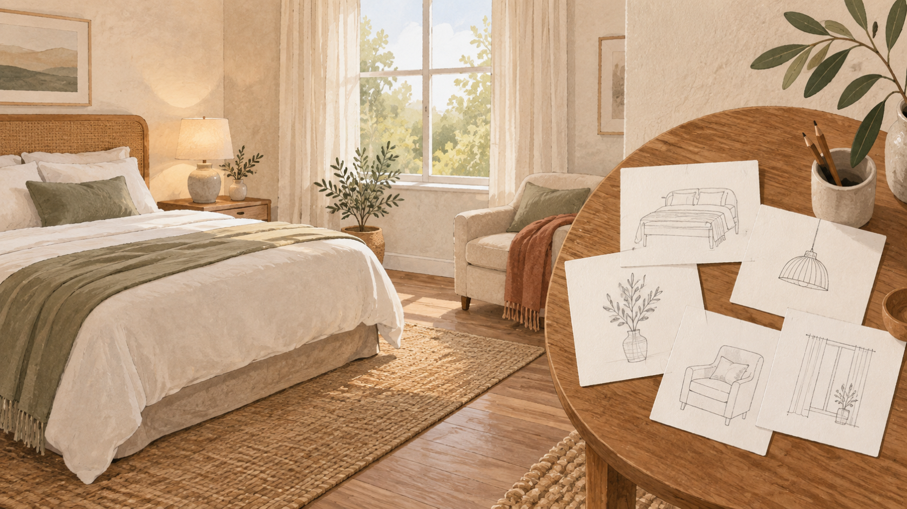
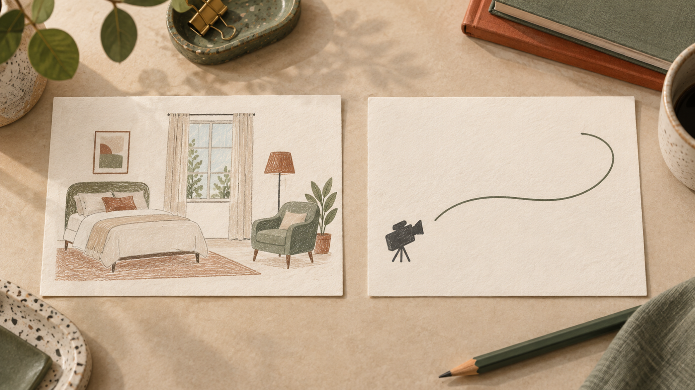
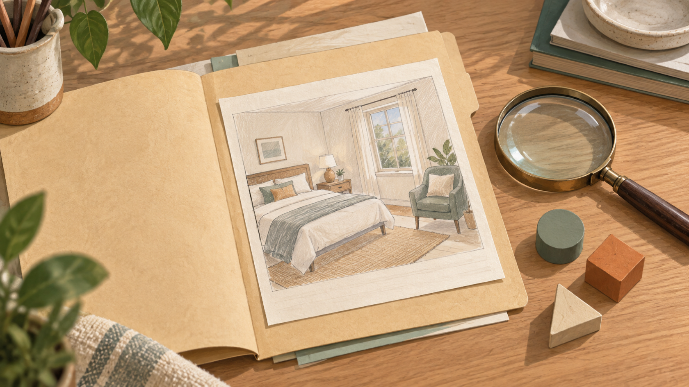

# Seedance 2.5 vs MiniMax H3 : écrire le brief d’une courte vidéo de chambre

Préparer une courte vidéo pour présenter une chambre commence souvent avant le choix d’un modèle. Il faut décider ce qui doit être visible, ce qui peut bouger et ce qui devra être vérifié après génération. Dans ce comparatif Seedance 2.5 et MiniMax H3, la question utile n’est donc pas « lequel gagne ? », mais « comment écrire un brief de pièce qui reste lisible et contrôlable ? »

Le cadre est volontairement étroit : une image de départ, des caractéristiques visibles de la chambre et une direction de caméra. Il aide à rédiger une demande précise, sans promettre que ces éléments seront conservés dans le clip.

*Illustration éditoriale : relever les éléments visibles avant de rédiger le brief. Elle ne représente pas une sortie de modèle.*

## Seedance 2.5 vs MiniMax H3 : poser une question de brief, pas un verdict

Les deux pages ne décrivent pas exactement le même point de départ. [La description VideoWeb de Seedance 2.5](https://videoweb.ai/model/seedance-2-5/) met en avant la création à partir de texte, d’image et, de façon optionnelle, de médias de référence. [La page VideoWeb consacrée à MiniMax H3](https://videoweb.ai/model/minimax-h3/) présente pour sa part un flux qui commence par une idée textuelle ou une image source, puis demande de décrire le sujet, l’action, la caméra, l’apparence et le son.

Ces phrases sont des descriptions publiées par VideoWeb, pas les résultats d’un essai comparatif. Elles suffisent toutefois à poser une méthode commune : partir d’une scène observable, puis séparer ce qui relève du décor, du cadrage et du mouvement souhaité.

### Ce que ce comparatif ne peut pas établir

Cet article ne rapporte aucun test indépendant de Seedance 2.5 ou de MiniMax H3. Il ne mesure ni fidélité des détails, ni qualité, ni vitesse, ni disponibilité. Il ne désigne donc pas de gagnant. Si un clip est généré plus tard, la conservation d’un détail de la chambre devra être contrôlée dans ce clip, et non déduite du brief.

## Commencer par l’image de départ et les caractéristiques visibles

Une image de départ sert d’abord à réduire les ambiguïtés. Au lieu d’écrire « chambre chaleureuse », nommez ce qui donne ce caractère à la pièce. Dans un logement, cela peut être la tête de lit en bois, une fenêtre à gauche, une lampe de chevet, un fauteuil vert et un tapis tressé. Cette liste n’est pas une promesse de rendu ; c’est une base de relecture.

Gardez les éléments dans un ordre simple : d’abord le sujet principal, ensuite les repères qui l’entourent, enfin ce qui doit rester hors champ. Par exemple : « Lit double au premier plan ; fenêtre avec rideaux clairs derrière ; lampe et fauteuil visibles à droite ; pas de personne. » On peut ainsi vérifier que la demande contient des objets concrets plutôt qu’une accumulation d’adjectifs.

Pour la création de vidéos courtes, évitez aussi de demander trop d’actions à la fois. Une chambre, une lumière et un déplacement de caméra constituent déjà une scène complète. Ajoutez une seule intention d’ambiance — calme, matinale ou feutrée — seulement si elle aide à lire la scène.

## Décrire le mouvement de caméra sans promettre la continuité

La direction de caméra doit être formulée séparément du décor. Le décor répond à « qu’est-ce qui est là ? » ; le mouvement répond à « depuis où regarde-t-on, et vers quoi va-t-on ? ». Cette distinction évite de transformer une liste de repères en phrase trop longue et rend le brief plus facile à corriger.

Un mouvement sobre peut être écrit ainsi : « Départ sur le pied du lit, léger panoramique vers la fenêtre, arrêt sur le fauteuil. » Il décrit une intention de cadrage. Il ne garantit pas une continuité du plan ni la présence exacte de chaque élément dans une sortie future.

*Illustration éditoriale : séparer les repères de scène de la direction de caméra dans le brief. Elle ne montre pas un résultat de génération.*

Cette séparation aide surtout à relire le brief : elle ne dit pas ce que le modèle produira. Si une caractéristique est importante pour une annonce, notez-la dans les repères de scène et prévoyez une vérification humaine du clip obtenu.

## Deux versions du même brief à relire

Le même scénario peut être exprimé avec deux accents différents, sans en faire une comparaison de performance. La première version met l’accent sur les sources de référence décrites par VideoWeb ; la seconde détaille la progression de la caméra. Dans les deux cas, les formulations restent des consignes à vérifier après usage.

### Version centrée sur la scène

> Image de départ d’une chambre lumineuse. Montrer le lit double, la fenêtre à rideaux clairs, la lampe de chevet et le fauteuil vert. Garder une ambiance calme. Caméra : léger panoramique du pied du lit vers la fenêtre. Pas de personne, pas d’objet supplémentaire mis en avant.

Cette version force une décision utile : quels repères sont assez importants pour être cités ? Elle ne dit pas que les références ou l’image de départ seront effectivement préservées.

### Version centrée sur le trajet de la caméra

> Plan d’ouverture au pied du lit. Panoramique léger vers la fenêtre, puis vers le fauteuil à droite. Conserver la lumière douce et l’agencement décrit. Durée courte, une seule action de caméra, sans personnage.

Ici, « conserver » doit être lu comme une intention du brief, pas comme une affirmation sur le résultat. Pour limiter l’ambiguïté, relisez la demande et retirez tout élément dont vous ne pourriez pas constater la présence dans le clip.

## Vérifier le brief avant de l’utiliser

Avant d’utiliser un générateur, une relecture de quelques secondes peut éviter des attentes contradictoires :

- l’image de départ est-elle décrite comme un point de référence, sans promesse de conservation ?
- les éléments visibles de la chambre sont-ils concrets et limités ?
- le mouvement de caméra est-il unique et compréhensible ?
- les éléments exclus — personne, texte à l’écran ou décor supplémentaire — sont-ils nécessaires au scénario ?
- le brief distingue-t-il ce qui est demandé de ce qui devra être vérifié dans un éventuel clip ?

*Illustration éditoriale : relire le brief avant usage, sans en déduire un résultat de modèle.*

Cette relecture ne mesure pas la qualité d’un modèle ; elle évite surtout qu’un brief mélange ce qui est vu, ce qui est demandé et ce qui devra être vérifié.

## Conclusion : préférer un brief clair à un gagnant non testé

Dans un comparatif Seedance 2.5 et MiniMax H3, la décision la plus solide consiste à écrire une scène vérifiable avant de chercher un vainqueur. Pour une chambre, partez d’une image de départ, nommez quelques caractéristiques visibles, ajoutez un seul mouvement de caméra et gardez une liste de points à contrôler après génération. C’est une méthode de préparation, non une preuve de résultat.

*Transparence : l’auteur est le fondateur de VideoWeb AI. Cette relation n’ajoute aucune preuve de test ; les descriptions de produit citées ci-dessus restent attribuées à VideoWeb.*
