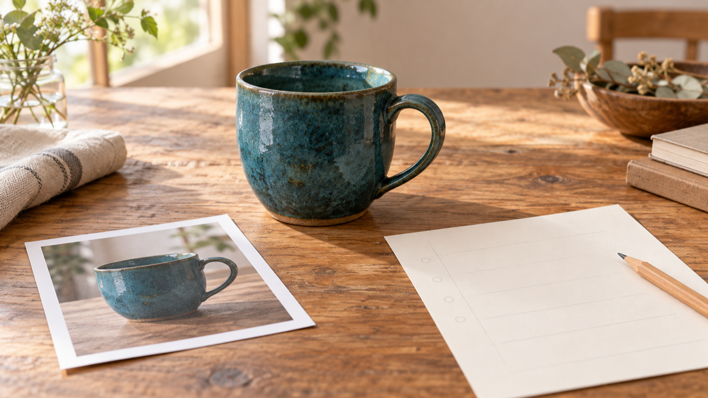
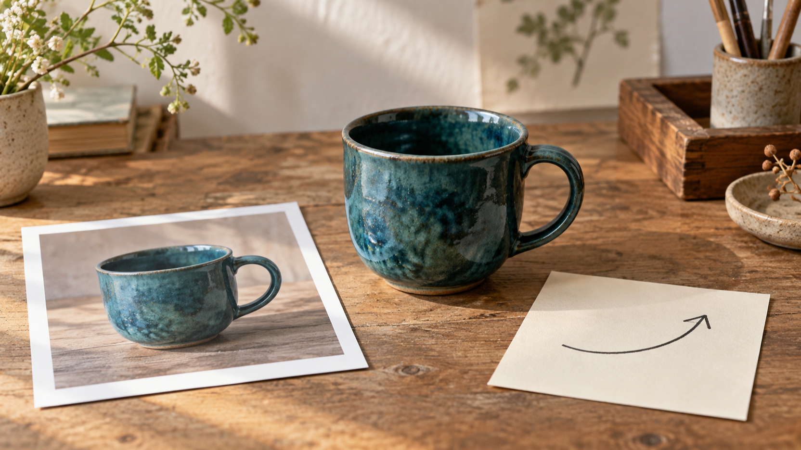
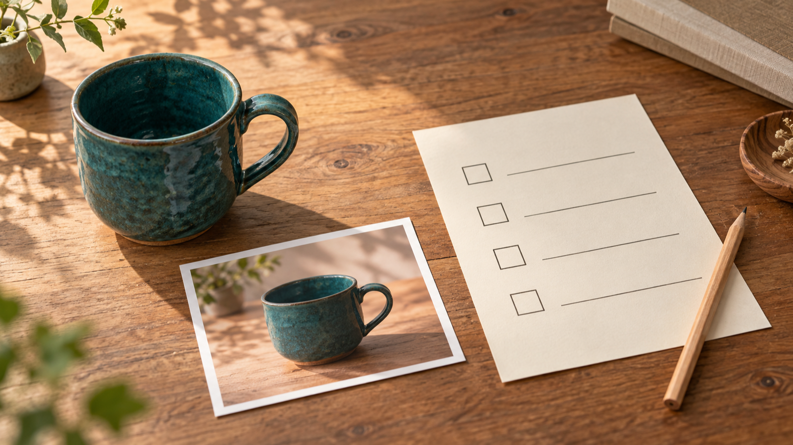

# 商品紹介動画を参考写真から企画する：Seedance 2.5とMiniMax H3の入力整理

参考写真から商品紹介用の短い動画を考えるとき、最初に決めたいのはモデルの勝ち負けではありません。写真の中で何を見せるのか、そしてその対象に一つだけどんな動きを与えたいのかを、小さな企画メモに分けておくことです。この記事は、その準備を整理するためのメモです。

なお、筆者はVideoWeb AIの創業者です。この関係を開示したうえで、ここではVideoWebのページに記載された入力の説明を読んでいます。個人の生成テスト、出力品質の比較、特定モデルの推奨は行いません。

*AI生成の編集用イラストです。実際の生成画面・出力例・比較テストではありません。*

## 参考写真から商品紹介動画を考える前に決めること

写真は、そのまま完成した動画の保証になるものではありません。むしろ企画の出発点です。たとえば手作りのカップを写した一枚なら、色や形を「見せる対象」として置き、カップに添える動きは一つに絞ります。

ここで決める動きは、大げさでなくて構いません。机の上で少し回る、光が縁をなぞる、カメラが近づく、といった一つの方向だけで十分です。複数の動きを一度に足すより、最初のメモでは対象と動きの関係を読み返せる形にするほうが扱いやすくなります。

## Seedance 2.5とMiniMax H3の説明を「入力整理」として読む

この段階で扱うのは、二つの名前の優劣ではなく、何を入力として整理するかです。[VideoWebのSeedance 2.5提供ページ](https://videoweb.ai/model/seedance-2-5/)では、reference imagesやproduct photosを参照素材にし、motionやproduct revealの指定を行う流れが説明されています。

同じく、[VideoWebのMiniMax H3提供ページ](https://videoweb.ai/model/minimax-h3/)では、source imageから始め、motion promptで被写体とカメラの変化を導く流れが説明されています。どちらもVideoWebの提供者ページ上の説明です。モデル提供元の公式資料、独立した比較、または実生成の結果として読むものではありません。

だから、Seedance 2.5 vs MiniMax H3をこのページだけで決める必要はありません。まずは写真、見せる対象、動き、画角という入力側のメモが一枚で読めるかを確認します。その後に使う画面や設定は、利用時点で自分の環境で確かめるのが安全です。

## 一枚の写真を「見せる対象」と「一つの動き」に分ける

企画メモは、長い文章でなくても構いません。写真に写っている物のうち、動画で最初に目に入ってほしいものを一つだけ書きます。次に、その物がどう変わるかではなく、どう見える動きを一つだけ書きます。

- 見せる対象: 深い青緑の手作りカップ
- 一つの動き: カップの正面から縁へ、ゆっくり視線が移る
- 画角: 机の木目と持ち手が一緒に入る近めの画角
- 省くもの: 別の商品、人物、文字、複数のカメラ移動

この四行は、動画プロンプトそのものではなく、書く前の材料です。写真の再現性や動きの成功を約束するものではありません。編集時に迷ったら、追加したい要素が「見せる対象」か「一つの動き」のどちらに関わるかを先に問い直します。

*AI生成の編集用イラストです。実際の生成画面・出力例・比較テストではありません。*

## 動画プロンプトの前に確認する4項目

短い商品紹介動画では、最初から説明を増やすより、次の四つを空欄で持っておくと整理しやすくなります。

1. **何を見せるか** — 商品の形、色、素材感のうち、中心に置くものは何か。
2. **一つだけ何を動かすか** — 商品、光、視線、またはカメラのどれを一つだけ動かすか。
3. **何を入れないか** — 人物、文字、別商品、急な場面転換など、最初の一枚から外したい要素は何か。
4. **どこで見せ終えるか** — 最後に残したい見え方を、効果ではなく構図として書けるか。

これはSeedance 2.5やMiniMax H3の挙動を測る表ではありません。Short Video Creationの前段で、動画プロンプトに混ざりやすい要素をほどくための確認項目です。実際の画面で使える入力や設定は変わり得るため、作業時に表示を確認してください。

*AI生成の編集用イラストです。実際の生成画面・出力例・比較テストではありません。*

## よくある質問

### Seedance 2.5とMiniMax H3は、どちらを選べばよいですか？

この記事は優劣や勝者を決めるためのテストではありません。まず参照写真と一つの動きを整理し、利用時点で見える選択肢や条件を自分の環境で確認してください。

### 参考写真があれば、狙った動画になりますか？

いいえ。写真は企画の出発点として扱うもので、再現性や結果を保証するものではありません。何を見せ、何を一つだけ動かすかを先に書き分けると、制作前の確認には使えます。

### 料金や無料利用については分かりますか？

この記事では料金、クレジット、無料枠、利用資格を扱いません。必要な場合は、作業時点の自分のアカウントと表示される条件を確認してください。

## まとめ

商品紹介動画を参考写真から企画するときは、写真を「証拠」ではなく「整理の入口」として使うのが出発点になります。見せる対象と一つの動きを分け、余計な要素を省く。その小さなメモがあれば、Seedance 2.5 vs MiniMax H3という名前を前にしても、出力の優劣を想像で決めずに、動画プロンプトの前に考えることを整えられます。
