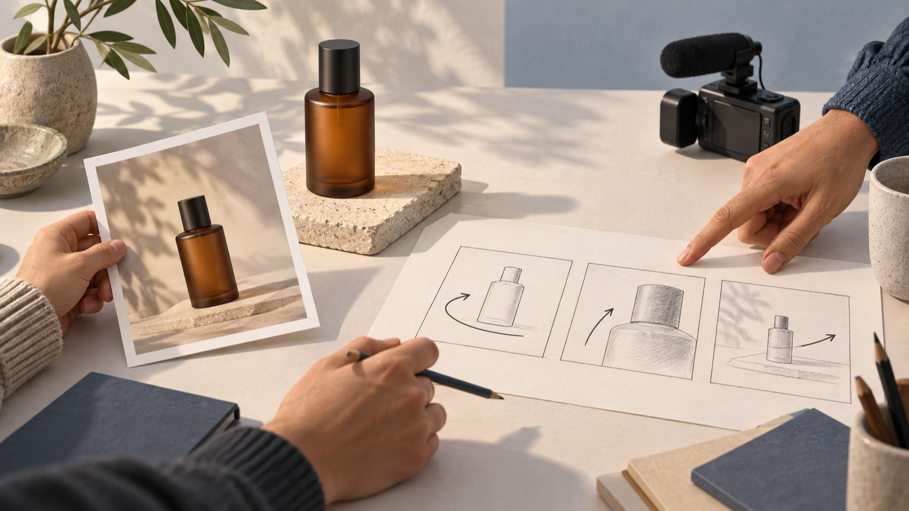

# Seedance 2.5 и MiniMax H3: как собрать проверяемый бриф для короткого продуктового ролика

**Раскрытие:** я — основатель VideoWeb AI. В тексте разбирается подготовка брифа для страниц VideoWeb с названиями Seedance 2.5 и MiniMax H3; независимое тестирование результатов не проводилось.

Короткий продуктовый ролик часто ломается ещё до работы с инструментом: в одном абзаце пытаются уместить товар, сюжет, стиль, камеру, музыку и финальный призыв. Для небольшой команды полезнее сначала разложить задачу на несколько кадров, которые можно проверить глазами и обсудить без догадок. Тогда prompt становится не списком эпитетов, а рабочим брифом: понятно, что взять за опору, что должно происходить и по каким признакам команда примет собственное ТЗ.

*Редакционная иллюстрация, не результат генерации. Референс, продукт и последовательность действий здесь показаны как элементы планирования.*

## Сначала определите один проверяемый кадр, а не «весь рекламный ролик»

Проверяемый кадр — это маленькая единица работы, о которой два человека могут договориться одинаково. Для него достаточно шести полей:

1. **Исходный материал.** Что лежит в основе: фотография товара, набросок сцены или нейтральный референс композиции.
2. **Видимый объект.** Что зритель должен узнавать в кадре: форма флакона, крышка, цветовой акцент, фон.
3. **Одно действие.** Например, флакон медленно поворачивается. Не добавляйте одновременно появление руки, смену локации и вспышку света.
4. **Движение камеры.** Один понятный маршрут: статичный план, плавное приближение или короткий обход.
5. **Неизменяемые детали.** Какие признаки нельзя потерять: пропорции товара, цвет фона, положение крышки, свободное пространство вокруг предмета.
6. **Критерий проверки.** Что команда сможет увидеть при просмотре: объект остаётся в центре, действие одно, камера не спорит с ним, важные детали не заменены.

Это не обещание того, как сработает какая-либо система. Это способ сделать само задание проверяемым до начала работы. Если критерий нельзя сформулировать без слов «красиво» или «дорого», его стоит превратить в наблюдаемую деталь: направление света, высоту предмета в кадре, расстояние камеры или порядок действия.

## Соберите короткий ролик из трёх кадров

Для продуктового объявления небольшой команде обычно достаточно трёх разных задач, а не трёх вариаций одного описания.

- **Кадр 1 — опора.** Товар и окружение появляются без конкурирующего движения. Команда проверяет силуэт, фон и место объекта.
- **Кадр 2 — действие.** Один предмет выполняет одно движение: поворот, лёгкое смещение или открывание. Камера получает отдельную, короткую инструкцию.
- **Кадр 3 — завершение.** Кадр фиксирует итоговое положение товара и оставляет место для последующей ручной верстки сообщения, если оно нужно.

Для каждого кадра сохраните одну строку с инвариантами. В примере с флаконом это может быть: «янтарное стекло, тёмная крышка, светлый матовый фон, без надписей и новых предметов». Это не техническая настройка и не проверка результата модели; это граница, по которой команда замечает, что собственный бриф стал слишком расплывчатым.

*Редакционная иллюстрация, не результат генерации. Карточки показывают порядок обсуждения брифа, а не последовательность полученных кадров.*

## Как развести Seedance 2.5 и MiniMax H3 в одном рабочем ТЗ

Сравнение здесь не отвечает на вопрос «кто лучше». Оно помогает не смешивать два набора входных полей в одной неясной фразе. На [странице VideoWeb о Seedance 2.5](https://videoweb.ai/model/seedance-2-5/) сервис описывает текст-в-видео, изображение-в-видео и работу с референсными материалами для коротких кампанийных роликов. Поэтому для этой версии брифа полезно явно отделить исходный материал от списка референсов и от действия в кадре. Это описание VideoWeb, а не независимое подтверждение того, как будет выглядеть готовый ролик.

Ниже — **непротестированный шаблон** для обсуждения внутри команды:

> Исходный материал: [одна фотография товара или описание сцены].  
> Референсы: [только те материалы, которые объясняют композицию, свет или настроение].  
> Видимый объект: [товар и его неизменяемые признаки].  
> Действие: [одно наблюдаемое движение].  
> Камера: [одна траектория].  
> Проверка: [три наблюдаемых условия без оценки качества].

На [странице VideoWeb о MiniMax H3](https://videoweb.ai/model/minimax-h3/) сервис описывает старт из текстовой идеи или исходного изображения и предлагает задавать объект, действие, камеру, вид и звук. Для второй версии того же брифа удобнее сначала зафиксировать исходное изображение или идею, затем написать одну связную строку движения и отдельно перечислить инварианты. Это также описание VideoWeb, а не результат теста и не гарантия сохранения товара в кадре.

Вторая **непротестированная** форма может выглядеть так:

> Исходное изображение или идея: [что задаёт стартовую композицию].  
> Объект: [один товар и его видимые признаки].  
> Действие: [одно изменение во времени].  
> Камера: [положение и короткое движение].  
> Вид и звук: [только если они действительно нужны для замысла].  
> Инварианты и проверка: [что не меняется и что команда будет смотреть вручную].

Обе формы намеренно не содержат обещаний о качестве, скорости, разрешении, длительности, цене или доступности. Не подставляйте название модели вместо критерия приёмки: «сделано в MiniMax H3» ничего не говорит о том, соблюдён ли ваш бриф.

## Превратите критерии проверки в короткий разговор команды

До работы с любым сервисом проведите пятиминутную проверку. Один человек читает бриф, второй смотрит на исходный материал и отвечает только «да», «нет» или «нужно уточнить».

1. Видно ли, какой материал задаёт стартовую композицию?
2. Назван ли один главный объект без новых предметов в середине сцены?
3. Есть ли только одно действие и совместимое с ним движение камеры?
4. Перечислены ли две–четыре детали, которые нельзя менять?
5. Можно ли проверить финальный кадр без слов «премиальный», «вау» или «кинематографичный»?

Если ответ «нужно уточнить» появляется дважды, не добавляйте ещё один эффект. Сократите действие или разделите задачу на кадры. Такой способ не измеряет возможности моделей и не заменяет тестирование; он помогает убрать противоречия из входного текста, за который отвечает сама команда.

*Редакционная иллюстрация, не результат генерации. Отметки относятся к проверке рабочего брифа, а не к оценке модели или готового видео.*

## Частые вопросы

### Нужно ли писать разные истории для Seedance 2.5 и MiniMax H3?

Нет. Начните с одной истории и одного набора критериев. Разными могут быть только поля, которые вы явно сопоставляете с описаниями VideoWeb: для одной страницы — исходный материал и референсы, для другой — исходное изображение или идея, объект, действие и камера. Это организационное различение брифа, а не сравнение результатов.

### Можно ли включить в критерии текст на упаковке?

Можно назвать текст критичной деталью, но не стоит обещать его точное отображение. В этой статье нет независимой проверки текста, брендинга или сохранения объекта в результате.

### Почему в шаблоне нет параметров качества и стоимости?

Такие параметры не нужны, чтобы принять собственный бриф. Кроме того, эта статья не проверяет цену, кредиты, право на бесплатное использование, доступность для аккаунта или качество результата.

## Итог

Связка **Seedance 2.5 и MiniMax H3** полезна для команды не как таблица победителей, а как повод аккуратно собрать входное ТЗ. Начните с исходного материала, назовите видимый объект, оставьте одно действие и одно движение камеры, зафиксируйте инварианты и договоритесь о наблюдаемых критериях. После этого можно подготовить две непротестированные версии prompt-брифа, не выдавая описание страниц VideoWeb за официальный источник производителей или за доказательство результата. Такой порядок делает создание короткого продуктового ролика понятнее ещё до любого запуска.
