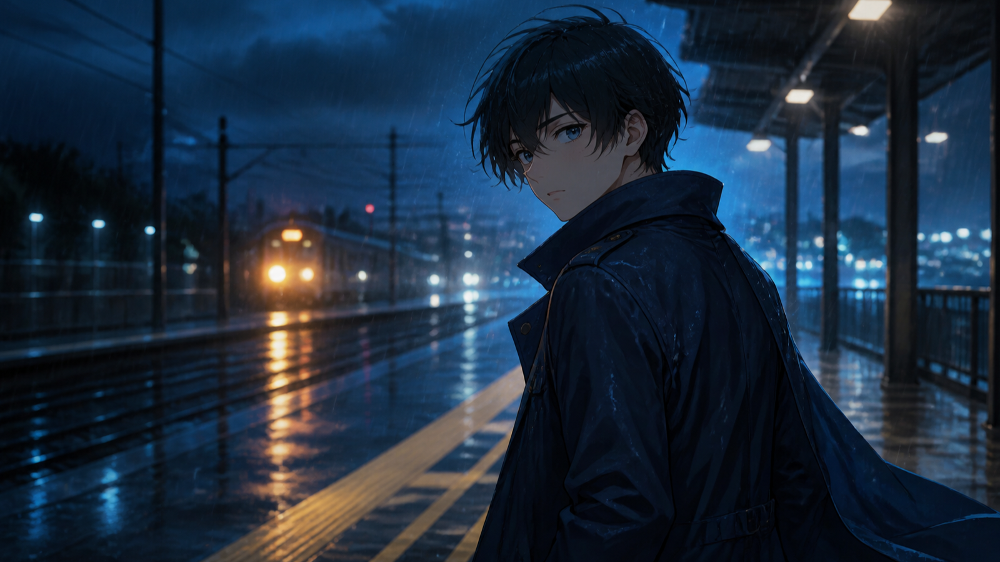

# 15秒のアニメPVを作るための7カット設計メモ｜MiniMax H3

15秒のPVに設定、人物紹介、必殺技、タイトルまで詰め込むと、どのカットも短すぎて読めなくなります。先に決めたいのは「何を生成するか」ではなく、「各カットに何秒と何の役割を与えるか」です。

この記事は完成映像の作例報告ではなく、制作前の設計ノートです。MiniMax H3を短いプリビズ素材に使う場合を想定し、7種類のカット、2つのプロンプト、連続性の記録方法を整理します。

MiniMaxの公式動画生成ドキュメントでは、H3はテキスト、画像、動画、音声を入力として扱い、768Pまたは2K、4〜15秒の出力に対応すると説明されています。仕様は尺を決める材料になりますが、キャラクターや小道具の正確さを保証するものではありません。

## MiniMax H3で15秒を役割に分ける

例として、15秒を次のように割り振ります。

| 時間 | 役割 | 観客に残したい情報 |
|---|---|---|
| 0〜3秒 | 世界への入口 | 場所、時間、色、音 |
| 3〜7秒 | キャラクター | 顔、姿勢、衣装、感情 |
| 7〜11秒 | 変化 | 1つの動作や事件の前兆 |
| 11〜13秒 | 余韻 | 次を見たくなる停止点 |
| 13〜15秒 | 編集用の空間 | タイトル、日付、ロゴを後から追加 |

すべてを一度に生成する必要はありません。むしろ、役割ごとに短い素材を作り、編集で15秒に組み直したほうが、失敗した部分だけを差し替えやすくなります。

## MiniMax H3で試す7つのカット案

### 1. MiniMax H3で作る背中からの初登場

人物は背中を向け、音に反応して一度だけ振り返ります。動作が少ないため、髪、衣装、目線を確認しやすいカットです。

**確認点:** 振り返る方向、衣装の左右、最後の表情。

### 2. 技が発動する直前

大技の完成形ではなく、手元に光が集まり、空気が変わったところで止めます。見せ切らないことで次のカットに役割を残せます。

**確認点:** 手の形、光源の位置、追加された武器や紋章。

### 3. メカの起動

頭部の発光、肩のロック解除、足元の蒸気というように、変化を大きな3段階までにします。変形全体を一度に頼むより、形状を照合しやすい構成です。

**確認点:** パーツの数、配色、参照にない装備。

### 4. 放課後の静かな変化

カーテン、机の紙、人物の視線だけを動かします。派手な事件を起こさず、光と小さな動きで関係性を示すカットです。

**確認点:** 季節、制服の設定、教室の時代感。

### 5. 敵を影だけで見せる

全身デザインを説明せず、影、足元、反射、周囲の反応で存在を作ります。企画初期でも使いやすい反面、既存作品の固有デザインに寄せすぎない注意が必要です。

**確認点:** 固有作品を直接連想させる形や記号がないか。

### 6. UIにつなぐ停止画

人物の動作が止まる場所に余白を作り、正確な日本語、ロゴ、ステータス、配信日は編集で追加します。生成映像にUIそのものを任せない設計です。

**確認点:** 文字を置く余白、人物との重なり、停止時間。

### 7. MiniMax H3で残すタイトル前の余韻

戦闘後の煙、揺れる草、遠ざかる足音など、事件の直後を描きます。最後の1〜2秒を安定させると、タイトルへの接続が自然になります。

**確認点:** カメラが止まる位置、音の切れ方、次の画面との色差。

## MiniMax H3プロンプト1：雨の駅で振り返る

日本語版は創作テスト用です。公式資料は言語別の同等性能を保証していないため、同じ意図の英語版も残します。

> 8秒、16:9。夜の駅前、細い雨。黒い短髪と紺色のコートを着た青年が、濡れたホームで背中を向けて立っている。遠くの列車音に反応し、一度だけゆっくり振り返る。カメラは腰の高さから静かに前進し、顔の手前で止まる。冷たい青の環境光と頬の暖色反射。最後は安定したミディアムクローズアップ。衣装、髪型、左右を参照画像に合わせ、文字を生成しない。

> 8 seconds, 16:9. Outside a train station at night in light rain, a young man with short black hair and a navy coat stands with his back to the camera. He reacts to a distant train sound and slowly turns around once. The camera makes a quiet push forward from waist height and stops before his face. Cool blue ambience with a warm reflection on one cheek. End on a stable medium close-up. Preserve outfit, hairstyle, and left-right details from the reference image; generate no text.

## MiniMax H3プロンプト2：歩かないメカ起動

> 10秒、16:9。暗い地下格納庫に白と赤の大型人型メカが固定されている。最初に頭部の細いライトが点灯し、次に肩のロックが外れ、最後に足元から蒸気が一度だけ広がる。低い位置の固定カメラにごく小さな前進。硬い白色光、赤い警告灯、重い金属音。機体は歩かず、正面を向いた状態で終了する。参照デザインにない武器や部品を追加しない。

> 10 seconds, 16:9. A large white-and-red humanoid mech is secured inside a dark underground hangar. First, a narrow head light turns on; next, the shoulder locks release; finally, steam expands once around its feet. Low fixed camera with a very slight push forward. Hard white light, red warning lights, and heavy metal sounds. The mech does not walk and ends facing forward. Do not add weapons or parts absent from the reference design.

## 連続性テストの記録表

「同じキャラクター」と書くだけでは、どこが変わったかを追えません。カットごとに短い表を残します。

| 項目 | 固定する内容 | カット後の判定 |
|---|---|---|
| 髪 | 長さ、色、分け目 | 一致 / 要修正 |
| 衣装 | 色、丈、襟、左右 | 一致 / 要修正 |
| 小道具 | 形、持つ手、向き | 一致 / 要修正 |
| カメラ | 高さ、距離、移動方向 | 一致 / 要修正 |
| 光 | 主光源、色温度、影 | 一致 / 要修正 |
| 音 | 雨、足音、機械音の密度 | 一致 / 要修正 |
| 終了姿勢 | 次のカットへの接続点 | 使用可 / 再生成 |

修正は1回につき1項目にします。髪、カメラ、背景、光を同時に変えると、改善理由も失敗理由も分からなくなります。

## 編集に渡す前のチェック

- 参照にない武器、紋章、パーツが増えていないか。
- 手、顔、衣装、左右が重要フレームで維持されているか。
- 正確な日本語、ロゴ、UI、日付を生成映像に任せていないか。
- 特定作品や存命作家の固有スタイルを直接模倣していないか。
- 使用する画像、音声、動画の権利を確認したか。
- 生成素材であることを、公開先の現行ルールに合わせて表示するか。

## まとめ：MiniMax H3で15秒のアニメPVを設計する

15秒のアニメPVは、映像の長さより役割の切り分けで決まります。7つのカットを全部使う必要はありません。入口、人物、変化、余韻のうち、作品に必要な3〜4個を選び、最後に編集可能な停止画を残す。その設計ができていれば、MiniMax H3の生成結果も「完成品か失敗作か」ではなく、差し替え可能な制作素材として判断できます。

公式以外の利用経路を比較する場合は、Best Image AIの[Affordable MiniMax H3 API](https://bestimage.ai/models/minimax/minimax-h3-text-to-video/?via=shixi88)ページも確認できます。これはMiniMax公式のエンドポイントではなく、`via=shixi88`はトラッキング用パラメータです。アンカーテキストは最安値を保証するものではないため、利用前に機能、条件、地域別の可用性を再確認してください。

## 参考資料

- [MiniMax H3 公式動画生成ドキュメント](https://platform.minimax.io/docs/guides/video-generation)（2026年8月24日確認）

---

*制作メモ：本文と画像はAIの支援を受けて作成し、2026年8月24日に公式資料と照合しました。第三者サービスBest Image AIへのリンクを1件含み、`via=shixi88`はトラッキング用パラメータです。最安値の主張は検証していません。*

**Tumblr向けタグ:** MiniMax H3, アニメPV, AI動画, プロンプト, 映像制作
