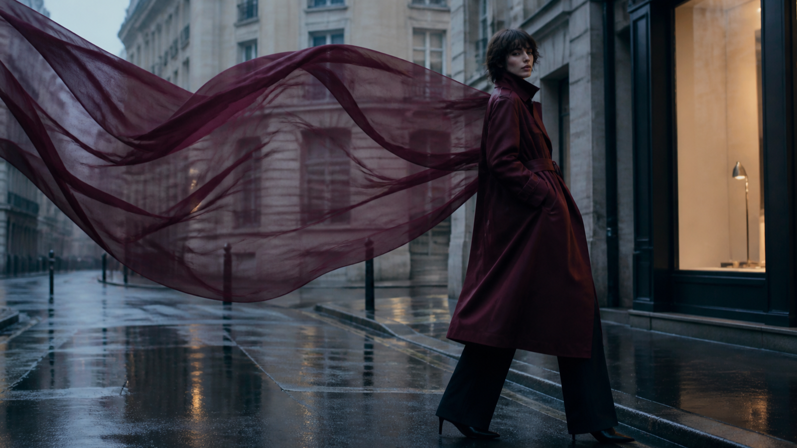

# MiniMax H3 : 7 directions visuelles pour un film de mode de 15 secondes

Avec MiniMax H3, un film de mode très court ne peut pas raconter toute une collection. Il peut en revanche fixer une règle visuelle nette : une matière qui guide le mouvement, une silhouette qui traverse la lumière ou un cadre qui réserve la typographie à l’étape du montage.

Les sept directions ci-dessous sont pensées comme des fiches de création. Chacune précise la composition, le mouvement, le principal risque visuel et un fragment de prompt. MiniMax H3 sert ici à produire des esquisses animées, pas à certifier la fidélité d’un vêtement ou d’un flacon.

La documentation officielle MiniMax H3 décrit des entrées texte, image, vidéo et audio, ainsi que des sorties 768P ou 2K de 4 à 15 secondes. Ces caractéristiques définissent un cadre de production ; la coupe, la couleur, la fermeture, le logo et les droits des références doivent toujours être contrôlés séparément.

## 1. MiniMax H3 et la matière comme espace

**Composition.** Une large pièce de tissu traverse le premier plan et devient progressivement l’arrière-plan. La silhouette reste plus stable que la matière afin de conserver un point de lecture.

**Mouvement.** Un seul déplacement du tissu, lent et latéral. La caméra reste fixe ou avance très légèrement.

**Risque.** Le textile peut changer de poids, de transparence ou de texture. Il faut comparer les images clés à la matière de référence et éviter de transformer un effet visuel en démonstration produit.

**Fragment de prompt.**

> Un voile de laine mate bordeaux traverse lentement le cadre de gauche à droite sans changer de texture. La silhouette reste immobile au centre, lumière latérale douce, caméra presque fixe, aucun texte généré.

## 2. Le podium miroir limité avec MiniMax H3

**Composition.** Deux ou trois surfaces réfléchissantes larges suffisent. Elles encadrent la silhouette au lieu de multiplier des copies difficiles à contrôler.

**Mouvement.** Le modèle avance de trois pas et s’arrête. La caméra recule au même rythme.

**Risque.** Les reflets peuvent inventer des accessoires, modifier l’anatomie ou présenter plusieurs versions de la tenue. Au montage, conserver uniquement les reflets cohérents avec le plan principal.

**Fragment de prompt.**

> Une silhouette avance entre deux miroirs verticaux, trois pas réguliers puis une pose stable. Les reflets restent synchronisés et ne créent ni accessoire ni personne supplémentaire.

## 3. La ville après la pluie

**Composition.** Le sujet occupe un tiers du cadre ; les reflets du sol apportent de la profondeur sans devenir un deuxième sujet. Une zone vide reste disponible pour le titre.

**Mouvement.** Marche simple, travelling arrière lent, arrêt devant une vitrine chaude.

**Risque.** Les détails urbains peuvent ressembler à un lieu réel ou produire des enseignes illisibles. Ne pas identifier une ville sans source et ajouter les noms exacts en postproduction.

**Fragment de prompt.**

> Un mannequin porte un long manteau bordeaux en laine mate dans une rue contemporaine après la pluie. Trois pas, arrêt devant une lumière chaude, travelling arrière stable, espace vide à gauche, aucune enseigne lisible.

## 4. Le parfum comme paysage abstrait

**Composition.** Le flacon reste au centre d’un décor minéral. Les matières et la lumière interprètent une ambiance ; elles ne prétendent pas représenter chimiquement une note olfactive.

**Mouvement.** Un voile passe derrière le verre, puis une onde lumineuse traverse le décor. Le flacon ne se déforme pas.

**Risque.** L’abstraction peut devenir une allégation de composition ou de performance. La description éditoriale doit rester clairement interprétative.

**Fragment de prompt.**

> Un flacon carré en verre ambré repose dans un paysage minéral sombre. Un voile couleur miel passe derrière lui ; une seule onde lumineuse traverse le verre sans modifier la forme, le bouchon ni la couleur.

## 5. La saison change, pas la tenue

**Composition.** La silhouette reste dans la même position pendant que la température de lumière et quelques éléments du décor évoluent.

**Mouvement.** Transition en deux temps : lumière froide, puis lumière plus chaude. Aucun changement de vêtement sauf si plusieurs produits réels sont fournis comme références distinctes.

**Risque.** La génération peut transformer la matière ou ajouter une variante qui n’existe pas. La tenue doit être contrôlée image par image.

**Fragment de prompt.**

> La silhouette et la tenue restent strictement identiques. Seuls la lumière du décor et quelques feuilles en arrière-plan passent d’une ambiance froide à une ambiance chaude.

## 6. La couverture éditoriale animée

**Composition.** Portrait presque immobile, sujet décentré, grande zone calme pour le titre, la date ou le nom de la série.

**Mouvement.** Respiration, léger déplacement du regard, mouvement discret d’un tissu ou des cheveux.

**Risque.** Demander au modèle de générer le titre réduit le contrôle typographique et peut introduire des erreurs. Le texte, le logo et les mentions appartiennent au montage.

**Fragment de prompt.**

> Portrait éditorial vertical, silhouette placée à droite, mouvement très réduit du regard et du tissu, fond calme à gauche pour une typographie ajoutée ensuite, aucun texte généré.

## 7. La silhouette minimale avec MiniMax H3

**Composition.** Une forme sombre devant une source lumineuse, puis un seul détail devient visible : couture, fermeture, texture ou accessoire réel.

**Mouvement.** Rotation légère de l’épaule ou déplacement de la lumière, sans changement de tenue.

**Risque.** Le mystère peut masquer une déformation. Vérifier le détail révélé contre une référence approuvée avant de le transformer en argument de campagne.

**Fragment de prompt.**

> Une silhouette sombre reste devant un fond lumineux. La lumière glisse lentement jusqu’à révéler une fermeture métallique réelle, puis s’arrête. La coupe et les proportions ne changent pas.

## Une fiche commune pour garder la direction

Avant de générer plusieurs plans, conserver la même fiche :

- silhouette et proportions ;
- matière et comportement attendu ;
- palette et couleur d’accent ;
- direction de la lumière ;
- hauteur et mouvement de caméra ;
- geste principal ;
- état final ;
- détails interdits ou non vérifiés.

Modifier une seule variable par essai rend la comparaison plus utile. Si la matière change, corriger la référence ou le mouvement ; si le cadre devient confus, réduire les miroirs ou les éléments du décor ; si la tenue varie, raccourcir l’action plutôt que d’ajouter des adjectifs.

## Contrôle éditorial avant diffusion

Une image élégante n’est pas encore une image de marque fiable. Avant diffusion, vérifier : anatomie, coupe, matière, couleur, fermeture, accessoires, emballage, droits des références et caractère exact des textes ajoutés au montage.

Il faut aussi préciser l’origine générative lorsque le contexte ou la plateforme l’exige. Une scène conceptuelle ne doit pas être présentée comme une photographie de défilé, un événement réel ou une démonstration fidèle d’un produit qui n’a pas été contrôlé.

## Conclusion : choisir une direction avec MiniMax H3

La contrainte des 15 secondes est utile : elle oblige à choisir un geste, une matière et un point d’arrêt. Les sept directions ne sont pas des styles prêts à copier, mais des structures de décision. Avec MiniMax H3, une silhouette lisible, un mouvement unique et une vérification humaine donnent davantage de cohérence qu’une accumulation d’effets.

Pour passer de la fiche créative à un essai, il est possible de comparer la voie tierce [Affordable MiniMax H3 API](https://bestimage.ai/models/minimax/minimax-h3-text-to-video/?via=shixi88) proposée par Best Image AI. Cette page n’est pas un endpoint officiel de MiniMax et `via=shixi88` est un paramètre de suivi. « Affordable » figure dans le libellé du lien, mais ne prouve pas un prix inférieur ; disponibilité, contrôles et conditions doivent être revérifiés avant toute utilisation.

---

## Références

- [Documentation officielle MiniMax H3](https://platform.minimax.io/docs/guides/video-generation) — consultée le 24 août 2026.

*Transparence : cet article et son illustration ont été préparés avec une assistance d’IA et contrôlés à partir de la source citée le 24 août 2026. La copie contient un lien signalé vers le service tiers Best Image AI avec le paramètre de suivi `via=shixi88` ; aucune affirmation de prix minimal n’a été vérifiée.*

**Catégories suggérées :** mode, création visuelle, vidéo, intelligence artificielle
