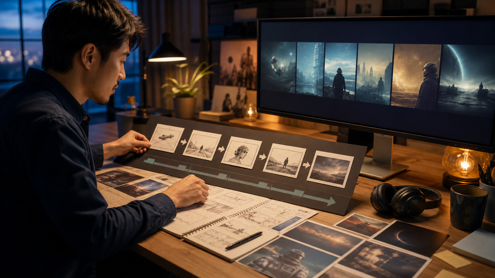

# MiniMax H3 视频生成实战：用 ratio、时长与镜头表拆解 15 秒短片

调用视频生成 API 并不难，难的是让请求参数、提示词和剪辑计划指向同一条片子。本文用一个 15 秒短片示例，把 MiniMax H3 的 `ratio`、`duration`、异步任务和镜头表放进同一套流程。代码依据 2026年8月14日可见的 MiniMax 中国开放平台文档编写，但没有在真实账户中执行；接入前仍需由开发者逐项复核。



> **AI 协助说明：** 本文由 AI 协助整理，经官方文档核对，不包含商业链接、联盟链接或跟踪参数。代码是待人工测试的示例，不代表已经成功调用线上接口。

## 先确认 MiniMax H3 的任务边界

[MiniMax 视频生成文档](https://platform.minimaxi.com/docs/guides/video-generation)当前列出的模型名为 `MiniMax-H3`，支持文本、图片、视频和音频输入，输出分辨率为 `768P` 或 `2K`，时长是 4—15 秒的整数。

视频生成采用异步流程：

1. `POST /v2/video_generation` 创建任务，获得 `task_id`；
2. 使用 `task_id` 查询任务状态；
3. 成功后从 `task.content.url` 取得视频地址并自行保存。

因此，接口返回 `task_id` 只说明任务已建立，不代表视频已经可用。

## 用镜头表拆解 15 秒短片

示例短片只表现一只透明玻璃杯接住晨光，水珠滑落，最后停在可加字幕的构图。先做镜头表：

| 镜头 | 时间 | 画面任务 | 主要动作 | 结束画面 |
|---|---:|---|---|---|
| S01 | 0—4 秒 | 建立环境 | 晨光照到石台 | 杯子轮廓进入画面 |
| S02 | 4—10 秒 | 展示材质 | 一颗水珠沿杯壁滑落 | 水珠接近杯底 |
| S03 | 10—15 秒 | 提供落点 | 镜头轻微推进后停止 | 杯子偏左，右侧留白 |

如果直接把三个镜头塞进一次复杂生成，问题会难以定位。更稳妥的做法是按镜头分别创建任务，再在剪辑软件中组合。每个请求只保留一个主要动作。

## 文生视频请求中的 ratio 和 duration

[V2 创建视频生成任务文档](https://platform.minimaxi.com/docs/api-reference/video-generation-v2-create)说明：当 `content` 只有文本时属于文生视频，`ratio` 必填且不能使用 `adaptive`。可选比例包括 `21:9`、`16:9`、`4:3`、`1:1`、`3:4` 和 `9:16`。

下面以 S02 为例创建一个 6 秒、16:9、2K 的文生视频任务：

```bash
export MINIMAX_API_KEY="请替换为本地安全保存的密钥"

curl --request POST \
  --url https://api.minimaxi.com/v2/video_generation \
  --header "Authorization: Bearer ${MINIMAX_API_KEY}" \
  --header "Content-Type: application/json" \
  --data '{
    "model": "MiniMax-H3",
    "content": [
      {
        "type": "text",
        "text": "透明玻璃杯位于浅色石台中央，杯型和比例保持稳定。晨光从右侧照到杯壁，一颗水珠缓慢向下滑落。镜头为稳定近景，只做轻微推进。最后停在杯子偏左的构图，右侧保留字幕空间；不要生成品牌文字、Logo 或额外物件。"
      }
    ],
    "resolution": "2K",
    "duration": 6,
    "ratio": "16:9"
  }'
```

请求成功时会返回类似结构：

```json
{
  "task_id": "424010985738629"
}
```

示例 ID 只用于说明字段位置，不能拿来查询真实任务。

## 图生视频不能只靠 ratio 改比例

比例行为会随模式变化：

- **文生视频：** `ratio` 必须指定具体比例，不能用 `adaptive`。
- **首帧或尾帧图生视频：** 比例由输入图片决定，`ratio` 按 `adaptive` 处理；即使传入其他合法比例也会被忽略。
- **多模态参考生成：** `ratio` 可省略并使用 `adaptive`，也可以指定具体比例。

因此，首尾帧图生视频若需要 9:16，应该先把首帧和尾帧素材制作成一致的 9:16，而不是只在 JSON 中写 `"ratio": "9:16"`。

图生和参考生成也不能混在同一请求里。官方文档规定：一旦使用 `reference_image`、`reference_video` 或 `reference_audio`，就不能再同时使用 `first_frame` 或 `last_frame`。

## 查询任务状态

官方指南给出的查询路径为：

```text
GET https://api.minimaxi.com/v2/query/video_generation/{task_id}
```

可以用 Python 做有限次数的轮询：

```python
import os
import time
import requests

API_KEY = os.environ["MINIMAX_API_KEY"]
BASE_URL = "https://api.minimaxi.com"
HEADERS = {"Authorization": f"Bearer {API_KEY}"}


def wait_for_video(task_id: str, max_checks: int = 60) -> str:
    url = f"{BASE_URL}/v2/query/video_generation/{task_id}"

    for _ in range(max_checks):
        time.sleep(10)
        response = requests.get(url, headers=HEADERS, timeout=30)
        response.raise_for_status()

        task = response.json()["task"]
        status = task["status"]

        if status == "succeeded":
            return task["content"]["url"]

        if status in {"failed", "cancelled"}:
            raise RuntimeError(
                f"任务结束：{status}，错误：{task.get('error')}"
            )

    raise TimeoutError("任务在限定查询次数内未进入终态")
```

`max_checks` 是应用自行设置的保护条件，不是官方服务时限。官方示例采用 10 秒轮询间隔。生产环境还要处理网络超时、临时下载地址、日志脱敏和文件持久化。

## 参数和提示词分别记录

建议为每个镜头保存一份结构化记录：

```json
{
  "shot_id": "S02",
  "model": "MiniMax-H3",
  "resolution": "2K",
  "duration": 6,
  "ratio": "16:9",
  "mode": "text-to-video",
  "prompt_version": "v03",
  "review_status": "pending"
}
```

提示词描述主体、动作、镜头、光线、声音和结束画面；参数控制模型、分辨率、时长和比例。分开记录后，修改动作时不必重新猜测本次任务到底用了哪个比例。

## 常见错误怎么排查

官方 API 参考列出了多类错误响应：

- `400`：请求参数无效，例如缺少非空文本；
- `401`：认证信息缺失或错误；
- `402`：账户余额不足；
- `422`：内容检查未通过；
- `429`：触发速率限制；
- `500`：服务端错误。

不要对所有错误使用同一种重试策略。参数错误需要修正请求；`429` 或临时服务错误才可能适合有限重试。即使状态为 `succeeded`，文件仍要检查尺寸、时长、是否可解码，以及人物、产品、文字和声音是否符合要求。

## 发布前检查

- [ ] 代码和字段已由开发者按最新官方文档复核。
- [ ] 示例已在授权测试环境运行，或明确保留“未执行”说明。
- [ ] 密钥只从环境变量或密钥管理系统读取。
- [ ] 每个镜头只有一个主要动作。
- [ ] 图生视频的输入图片比例与目标一致。
- [ ] 任务参数、提示词版本和审核状态有记录。
- [ ] 生成素材没有冒充真实用户证言、新闻画面或产品承诺。
- [ ] 精确文字、Logo、价格和规格在后期加入并核对。

## 结语

15 秒短片的稳定性不只取决于提示词。镜头表负责拆分叙事，`duration` 负责约束单个任务，`ratio` 需要按生成模式正确设置，异步查询则把任务结果带回剪辑流程。把这四部分记录清楚，出现问题时才能判断应该改分镜、改素材、改参数，还是直接拒绝这条生成结果。

---

**建议标签：** MiniMax H3、AI视频生成、Prompt工程、API

**摘要：** 用镜头表拆解 15 秒短片，并通过 MiniMax H3 V2 API 创建和查询任务，理解文生、图生与参考生成的 `ratio` 差异。
