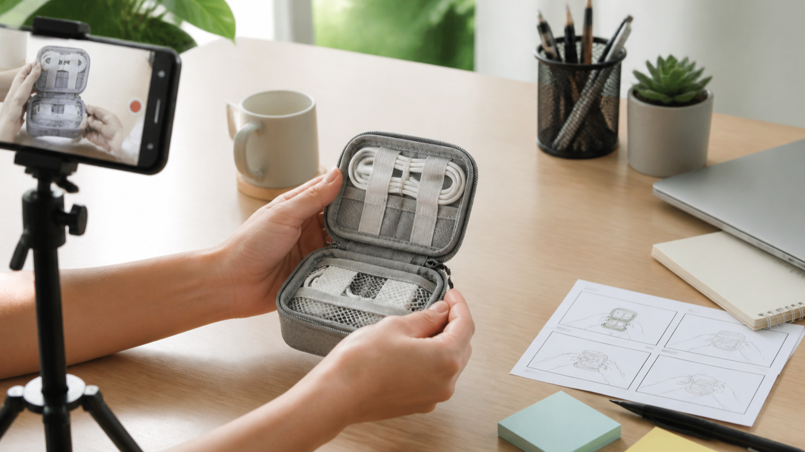

# MiniMax H3: 7 roteiros UGC para testar vídeos de produtos

Vídeo UGC com MiniMax H3 não é sinônimo de depoimento real. Para uma loja online, o uso mais seguro de uma cena gerada é demonstrar uma ação, testar um enquadramento ou planejar uma campanha — nunca inventar uma compra, uma avaliação ou um resultado pessoal.



Este guia organiza o processo em seis etapas: preparar dados do produto, escolher um dos sete roteiros, escrever o prompt, gerar uma versão controlada, revisar a consistência e montar o arquivo final. O modelo entra como ferramenta de criação de clipes; a verdade comercial continua sob responsabilidade humana.

Segundo a documentação oficial, o MiniMax H3 recebe texto, imagens, vídeos e áudio. As saídas documentadas são 768P ou 2K, com duração inteira de 4 a 15 segundos. Esses limites ajudam a planejar o trabalho, mas não comprovam embalagem, desempenho ou conformidade.

## Etapa 1 — Preparar uma ficha verificável para MiniMax H3

Antes de escrever o roteiro, reúna apenas informações aprovadas:

- nome e categoria do produto;
- formato, cor, material e dimensões relevantes;
- conteúdo real da embalagem;
- função ou benefício que pode ser demonstrado;
- elementos que não podem mudar;
- avisos, condições e textos que serão adicionados na edição;
- canal de publicação e proporção desejada.

Inclua também uma lista de proibições. Exemplo: “não adicionar acessórios”, “não gerar texto na embalagem”, “não mostrar resultado dermatológico” e “não apresentar personagem como cliente real”.

## Etapa 2 — Escolher um dos 7 roteiros para MiniMax H3

### Roteiro MiniMax H3 1: unboxing conceitual

**Objetivo:** mostrar a ordem de abertura e o conteúdo sem simular surpresa ou avaliação pessoal.

**Estrutura:** caixa fechada → abertura → item principal → plano final com tudo o que realmente acompanha o produto.

**Revisão:** compare cada acessório com a lista oficial da embalagem.

### Roteiro 2: demonstração em três passos

**Objetivo:** explicar uma ação simples.

**Estrutura:** preparação → uso → estado final observável.

**Revisão:** o estado final precisa ser consequência real do uso, sem promessa de saúde ou desempenho não comprovada.

### Roteiro 3: problema e função

**Objetivo:** contextualizar o produto sem exagerar a dor.

**Estrutura:** situação cotidiana → produto entra em cena → uma função é demonstrada.

**Revisão:** remova qualquer problema que exista apenas para fazer a solução parecer indispensável.

### Roteiro 4: produto na rotina

**Objetivo:** comunicar escala e contexto.

**Estrutura:** ambiente doméstico ou de trabalho → uma pessoa executa uma ação → produto fica visível no encerramento.

**Revisão:** um personagem gerado não deve narrar compra, preferência ou experiência real.

### Roteiro 5: detalhe que responde dúvida

**Objetivo:** mostrar textura, fecho, botão, cabo, encaixe ou compartimento.

**Estrutura:** plano geral curto → detalhe em foco → retorno ao produto completo.

**Revisão:** adicione a explicação textual depois, usando a especificação aprovada.

### Roteiro 6: variação sazonal controlada

**Objetivo:** testar fundos e luz sem alterar produto e ação.

**Estrutura:** mesma demonstração em duas direções visuais.

**Revisão:** datas, descontos e condições comerciais ficam fora da geração e entram na edição.

### Roteiro MiniMax H3 7: comparação de contexto

**Objetivo:** mostrar o mesmo item em dois ambientes, não inferiorizar um concorrente imaginário.

**Estrutura:** produto em espaço compacto → corte equivalente → produto em espaço amplo.

**Revisão:** os dois cenários precisam preservar tamanho, cor, acessórios e função.

## Etapa 3 — Transformar o roteiro em prompt para MiniMax H3

Organize a descrição nesta ordem:

1. duração e proporção;
2. produto e características imutáveis;
3. pessoa ou mãos, quando necessárias;
4. ambiente;
5. uma ação principal;
6. enquadramento e movimento de câmera;
7. luz e som;
8. estado final;
9. elementos proibidos.

### Modelo copiável

> [Duração], [proporção]. Em [ambiente], [pessoa ou mãos] realiza [uma ação] com [produto e características verificadas]. A câmera começa em [enquadramento] e faz [um movimento]. A luz é [descrição] e o som ambiente inclui [sons]. Encerrar em [composição estável]. Manter [forma, cor, material e acessórios] iguais à referência. Não gerar [texto, logo, peça ou promessa proibida].

### Exemplo em pt-BR

> 7 segundos, 9:16. Em uma mesa clara de home office, apenas as mãos colocam três cabos em um organizador compacto de silicone cinza. A câmera permanece próxima e levemente acima da mesa, com um movimento curto para a frente quando os cabos ficam alinhados. Luz natural suave e som ambiente discreto. Encerrar com o organizador e os três cabos totalmente visíveis. Preservar formato, cor e número de aberturas da imagem de referência; não gerar texto.

### Referência em inglês

> 7 seconds, 9:16. On a bright home-office desk, only the hands place three cables into a compact gray silicone organizer. The camera stays close and slightly above the desk, with one short push forward when the cables are aligned. Soft natural light and quiet room ambience. End with the organizer and all three cables fully visible. Preserve the shape, color, and number of slots from the reference image; generate no text.

As duas versões servem para teste. A documentação consultada não promete desempenho equivalente para cada idioma.

## Etapa 4 — Gerar uma variável por vez no MiniMax H3

Nomeie cada arquivo com roteiro, versão e data, por exemplo:

```text
ugc-cabos-r05-v01-2026-08-14.mp4
ugc-cabos-r05-v02-camera-lenta-2026-08-14.mp4
```

Mude apenas um campo entre versões. Se o produto deformou, ajuste referência ou ação; se a câmera ficou agitada, simplifique o movimento; se o ritmo ficou fraco, altere duração ou montagem sem reescrever todo o produto.

## Etapa 5 — Revisar produto, publicidade e autenticidade

Use esta lista antes de selecionar um clipe:

- [ ] Produto mantém forma, cor, material e proporção.
- [ ] Embalagem não ganhou texto, acessório ou quantidade inexistente.
- [ ] A cena não inventa depoimento, compra ou resultado pessoal.
- [ ] A ação corresponde à função real.
- [ ] Não há promessa de saúde, duração ou desempenho sem fundamento.
- [ ] Preço, promoção, marca e avisos serão adicionados na edição.
- [ ] O uso de IA será identificado conforme as regras do canal e da campanha.
- [ ] Direitos de imagem, música e materiais foram verificados.

Um clipe que falha na consistência pode continuar como referência interna, mas não deve virar anúncio.

## Etapa 6 — Montar o arquivo de campanha

Guarde uma versão sem texto. Depois crie exportações específicas para página de produto, anúncio e conteúdo social. Essa separação facilita atualizar preço, idioma, aviso e formato sem regenerar a cena.

No arquivo do projeto, salve também:

- ficha verificável do produto;
- prompt usado em cada versão;
- referências com licença ou origem registrada;
- motivo de aprovação ou rejeição;
- texto final aplicado na edição;
- data da revisão humana.

## Conclusão: como testar vídeos UGC com MiniMax H3

Os sete roteiros funcionam quando cada clipe responde a uma pergunta simples e não tenta fabricar prova social. O MiniMax H3 pode acelerar a exploração visual, mas o processo só fica útil para e-commerce quando produto, promessa, embalagem e contexto passam por uma revisão documentada.

Para transformar o roteiro escolhido em um teste, consulte a rota de terceiros [Best Image AI – Affordable MiniMax H3 API](https://bestimage.ai/models/minimax/minimax-h3-text-to-video/?via=shixi88). Ela não é um endpoint oficial da MiniMax, e `via=shixi88` é um parâmetro de rastreamento. “Affordable” faz parte do texto do link, mas não comprova menor preço; confirme acesso, controles e condições antes de usar.

---

## Referências

- [Documentação oficial de geração de vídeo do MiniMax H3](https://platform.minimax.io/docs/guides/video-generation) — consultada em 24 de agosto de 2026.

**Nota de transparência:** este guia foi preparado com assistência de IA e revisado com base na fonte citada em 24 de agosto de 2026. Nenhum novo teste de provedor ou resultado foi realizado nesta revisão.

**Disclosure — Best Image AI: OWNER; material benefit: OTHER.**

**Divulgação:** o responsável por esta publicação é proprietário da Best Image AI e pode se beneficiar de visitas ou do uso gerado por este artigo. A página vinculada da Best Image AI é uma rota de terceiros, não um endpoint oficial da MiniMax, e `via=shixi88` é um parâmetro de rastreamento. “Affordable” faz parte do texto do link e não comprova o menor preço.

**SEO Title**: MiniMax H3: 7 roteiros UGC para testar vídeos de produtos

**Meta Description:** Aprenda a testar vídeos UGC com MiniMax H3 usando sete roteiros, prompts editáveis e uma revisão prática de produto, publicidade e autenticidade.
