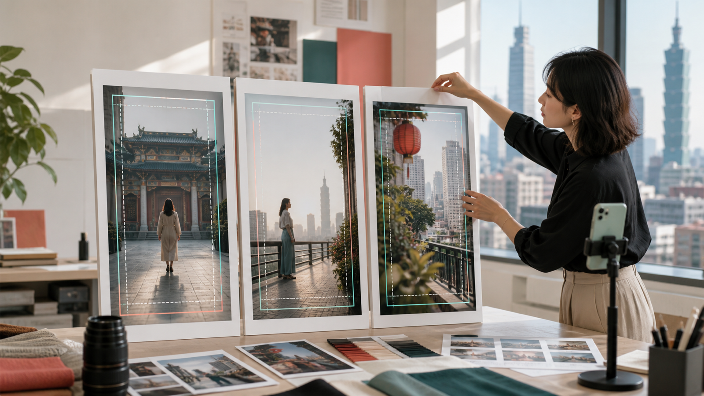
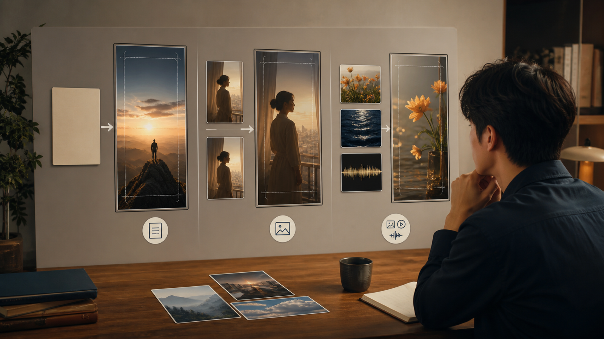
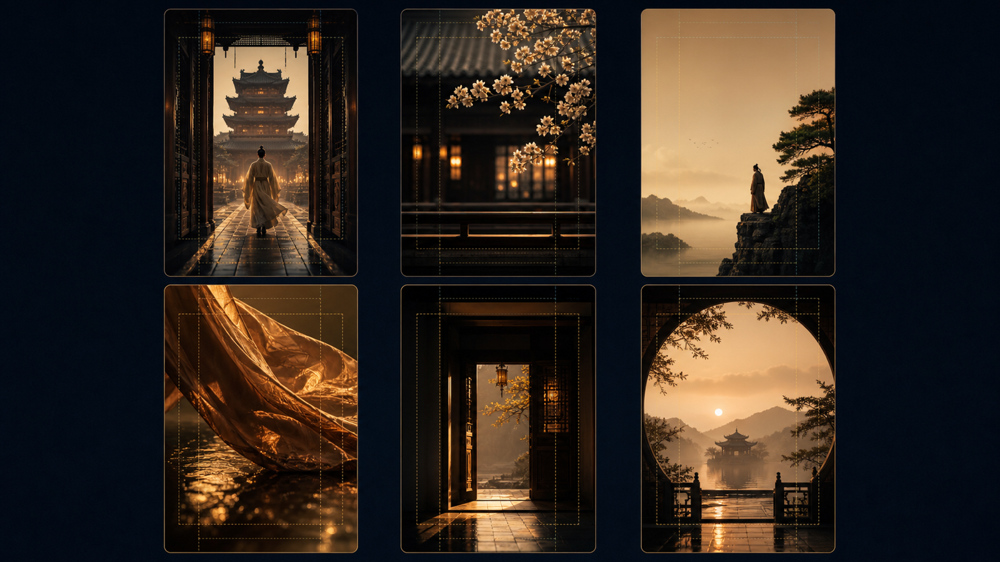
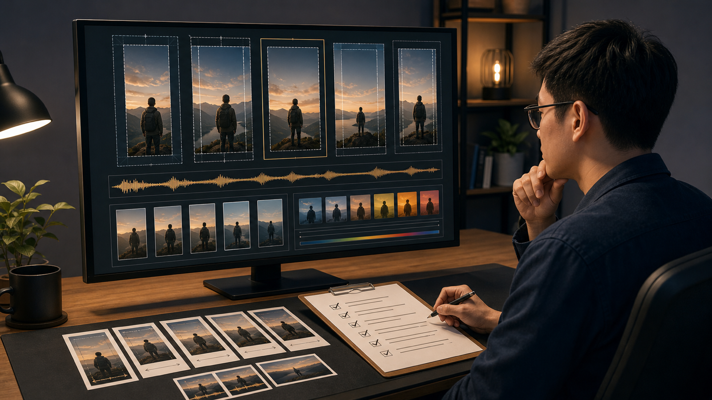

# 15 秒不是塞滿畫面：MiniMax H3 直式影片的 6 種 9:16 構圖法

*先分清生成模式，再用留白、縱深與穩定收尾，讓直式短片有呼吸，也有後製空間。*

一支 MiniMax H3 的 15 秒直式影片最常見的問題，不是內容太少，而是所有東西都想同時出現：人物要動、商品要亮相、鏡頭要轉、字幕要塞進來，最後連平台介面都找不到可避讓的位置。9:16 畫面看似很高，真正能安全使用的區域其實有限。

本文由 AI 協助整理初稿，並由人工依 MiniMax 官方文件逐項核對技術內容與台灣用語；文中圖片亦為 AI 生成概念圖。它們用來說明構圖，不是實拍畫面、產品介面或效果保證。文末另揭露一個第三方服務連結及其追蹤參數。

依 2026 年 8 月 24 日可見的官方資料，`MiniMax-H3` 支援文字、圖片、影片與音訊輸入，輸出規格包含 768P、2K 與 4—15 秒。這些是模型與 API 的任務範圍，不代表任何第三方平台在所有地區都提供相同功能、價格或即時可用性。

## 先留空間，再談 MiniMax H3 直式影片

直式構圖不是把橫式畫面裁掉左右兩側，而是重新安排注意力。開始寫提示詞前，先在 9:16 畫板上標出三個區域：主體活動範圍、後製字幕範圍，以及平台介面可能遮住的位置。臉部、商品輪廓與關鍵手部動作，不要貼著上下邊緣。

接著只選一個主要動作。人物走兩步後停下，通常比同時轉身、拿起商品、對鏡頭微笑和走出畫面更容易檢查。鏡頭也同樣節制：固定、中景緩慢後退，或低角度平穩上移，選一種即可。

最後先設計停在哪裡。直式短片的結尾若能穩定停留半秒，剪輯者才有空間接字幕、Logo 或下一個鏡頭。把文字留給後製，也能避免生成畫面出現難以控制的錯字。

*AI 生成概念圖：創作者以三個 9:16 畫框規劃主體、留白與安全區。*

## MiniMax H3 的三種生成模式：ratio 不是同一種設定

MiniMax v2 建立任務的欄位名稱是 `ratio`。但「設定 9:16」並不是三種生成模式都採取同一個動作。

- **文生影片：** `content` 只有文字時，要明確傳入 `ratio: "9:16"`；不能把 `adaptive` 當成直式設定。
- **首尾幀圖生影片：** `content` 含 `first_frame` 或 `last_frame` 時，比例由輸入圖片決定，服務會按自適應方式處理。即使傳入具體比例也可能被忽略，所以首幀與尾幀素材本身就要先做成一致的 9:16。
- **多模態參考生成：** 使用參考圖片、影片或音訊時，可以保留 `adaptive`，也可以明確指定 `9:16`。若要交付直式版本，仍應檢查參考人物與動作能否安全放進窄畫面。

這個差異會直接影響工作順序。文生影片先決定參數；圖生影片先重做素材畫布；參考生成則先判斷參考內容的取景是否適合直式。只在提示詞裡寫「vertical video」，不能取代正確的 API 設定或素材比例。

*AI 生成概念圖：文字、首尾幀與參考素材三條工作路徑，未呈現真實產品介面。*

## MiniMax H3 的 6 種 9:16 構圖法

### 1. MiniMax H3 中央進場：用縱深取代橫向移動

讓人物或商品沿畫面深處靠近鏡頭，視線會自然集中在中央。提示詞應限制移動距離，並說明最後停在半身或完整商品輪廓，避免主體靠得太近而被裁切。

### 2. 上下層次：把前景當成第二層故事

下方安排桌面、食物、布料或花朵，上方保留人物和空間。兩層不要同時大幅移動；一層負責主要動作，另一層只提供深度與材質。

### 3. 側邊留白：先替後製文字保留位置

把主體放在左或右側三分之一處，另一側保留乾淨背景。描述「左上方保留留白」即可，不要要求模型直接產生標題、價格或品牌字樣。

### 4. 低角度材質：讓動態沿垂直方向展開

布料、蒸氣、液體、髮絲與反光適合從低角度向上看。這種構圖很有張力，但材質變化不能遮住臉部或商品，所以提示詞要指定一個主要材質與一個動作。

### 5. 直向框景轉場：用門、窗與走廊接鏡頭

電梯門、窗框、柱子和鏡面本身就接近直式比例。轉場前後要維持相近的主體高度與運動方向，否則兩個漂亮場景仍會在剪接點跳動。

### 6. MiniMax H3 可循環收尾：讓最後一格能回到開場

人物回到起始姿勢，或光線、門片和鏡頭運動回到相似狀態，就有機會做成循環。若生成結果無法精準閉合，也可以在相近構圖處剪接，不必追求一次生成完整迴圈。

*AI 生成概念圖：六種 9:16 構圖的視覺索引，未使用品牌 Logo 或可辨識介面。*

## 從素材到可發布版本

生成完成不是終點。先保留一份無字幕母版，再針對各平台輸出版本；逐一檢查裁切、字幕區、封面取幀、音量、人物肢體、商品輪廓，以及聲音是否與動作同步。任何可能被理解為真實事件、使用者見證、價格或產品功效的內容，都應回到可靠來源核對。

提示詞可以按照「主體與不可變特徵 → 畫面位置 → 一個動作 → 一種運鏡 → 光線與聲音 → 穩定結尾 → 後製留白」排列。例如：

> 一名穿著霧灰色長外套的成年人站在直式畫面右側，服裝顏色與髮型保持一致。背景是雨後街道。人物向前走兩步，在暖色櫥窗旁停下並看向左側留白。使用中景與平穩後退運鏡，最後停在半身構圖；左上方保留後製標題區，不要生成文字或 Logo。

若是團隊協作，建議每次只調整一個變數，並記錄素材、參數、提示詞與人工判斷。這樣「哪一版比較好」才不只是印象，而是能回溯的製作決策。

## 結論：用 MiniMax H3 完成可發布的 9:16 影片

15 秒不需要塞滿畫面。先分清生成模式，再讓主體、留白和結尾各自有位置，MiniMax H3 直式影片才真正有機會進入剪輯，而不是只停在第一次生成的驚喜。

若要把構圖方案轉成實際測試，可比較 Best Image AI 的第三方 [Affordable MiniMax H3 API](https://bestimage.ai/models/minimax/minimax-h3-text-to-video/?via=shixi88) 入口。Best Image AI 並非 MiniMax 官方服務，`via=shixi88` 是追蹤參數；「Affordable」只是連結文字的一部分，不代表價格最低，也不保證各地區即時可用，使用前仍要重查功能與條件。

**參考資料**

- [MiniMax 影片生成文件](https://platform.minimaxi.com/docs/guides/video-generation)（2026 年 8 月 24 日查閱）
- [建立影片生成任務文件](https://platform.minimaxi.com/docs/api-reference/video-generation-v2-create)（2026 年 8 月 24 日查閱）

*AI 生成概念圖：直式影片的後製檢查情境，不代表實際軟體介面。*
